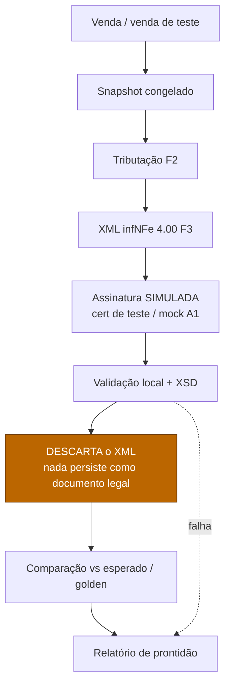
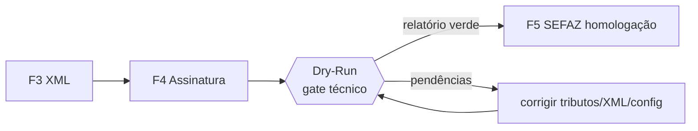

# 🧪 FISCAL_DRY_RUN — Emissão a seco

> **Etapa oficial nova** da arquitetura fiscal: executar **toda** a cadeia de emissão
> (snapshot → tributação → XML → assinatura simulada → validação) **sem transmitir** à SEFAZ,
> **descartando** o XML e produzindo um **relatório de prontidão**.
> **Objetivo:** garantir que a emissão funciona **antes** de tocar a homologação real.
> **Princípios:** `docs/decisions/ADR-0008-fiscal-architecture.md` · **Fluxo:** `NFCE_ARCHITECTURE.md`.
>
> ⚠️ **Dry-Run nunca transmite, nunca persiste documento legal e nunca consome numeração de
> produção.** É puramente diagnóstico. Implementação é fase futura (entre F4 e F5).

---

## 1. Por que existe

Entre "ter o código de XML/assinatura" (F3/F4) e "transmitir para a SEFAZ" (F5) há um abismo de
risco: o primeiro contato real com a SEFAZ é caro (rede, certificado, ambiente) e barulhento
(rejeições genéricas). O **Dry-Run** fecha esse abismo: roda a esteira inteira **localmente**,
valida contra XSD, e diz **"este documento passaria"** — ou lista exatamente o que falta — **sem**
gastar um único request na SEFAZ e **sem** risco de emitir algo indevido.

É o equivalente fiscal de um *build* que compila e roda os testes antes do *deploy*.

---

## 2. Fluxo do Dry-Run

> **Diferença para o pipeline real (`NFCE_ARCHITECTURE §1`):** o Dry-Run **substitui**
> "Fila → SEFAZ → Retorno → Persistência" por "**Descarta XML → Comparação → Relatório**".
> Tudo antes disso é idêntico — é justamente o ponto: exercitar o mesmo caminho.

---

## 3. Etapas detalhadas

### 3.1 Snapshot
- **Entrada:** venda real (read-only) **ou** venda sintética de teste (golden case).
- **Saída:** snapshot congelado (idêntico ao da emissão real — `buildVendaFiscalSnapshot`).
- **Nota:** o Dry-Run **não** precisa criar `NotaFiscal` persistida; pode operar sobre o snapshot
  em memória (ou uma nota efêmera marcada como dry-run, descartada ao fim).

### 3.2 Tributação (F2)
- Mesmo motor de tributos da emissão real. Saída: itens com base/alíquota/ICMS/tributos calculados.
- **Falha aqui** = regra tributária incompleta → entra no relatório como bloqueio.

### 3.3 XML (F3)
- Mesmo builder `infNFe` 4.00 + chave de acesso. Para Dry-Run, a numeração pode usar uma **série
  de teste** ou número simbólico — **nunca** a série de produção (não queima numeração real).

### 3.4 Assinatura simulada
- Usa um **certificado de teste** (ou mock de assinatura) — **não** o A1 de produção.
- Verifica que a estrutura XMLDSig é montável e o digest fecha. Segue P6: nenhum segredo real.

### 3.5 Validação local + XSD
- Valida o XML contra o **XSD oficial** (homologação). Este é o veredito técnico principal:
  o documento é estruturalmente válido?
- Pode incluir validações de regra de negócio (totais batem, CSOSN×CFOP coerentes, destinatário ok).

### 3.6 Descarte do XML
- O XML gerado é **descartado** — não vira `xmlAssinado`/`xmlAutorizado`, não enfileira, não
  transmite. (Opcional: persistir o XML num diretório/relatório de diagnóstico, claramente
  marcado "DRY-RUN — NÃO FISCAL", para inspeção manual.)

### 3.7 Comparação (golden)
- Quando houver casos golden (XMLs de referência conhecidos-bons), compara o XML gerado contra o
  esperado (ignorando campos voláteis: timestamps, cNF aleatório, assinatura).
- Detecta **regressões**: "a mudança na F2 quebrou o XML do caso X".

### 3.8 Relatório de prontidão
- Saída final: um relatório estruturado (ver §4).

---

## 4. Relatório de prontidão (saída)

| Campo | Conteúdo |
|---|---|
| `loja` / `storeId` | escopo |
| `casoTeste` | venda real (id) ou golden case |
| `prontoParaEmissao` | bool — passou em todas as etapas |
| `etapas[]` | por etapa: ok/pendente/erro + mensagem (espelha `EmissionEtapaResumo`) |
| `pendencias[]` | o que falta (ex.: "item 2 sem NCM", "loja sem IE") |
| `validacaoXsd` | ok / lista de violações de schema |
| `comparacaoGolden` | igual / diff (campos divergentes) |
| `xmlDescartado` | confirmação de que nada foi transmitido/persistido como legal |

> **Reuso:** o relatório reaproveita o diagnóstico que o snapshot já produz
> (`diagnostico.prontoParaEmissao`/`pendencias`/`itensSemFiscal`) e os `etapas[]` do
> `EmissionOutcome`, estendendo com XSD + golden.

---

## 5. Garantias (invariantes)

1. **Zero transmissão.** Nenhum request à SEFAZ/gateway. Provider em modo dry-run **não** chama rede.
2. **Zero documento legal.** Não grava `xmlAutorizado`/`chaveAcesso` real; não muta
   `Venda.fiscalStatus` de venda real para estado fiscal de produção.
3. **Zero numeração de produção.** Usa série de teste ou número simbólico.
4. **Zero segredo real.** Assinatura com certificado de teste (P6).
5. **Determinístico.** Mesmo snapshot → mesmo XML (ignorando campos voláteis) → mesmo veredito.
6. **Seguro por construção.** Pode rodar em CI, sobre vendas reais (read-only), sem efeito colateral.

---

## 6. Onde encaixa no plano

- **Posição:** gate técnico **entre F4 e F5**. Não recebe número próprio (para não renumerar
  F5–F12); é um **critério de entrada da F5**: *não se transmite à SEFAZ sem Dry-Run verde*.
- **Também útil em CI:** golden cases rodam a cada mudança em `lib/fiscal/tributos|xml|assinatura`
  para pegar regressão antes da homologação.

---

## 7. Relação com a homologação (F11)

| | Dry-Run | Homologação SEFAZ (F11) |
|---|---|---|
| Transmite? | ❌ não | ✅ sim (ambiente de homologação) |
| Custo/risco | nenhum | request real, certificado, ambiente |
| Pega | erro estrutural/regra/regressão | rejeições reais da SEFAZ (cStat) |
| Quando | toda mudança (CI) + antes da F5 | bateria ampla antes da produção (F12) |

O Dry-Run **não substitui** a homologação — **reduz** o número de idas à SEFAZ com documento que
nunca passaria. É o filtro barato antes do teste caro.

---

## 8. Referências

- Princípios: `docs/decisions/ADR-0008-fiscal-architecture.md`.
- Fluxo real: `docs/architecture/NFCE_ARCHITECTURE.md` (§4 etapas, §9 existe vs falta).
- Dados/diagnóstico: `docs/architecture/FISCAL_SCHEMA_DESIGN.md`; snapshot
  `lib/fiscal/venda-fiscal-snapshot.ts` (`diagnostico`).
- Segurança da assinatura: `docs/architecture/FISCAL_SECURITY.md`.
- Plano/fases: `docs/governance/MASTER_FISCAL_EXECUTION_PLAN.md` (gate entre F4 e F5; CI).
