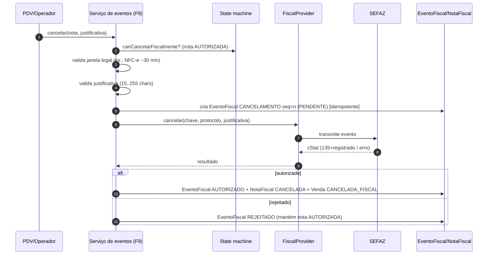
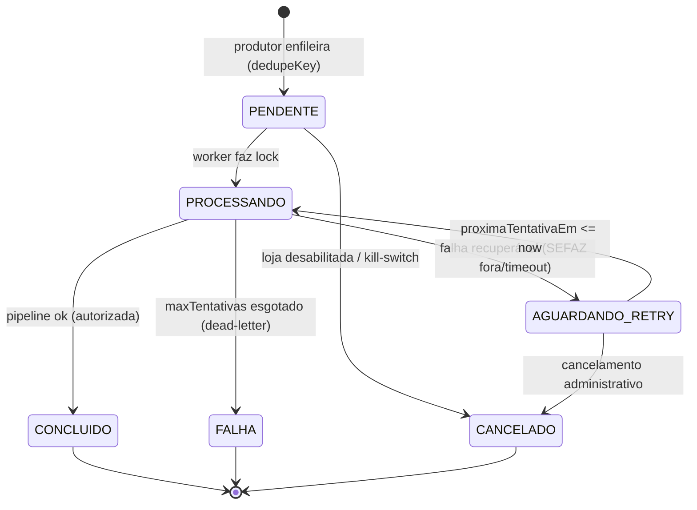
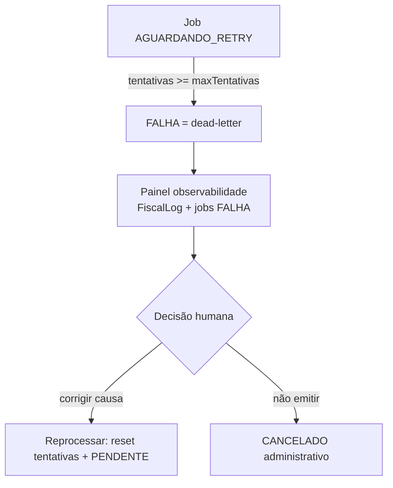

# 🧾 FISCAL_EVENTS — Eventos fiscais e ciclo de vida da fila

> **Documento oficial** dos eventos fiscais (autorização, cancelamento, inutilização, CC-e,
> rejeições) e do ciclo de vida da fila (`FiscalEmissaoJob`): retentativas, dead-letter,
> reprocessamento.
> **Princípios:** `docs/decisions/ADR-0008-fiscal-architecture.md` (P2 fila, P4 XML imutável).
> **Dados:** `docs/architecture/FISCAL_SCHEMA_DESIGN.md` · **Fluxo:** `NFCE_ARCHITECTURE.md`.
>
> ⚠️ Hoje só o **provider STUB** responde a `cancelar`/`inutilizar` (simulado); **não existe**
> serviço que grava `EventoFiscal` real nem worker que drena a fila. Isto é a arquitetura-alvo
> das fases **F9 (eventos)** e **F7/F10 (fila/contingência)**.

---

## 1. Taxonomia de eventos

Um **evento fiscal** é um documento secundário que altera o estado de uma nota **já existente**
(autorizada), sem nunca reescrever o XML original (ADR-0008 P4). Mapeia o enum `TipoEventoFiscal`:

| Evento | `TipoEventoFiscal` | Pré-condição | Efeito na nota |
|---|---|---|---|
| **Autorização** | (não é evento — é o resultado da emissão) | nota `EMITINDO` | `AUTORIZADA` |
| **Cancelamento** | `CANCELAMENTO` | nota `AUTORIZADA` + dentro da janela legal | `CANCELADA` |
| **Carta de Correção (CC-e)** | `CARTA_CORRECAO` | nota `AUTORIZADA` (campos corrigíveis) | nota inalterada + evento vinculado |
| **Inutilização** | `INUTILIZACAO` | faixa de numeração **não usada** (quebra de sequência) | nenhuma nota (numeração queimada) |
| **Contingência (envio)** | `CONTINGENCIA_ENVIO` | nota emitida offline aguardando transmissão | registra a transmissão posterior |
| **Rejeição** | (não gera `EventoFiscal`) | retorno cStat≠100 na emissão | `REJEITADA` (corrige + reenvia) |

> **CC-e:** aplicável a NF-e; para **NFC-e** a CC-e tem uso restrito (muitos campos não são
> corrigíveis por carta). O schema já prevê o tipo; a regra por modelo entra na implementação (F9).

---

## 2. Autorização (resultado da emissão)

Não é um `EventoFiscal` — é o desfecho feliz do pipeline (`NFCE_ARCHITECTURE §4 Etapa 7-8`).

- **Entrada:** XML assinado transmitido; **Saída:** `cStat 100` + `protocolo` + `dataAutorizacao`.
- **Persistência:** `NotaFiscal.status = AUTORIZADA`, `xmlAutorizado`, `Venda.fiscalStatus = AUTORIZADA`.
- **Trilha:** `FiscalLog acao = emissao.resultado, cStat = 100`.
- A partir daqui, qualquer alteração é **por evento** (cancelamento/CC-e) — nunca por edição.

---

## 3. Cancelamento

- **Entradas:** `chaveAcesso`, `protocolo`, `justificativa` (15–255 chars — validado hoje no STUB).
- **Pré-condições:** nota `AUTORIZADA` (`canCancelarFiscalmente`), **dentro da janela legal**.
- **Saídas:** evento autorizado → `NotaFiscal.status = CANCELADA`, `Venda.fiscalStatus =
  CANCELADA_FISCAL`; evento rejeitado → nota permanece `AUTORIZADA`.
- **Falhas:** fora da janela → bloqueio com mensagem clara (não transmite); justificativa curta →
  `justificativa_invalida`; SEFAZ rejeita → evento `REJEITADO`.
- **Rollback:** o cancelamento **é** a forma de "desfazer" fiscalmente; não há delete da nota.
- **Idempotência:** `@@unique([notaFiscalId, tipo, sequencia])` — reenviar o mesmo cancelamento
  não cria evento duplicado; consulta de status confirma se já foi registrado.

---

## 4. Inutilização

- **Quando:** quebra de sequência de numeração (um número foi **pulado** e nunca virou nota).
- **Entradas:** `serie`, `numeroInicial`, `numeroFinal`, `justificativa`
  (`FiscalProviderInutilizacaoParams`).
- **Processo (alvo):** valida a faixa, cria `EventoFiscal INUTILIZACAO`, transmite, marca a faixa
  como queimada (não pode ser reaproveitada).
- **Saída:** evento `AUTORIZADO`; nenhuma `NotaFiscal` associada (não há documento).
- **Falhas:** faixa já usada por nota autorizada → bloqueio; faixa inválida → `parametros_invalidos`.
- **Idempotência:** por `(serie, numeroInicial, numeroFinal)` + `@@unique` do evento.

> **Prevenção é melhor que inutilização:** a numeração (`numbering/*`) só reserva número **ao
> emitir** e é atômica/idempotente — minimiza buracos de sequência por construção.

---

## 5. Carta de Correção (CC-e)

- **Quando:** corrigir informação **acessória** de NF-e autorizada (não valores, não destinatário,
  não datas). Uso em **NFC-e é restrito** — avaliar por modelo na F9.
- **Entradas:** texto da correção + `sequencia` (CC-e pode ter várias).
- **Saída:** `EventoFiscal CARTA_CORRECAO` autorizado, **vinculado** à nota; a nota e o XML
  original permanecem **imutáveis** (P4).
- **Idempotência:** `sequencia` incremental + `@@unique([notaFiscalId, tipo, sequencia])`.

---

## 6. Rejeições

Rejeição **não** gera `EventoFiscal` — é o retorno `cStat≠100` da própria emissão:

- **Causas comuns:** dado obrigatório ausente, NCM inválido, CSOSN×CFOP incompatível, certificado,
  CSC errado, schema XSD.
- **Tratamento:** `NotaFiscal.status = REJEITADA` + `Venda.fiscalStatus = REJEITADA`; `cStat`/
  `xMotivo` persistidos; trilha em `FiscalLog`.
- **Recuperação:** corrigir a origem (config/produto/snapshot) → **nova tentativa** (`tentativas++`,
  nova `NotaFiscal` vigente) → reprocessa. O documento rejeitado **não** é editado in-place.
- **Denegação (`DENEGADA`):** caso especial — problema cadastral/fiscal do emitente/destinatário
  na SEFAZ; a numeração é consumida e o documento não pode ser reaproveitado.

---

## 7. Fila de emissão (`FiscalEmissaoJob`) — ciclo de vida

**Tipos de job (`FiscalJobTipo`):** `EMISSAO`, `CANCELAMENTO`, `INUTILIZACAO`,
`CONTINGENCIA_TRANSMISSAO`, `CONSULTA` — a fila serve a **todos** os atos fiscais assíncronos,
não só à emissão.

### 7.1 Lock (concorrência segura)
- `lockOwner` (id do worker) + `lockedAt` + `lockExpiresAt`.
- Worker só processa job com lock livre **ou** lock expirado (`lockExpiresAt < now`).
- Worker que morre não trava o job: o lock expira e outro worker reassume.

### 7.2 Retentativas (backoff)
- A cada falha recuperável: `tentativas++`, `proximaTentativaEm = now + backoff(tentativas)`,
  `status = AGUARDANDO_RETRY`.
- Varredura por `@@index([status, proximaTentativaEm])`: o worker pega o próximo job elegível.
- Teto: `maxTentativas` (default 5). Backoff sugerido: exponencial com teto (ex.: 1m, 5m, 15m, 1h, 3h).

---

## 8. Dead-letter queue (DLQ)

- **DLQ = jobs em `FALHA`** após esgotar tentativas. **Nunca** somem; ficam para inspeção.
- **Causas típicas:** rejeição persistente (dado errado), certificado vencido, CSC inválido,
  SEFAZ fora por muito tempo.
- **Reprocessamento:** após corrigir a causa-raiz, um job em `FALHA` pode ser **reposto** em
  `PENDENTE` (reset de `tentativas`/`proximaTentativaEm`) — **sem** re-serializar XML (P4):
  reusa o documento já gerado/assinado.
- **Cancelamento administrativo:** se a venda não deve mesmo emitir, `status = CANCELADO`
  (não confundir com cancelamento **fiscal** de nota autorizada).

---

## 9. Reprocessamento — regras de ouro

1. **Reprocessar ≠ reemitir do zero.** Reusa snapshot + XML existentes; nunca lê dado vivo (P3/P4).
2. **Consulta antes de retransmitir.** Antes de reenviar, consultar por `chaveAcesso` evita
   autorizar o mesmo documento duas vezes (a chave é `@unique`).
3. **Idempotência preserva o efeito.** `AUTORIZADA → no-op`; `dedupeKey` evita job duplicado.
4. **Correção de dado → nova tentativa, não edição.** Rejeição vira nova `NotaFiscal` vigente.
5. **Tudo deixa trilha.** `FiscalLog` registra cada reprocessamento (quem, quando, resultado).

---

## 10. Observabilidade (alvo P2)

Painel sobre `FiscalEmissaoJob` + `FiscalLog`:
- Fila por estado (`PENDENTE`/`PROCESSANDO`/`AGUARDANDO_RETRY`/`FALHA`) por loja.
- Distribuição de `cStat` (autorizações × rejeições × denegações).
- Jobs em dead-letter (alerta quando > 0).
- Tempo médio venda → autorização (deve ser eventual, sem impactar o balcão).

---

## 11. Referências

- Princípios: `docs/decisions/ADR-0008-fiscal-architecture.md`.
- Dados: `docs/architecture/FISCAL_SCHEMA_DESIGN.md` (EventoFiscal, FiscalEmissaoJob, FiscalLog).
- Fluxo de emissão: `docs/architecture/NFCE_ARCHITECTURE.md` (§5 estados, §7 idempotência/retry).
- Segurança: `docs/architecture/FISCAL_SECURITY.md`.
- Plano/fases: `docs/governance/MASTER_FISCAL_EXECUTION_PLAN.md` (F7, F9, F10).
- Código (contrato de eventos no provider): `lib/fiscal/provider/types.ts`
  (`cancelar`/`inutilizar`/`consultar`), `prisma/schema.prisma` (`EventoFiscal`, `FiscalEmissaoJob`).
