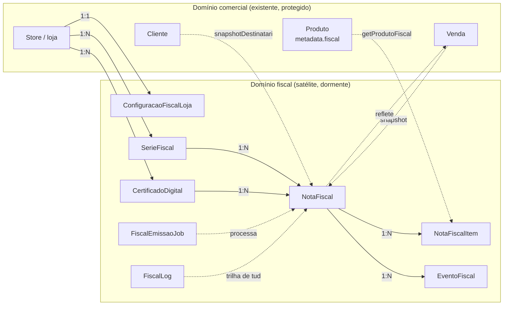
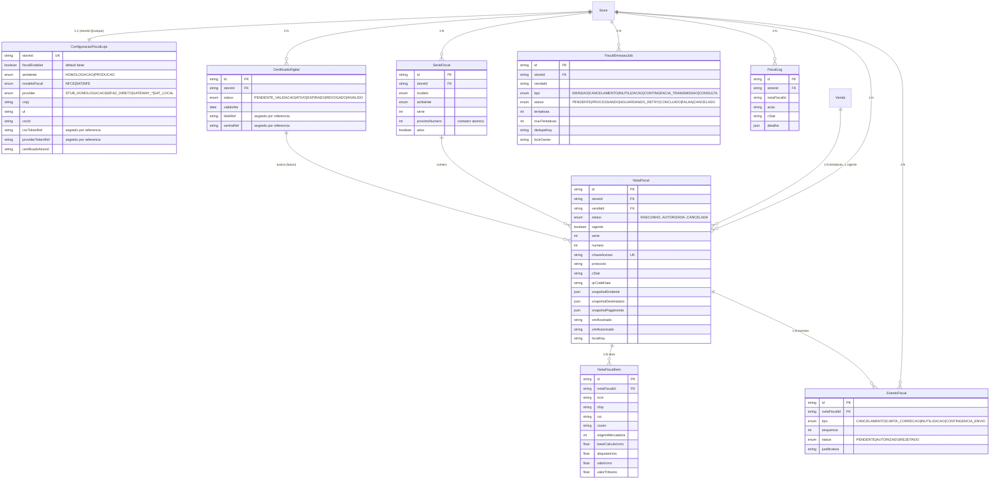
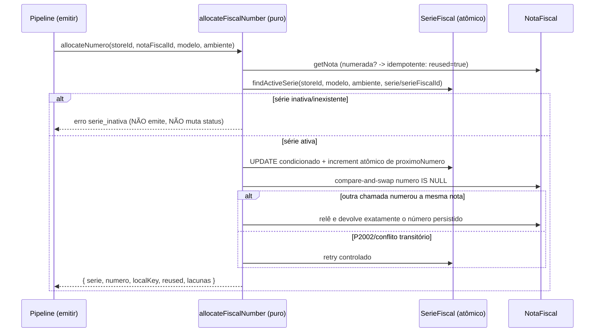
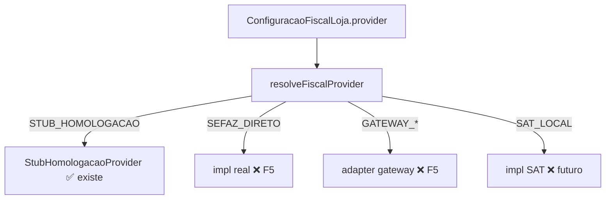
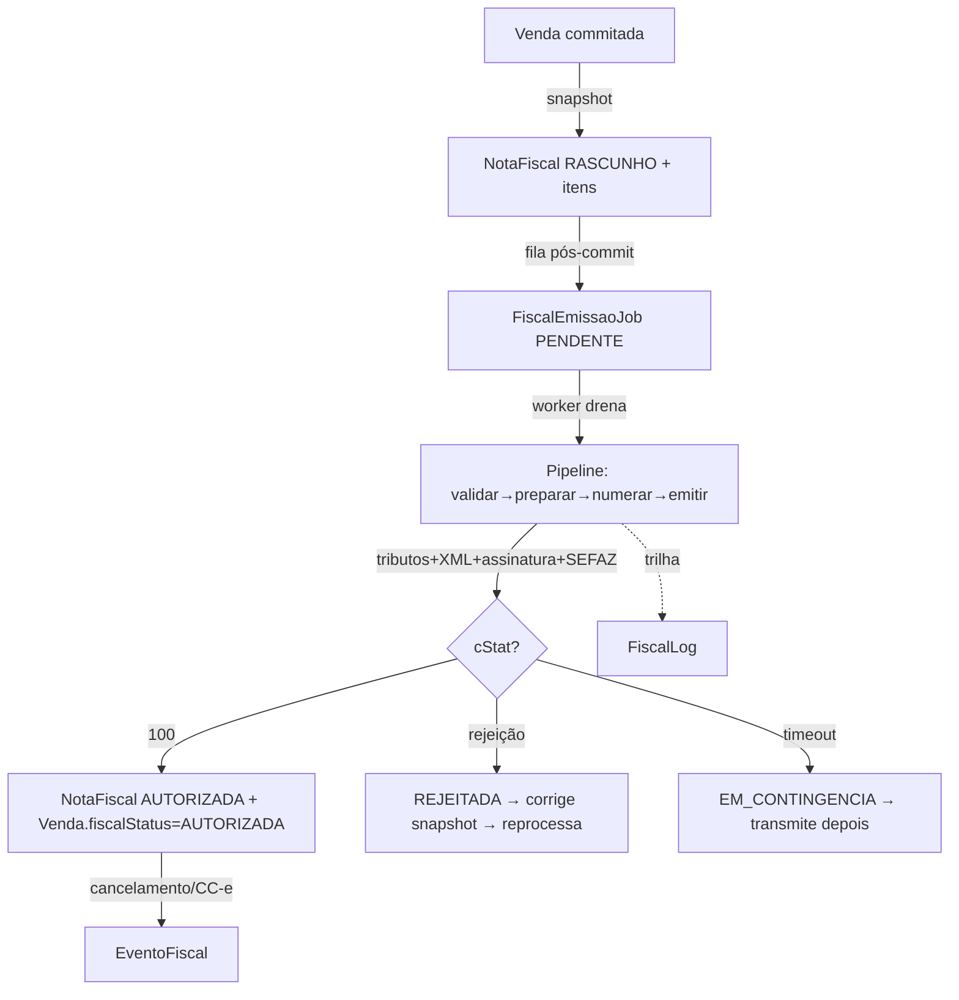

# 🧾 FISCAL_SCHEMA_DESIGN — Desenho das entidades fiscais

> **Documento oficial de arquitetura de dados** da frente Fiscal (NFC-e/SAT/NF-e).
> Espelha o bloco fiscal **já existente** em `prisma/schema.prisma` (~L2072, GOAL_001B). É o
> documento que o comentário `schema.prisma:2077` cita como desenho do schema fiscal.
> **Princípios:** `docs/decisions/ADR-0008-fiscal-architecture.md`.
> **Fluxo de emissão:** `docs/architecture/NFCE_ARCHITECTURE.md`.
>
> ⚠️ **Nada aqui propõe alterar o schema.** O schema fiscal já está aplicado e dormente; este
> doc o documenta e racionaliza. Mudança de schema exige autorização explícita + ADR
> (`MASTER_FISCAL_EXECUTION_PLAN §11`).

---

## 1. Visão de conjunto

O domínio fiscal é um **satélite** do domínio comercial (ADR-0008 P1). Ele se conecta ao
comercial por **dois pontos apenas**:

1. **Entrada (comercial → fiscal):** o **snapshot congelado** da venda (`buildVendaFiscalSnapshot`)
   materializa `NotaFiscal` + `NotaFiscalItem`. Daí em diante o fiscal **não relê** dado vivo.
2. **Saída (fiscal → comercial):** o campo colapsado **`Venda.fiscalStatus`** reflete, read-only,
   o estado fiscal para a UI do PDV/recibo.

**Convenção de leitura:** linha cheia = FK relacional no Prisma; linha tracejada = relação
**lógica** materializada por código (snapshot/reflexo), sem FK direta.

---

## 2. Entidades e responsabilidades

| Entidade (tabela) | Responsabilidade única | Cardinalidade |
|---|---|---|
| `ConfiguracaoFiscalLoja` (`configuracoes_fiscais_loja`) | Identidade fiscal + flags + provider + CSC da loja | 1:1 com `Store` |
| `CertificadoDigital` (`certificados_digitais`) | Metadados do A1 + **referência** ao segredo | N:1 com `Store` |
| `SerieFiscal` (`series_fiscais`) | Série + contador atômico de numeração | N:1 com `Store` |
| `NotaFiscal` (`notas_fiscais`) | Documento fiscal: cabeçalho, snapshots, resultado SEFAZ, XML | N:1 com `Venda`/`Store` |
| `NotaFiscalItem` (`notas_fiscais_itens`) | Item fiscal congelado (identidade + tributos) | N:1 com `NotaFiscal` |
| `EventoFiscal` (`eventos_fiscais`) | Cancelamento/CC-e/inutilização/contingência | N:1 com `NotaFiscal` |
| `FiscalEmissaoJob` (`fiscal_emissao_jobs`) | Fila idempotente pós-commit (lock/retry/dedupe) | N:1 com `Store` |
| `FiscalLog` (`fiscal_logs`) | Trilha append-only de toda interação fiscal | N:1 com `Store` |

> **FiscalProvider não é tabela.** É um **contrato de código** (`lib/fiscal/provider/types.ts`),
> selecionado pela coluna `ConfiguracaoFiscalLoja.provider` (enum `FiscalProviderTipo`). Ver §7.
> **FiscalNumber não é tabela.** É o **número alocado** (`serie`/`numero` em `NotaFiscal`),
> reservado atomicamente a partir de `SerieFiscal.proximoNumero`. Ver §6.

---

## 3. Diagrama entidade-relacionamento (fiscal)

---

## 4. Campos por entidade (obrigatórios × opcionais)

> "Obrigatório" = sem `?` no Prisma (tem `@default` ou é `NOT NULL`). "Opcional" = `String?`,
> `Int?`, etc. (nullable). Os defaults vêm do schema real.

### 4.1 `ConfiguracaoFiscalLoja` — identidade fiscal por loja (1:1)
| Campo | Tipo | Oblig.? | Papel / motivação |
|---|---|---|---|
| `storeId` | String `@unique` | ✅ | Escopo multi-loja (ADR-0003); 1:1 com `Store` |
| `fiscalEnabled` | Boolean `@default(false)` | ✅ | **Kill-switch / default-off** (ADR-0008 P7) |
| `ambiente` | `AmbienteFiscal @default(HOMOLOGACAO)` | ✅ | Homologação até F12; vira `PRODUCAO` por loja |
| `modeloFiscal` | `ModeloFiscal @default(NFCE)` | ✅ | NFC-e primeiro; SAT/NF-e depois |
| `provider` | `FiscalProviderTipo @default(STUB_HOMOLOGACAO)` | ✅ | Seleciona a impl. do contrato (§7) |
| `cnpj`, `razaoSocial`, `uf`, `crt`, `regimeTributario` | String/Int/enum `@default` | ✅ | Identidade fiscal mínima do emitente |
| `logradouro`..`cep`, `codigoMunicipioIbge`, `municipio` | String `@default("")` | ✅ | Endereço **estruturado** (exigência do XML) |
| `cscId` | String `@default("")` | ✅ | Identificador do CSC (não-segredo) |
| `cscTokenRef` | String? | ⛔ opcional | **Referência** ao token CSC (segredo — nunca em claro) |
| `providerConfig` | Json? `@db.JsonB` | ⛔ opcional | Config livre do provider (não-segredo) |
| `providerTokenRef` | String? | ⛔ opcional | **Referência** ao token do gateway (segredo) |
| `certificadoAtivoId` | String? | ⛔ opcional | Aponta o `CertificadoDigital` ativo |

### 4.2 `CertificadoDigital` — A1 por loja
| Campo | Tipo | Oblig.? | Papel |
|---|---|---|---|
| `storeId` | String | ✅ | Multi-loja |
| `tipo` | String `@default("A1")` | ✅ | A1 (arquivo) — A3 fora de escopo inicial |
| `status` | `CertificadoStatus @default(PENDENTE_VALIDACAO)` | ✅ | Ciclo de vida do certificado |
| `validoDe` / `validoAte` | DateTime? | ⛔ opcional | Vigência (alerta de expiração via `@@index([validoAte])`) |
| `blobRef` | String? | ⛔ opcional | **Referência** ao `.pfx` no cofre — **nunca** os bytes |
| `senhaRef` | String? | ⛔ opcional | **Referência** à senha no cofre — **nunca** em claro |
| `serialNumber`, `fingerprint`, `titularCn`, `cnpjTitular` | String `@default("")` | ✅ | Metadados de identificação (não-segredo) |

> Detalhe de segurança do cofre/segredo: `docs/architecture/FISCAL_SECURITY.md`.

### 4.3 `SerieFiscal` — numeração atômica
| Campo | Tipo | Oblig.? | Papel |
|---|---|---|---|
| `storeId`, `modelo`, `ambiente`, `serie` | String/enum/Int | ✅ | Chave de numeração `@@unique([storeId, modelo, serie, ambiente])` |
| `proximoNumero` | Int `@default(1)` | ✅ | **Contador atômico** (reserva por incremento — §6) |
| `ativo` | Boolean `@default(true)` | ✅ | Série inativa ⇒ numeração indisponível (não emite) |

### 4.4 `NotaFiscal` — documento fiscal
| Campo | Tipo | Oblig.? | Papel |
|---|---|---|---|
| `storeId`, `vendaId` | String | ✅ | Vínculo (onDelete: Restrict — nota nunca some por cascade) |
| `modelo`, `ambiente`, `tipoEmissao`, `status` | enum `@default` | ✅ | Estado e classificação do documento |
| `vigente` | Boolean `@default(true)` | ✅ | 1 venda → N tentativas, **1 vigente** (índice parcial na migration) |
| `serie`, `numero` | Int? | ⛔ opcional | Numeração — só após alocação (§6) |
| `chaveAcesso` | String? `@unique` | ⛔ opcional | 44 dígitos — preenchida na emissão (P0-2) |
| `protocolo`, `cStat`, `xMotivo`, `dataAutorizacao` | String?/DateTime? | ⛔ opcional | **Resultado SEFAZ** |
| `qrCodeData`, `urlConsulta` | String? | ⛔ opcional | QR-Code NFC-e (P0-5) |
| `valorTotal`..`valorTotalTributos` | Float `@default(0)` | ✅ | Totais (Lei da Transparência) |
| `snapshotEmitente`/`Destinatario`/`Pagamento` | Json? `@db.JsonB` | ⛔ opcional | **Foto congelada** do instante (ADR-0008 P3) |
| `xmlAssinado`, `xmlAutorizado` | String? `@db.Text` | ⛔ opcional | **Registro legal** — nunca recalculado (P4) |
| `xmlStorageRef` | String? | ⛔ opcional | Referência a storage externo (XML grande) |
| `localKey` | String? | ⛔ opcional | Idempotência `@@unique([storeId, localKey])` |
| `tentativas`, `ultimoErro` | Int/String? | ✅/⛔ | Telemetria de reprocessamento |
| `dataContingencia`, `justContingencia` | DateTime?/String? | ⛔ opcional | Contingência offline (P1-3) |

**Índices-chave:** `@@unique([storeId, modelo, serie, numero, ambiente])` (sem colisão de
numeração), `@@unique([storeId, localKey])` (idempotência), `@@unique(chaveAcesso)` (chave única
global).

### 4.5 `NotaFiscalItem` — item congelado
Identidade fiscal (`ncm`, `cest`, `cfop`, `cst`, `csosn`, `origemMercadoria`, `unidadeComercial`)
+ valores (`quantidade`, `valorUnitario`, `valorBruto`, `valorDesconto`, `valorTotal`) +
**tributos** (`baseCalculoIcms`, `aliquotaIcms`, `valorIcms`, `valorTributos`). Hoje o snapshot
grava tributos = `0` (gap **P0-1**: motor de tributos é a F2). `numeroItem` ordena os itens.

### 4.6 `EventoFiscal` — eventos da nota
`tipo` (`CANCELAMENTO`/`CARTA_CORRECAO`/`INUTILIZACAO`/`CONTINGENCIA_ENVIO`), `sequencia`,
`status`, `justificativa`, `xmlEvento`/`xmlRetorno`. **Idempotente** por
`@@unique([notaFiscalId, tipo, sequencia])`. Detalhe de fluxo: `FISCAL_EVENTS.md`.

### 4.7 `FiscalEmissaoJob` — fila pós-commit
`tipo`/`status` (enums), `tentativas`/`maxTentativas`/`proximaTentativaEm`/`prioridade`,
lock (`lockOwner`/`lockedAt`/`lockExpiresAt`), `dedupeKey`, `payload`. **Idempotente** por
`@@unique([storeId, dedupeKey])`; varredura por `@@index([status, proximaTentativaEm])`.
Tabela existe; **produtor e worker são a F7** (gap P0-6).

### 4.8 `FiscalLog` — trilha append-only
`nivel`, `acao`, `cStat`, `xMotivo`, `mensagem`, `detalhe` (JSONB), com `vendaId`/`notaFiscalId`/
`eventoFiscalId`/`jobId` para correlação. **Nunca** carrega segredo no `detalhe`.

---

## 5. Enums fiscais (12) — semântica

| Enum | Valores | Uso |
|---|---|---|
| `FiscalStatusVenda` | NAO_FISCAL · PENDENTE · EMITINDO · EM_CONTINGENCIA · AUTORIZADA · REJEITADA · CANCELADA_FISCAL · BLOQUEADA_FISCAL | Campo colapsado `Venda.fiscalStatus` (reflexo) |
| `StatusNotaFiscal` | RASCUNHO · VALIDANDO · ASSINADA · TRANSMITINDO · AUTORIZADA · REJEITADA · DENEGADA · CONTINGENCIA · CANCELADA · INUTILIZADA · ERRO | Estado granular do documento |
| `ModeloFiscal` | NFCE · SAT · NFE | Modelo do documento |
| `AmbienteFiscal` | HOMOLOGACAO · PRODUCAO | Ambiente SEFAZ |
| `TipoEmissao` | NORMAL · CONTINGENCIA_OFFLINE | Modo de emissão |
| `RegimeTributario` | SIMPLES_NACIONAL · SIMPLES_NACIONAL_EXCESSO · REGIME_NORMAL · MEI | Define CSOSN×CST (motor de tributos F2) |
| `FiscalProviderTipo` | STUB_HOMOLOGACAO · SEFAZ_DIRETO · GATEWAY_FOCUS · GATEWAY_PLUGNOTAS · GATEWAY_ENOTAS · GATEWAY_NFEIO · SAT_LOCAL | Seleciona impl. do contrato |
| `CertificadoStatus` | PENDENTE_VALIDACAO · ATIVO · EXPIRADO · REVOGADO · INVALIDO | Ciclo de vida do A1 |
| `TipoEventoFiscal` | CANCELAMENTO · CARTA_CORRECAO · INUTILIZACAO · CONTINGENCIA_ENVIO | Tipo de evento |
| `StatusEventoFiscal` | PENDENTE · AUTORIZADO · REJEITADO | Estado do evento |
| `FiscalJobTipo` | EMISSAO · CANCELAMENTO · INUTILIZACAO · CONTINGENCIA_TRANSMISSAO · CONSULTA | Tipo de job na fila |
| `FiscalJobStatus` | PENDENTE · PROCESSANDO · AGUARDANDO_RETRY · CONCLUIDO · FALHA · CANCELADO | Estado do job |

---

## 6. FiscalNumber — numeração como entidade lógica

Não há tabela `FiscalNumber`. O número fiscal é o par `(serie, numero)` em `NotaFiscal`,
reservado a partir de `SerieFiscal.proximoNumero`. A identidade do contador é sempre a chave
completa `(storeId, modelo, serie, ambiente)`; não existe contador global, fallback de loja,
série literal ou troca automática de ambiente.

### 6.1 Invariantes endurecidas no GOAL-010

- A reserva é um único `UPDATE` atômico que revalida `id`, `storeId`, `modelo`, `serie`,
  `ambiente`, `ativo=true` e `proximoNumero` entre `1` e `999.999.999`, incrementando o contador
  sem read-modify-write na aplicação.
- A unicidade de `SerieFiscal(storeId, modelo, serie, ambiente)` isola linhas e locks; a unicidade
  de `NotaFiscal(storeId, modelo, serie, numero, ambiente)` atua como segunda barreira contra
  duplicidade.
- Nota já numerada retorna o mesmo `serieFiscalId`, série, número, ambiente e `localKey`, sem tocar
  no contador. O vínculo inicial usa compare-and-swap e nunca sobrescreve número persistido.
- Conflitos transitórios e colisões usam retry limitado (padrão 3, teto 10). Esgotamento falha
  claramente; não reinicia nem retrocede o contador.
- Zero, negativos e valores acima de `999.999.999` falham antes do incremento. O último número
  válido pode ser reservado uma vez; o estado seguinte fica esgotado e não reinicia.
- Reserva seguida de falha de vínculo não sofre rollback. O resultado carrega loja, nota,
  `localKey`, série fiscal, modelo, ambiente, série, número, motivo e
  `requerInutilizacao=true`, preparando a futura inutilização sem chamar a SEFAZ neste GOAL.
- A integração opt-in do pipeline ocorre antes da geração definitiva de XML/chave e antes do
  provider. Sem a porta de numeração, o dry-run permanece puro, determinístico e sem banco.
- Essa integração aceita somente NFC-e/HOMOLOGACAO; PRODUCAO (`tpAmb=1`) permanece bloqueada antes
  de qualquer acesso ao contador. O piloto continua restrito à Matriz RafaCell Assistec por
  `storeId` real obtido em runtime, sem registrar seu valor em documentação ou fixture.

Código: `lib/fiscal/numbering/*` e integração mínima em `lib/fiscal/pipeline/fiscal-pipeline.ts`.
Falha de numeração aborta o pipeline antes de XML/chave/provider. Nenhuma transmissão ou
inutilização SEFAZ foi adicionada.

---

## 7. FiscalProvider — abstração como entidade lógica

Não há tabela `FiscalProvider`. É o **contrato** `interface FiscalProvider`
(`lib/fiscal/provider/types.ts`), resolvido por `resolveFiscalProvider` a partir de
`ConfiguracaoFiscalLoja.provider`:

**8 métodos do contrato:** `validarConfiguracao`, `validarSnapshot`, `prepararEmissao`
(síncronos/puros) + `emitir`, `consultar`, `cancelar`, `inutilizar`, `statusServico`
(assíncronos — já refletem I/O real). Hoje só `STUB_HOMOLOGACAO` existe; os demais retornam
`provider_nao_implementado`. **Princípio:** o provider só consome o **snapshot congelado** —
nunca relê Produto/Venda (ADR-0008 P3/P5).

---

## 8. Fluxos completos (resumo; detalhe em NFCE_ARCHITECTURE.md)

> **Estado atual:** as etapas `tributos+XML+assinatura+SEFAZ` são **simuladas** (`STUB`),
> e não há produtor/worker da fila. O que existe e está testado: snapshot, numeração,
> orquestração do pipeline (simulada), state machine, identidade por loja.

---

## 9. Decisões de design (motivação)

| Decisão | Por quê |
|---|---|
| **Snapshots em JSONB na própria `NotaFiscal`** | Foto auto-contida; o documento não depende de joins vivos (ADR-0008 P3) |
| **XML em colunas `@db.Text` + `xmlStorageRef`** | Registro legal junto do documento; ref externa para XML grande sem inchar a linha |
| **`onDelete: Restrict` em `NotaFiscal`** | Documento fiscal **nunca** some por cascade de venda/loja; correção é por evento |
| **`vigente` + N tentativas** | Reenvio após rejeição cria nova tentativa sem perder histórico; 1 vigente por venda |
| **Numeração separada (`SerieFiscal`) do documento** | Contador atômico isolado; numera só quando vai emitir; multi-série por loja |
| **Fila (`FiscalEmissaoJob`) separada do documento** | Desacopla balcão da SEFAZ (ADR-0008 P1/P2); lock/retry/dedupe próprios |
| **Segredo só por `*Ref`** | Cofre fora do banco; backup do DB não carrega `.pfx`/senha (ADR-0008 P6) |
| **`localKey` em snapshot/nota/job** | Idempotência determinística por `storeId` (padrão do projeto) |

---

## 10. Evolução futura

- **Tributos (F2):** preencher `NotaFiscalItem.base/aliquota/valorIcms/valorTributos` a partir
  de `lib/fiscal/tributos/*` (hoje `0`). Sem mudança de schema — colunas já existem.
- **Destinatário estruturado (P1-4):** o snapshot lê hoje `cliente.municipio`; NFC-e nominal/NF-e
  exigem endereço completo. Pode exigir capturar mais campos do `Cliente` (avaliar no F-respectivo).
- **Multi-modelo (SAT/NF-e):** enums já preveem; lógica por modelo é incremento (P2).
- **`xmlStorageRef`:** quando o volume de XML pesar, mover corpo para storage e manter só a ref.
- **Particionamento de `FiscalLog`:** se a trilha crescer muito, particionar por `createdAt`/loja.

> **Regra:** qualquer evolução que toque o schema é **aditiva**, autorizada e com ADR
> (`MASTER_FISCAL_EXECUTION_PLAN §11`). O alvo é **não** mexer no schema nas fases de emissão.

---

## 11. Referências

- Schema real: `prisma/schema.prisma` (bloco fiscal ~L2072–2492).
- Código: `lib/fiscal/**` (identity, state-machine, snapshot, provider, emission, numbering).
- Princípios: `docs/decisions/ADR-0008-fiscal-architecture.md`.
- Fluxo de emissão: `docs/architecture/NFCE_ARCHITECTURE.md`.
- Eventos: `docs/architecture/FISCAL_EVENTS.md` · Segurança: `docs/architecture/FISCAL_SECURITY.md`.
- Plano/roadmap: `docs/governance/MASTER_FISCAL_EXECUTION_PLAN.md`, `docs/roadmaps/ROADMAP_FISCAL.md`.
- Auditorias: `docs/audits/AUDITORIA_PRE_FISCAL_READINESS_v01.md`, `AUDITORIA_FISCAL_GAPS_v01.md`.
