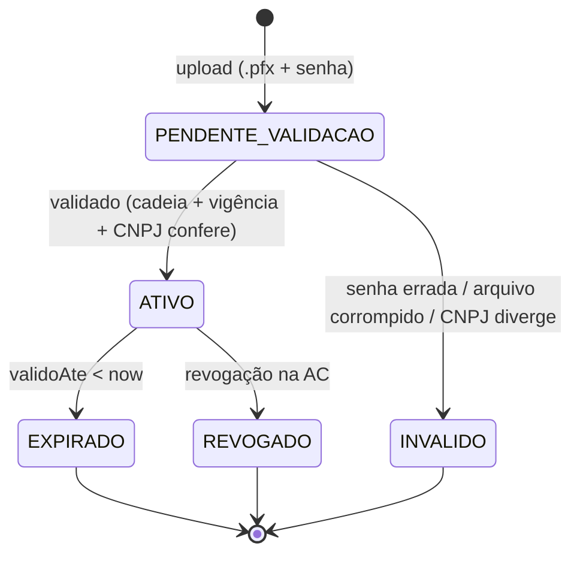
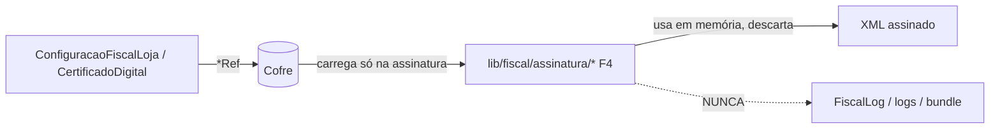

# 🔐 FISCAL_SECURITY — Segurança dos segredos fiscais

> **Documento oficial de arquitetura de segurança** dos segredos fiscais: certificado A1,
> senha do `.pfx`, CSC (NFC-e) e token de gateway.
> **Princípio fundador:** ADR-0008 **P6 — segredo só por referência**.
>
> ⚠️ **Este documento é arquitetura, não implementação.** Ele define *o que* deve ser garantido
> e *quais opções* existem. A escolha concreta do cofre (Vault × KMS × env por loja) é uma
> **decisão de ADR próprio** — a **Fase F1 [GATE HUMANO]** do `MASTER_FISCAL_EXECUTION_PLAN`.
> **Nenhum `.pfx` real sobe antes desse ADR aprovado.** Nada aqui implementa cripto/cofre.

---

## 1. O que é segredo (e o que não é)

| Dado | Sensibilidade | Onde mora hoje (schema) |
|---|---|---|
| **`.pfx` (bytes do A1)** | 🔴 segredo crítico (permite emitir/assinar em nome do contribuinte) | `CertificadoDigital.blobRef` → **referência**; bytes **fora do banco** |
| **Senha do `.pfx`** | 🔴 segredo crítico | `CertificadoDigital.senhaRef` → **referência** |
| **Token CSC (NFC-e)** | 🔴 segredo (permite forjar QR válido) | `ConfiguracaoFiscalLoja.cscTokenRef` → **referência** |
| **Token de gateway** | 🔴 segredo (acesso à conta do emissor externo) | `ConfiguracaoFiscalLoja.providerTokenRef` → **referência** |
| `cscId` | 🟡 identificador (não-segredo) | coluna em claro (ok) |
| Serial/fingerprint/titular do cert | 🟢 metadado público | colunas em claro (ok) |
| CNPJ/IE/endereço da loja | 🟢 dado fiscal público | colunas em claro (ok) |

**Invariante (ADR-0008 P6):** todo campo 🔴 aparece no schema **apenas** como `*Ref` (um
ponteiro para o cofre). **Nunca** os bytes/senha/token em coluna, log, trace, `FiscalLog.detalhe`,
mensagem de erro ou bundle do cliente.

---

## 2. Certificado A1 — ciclo de vida



Mapeia o enum `CertificadoStatus`. Regras:
- **Upload** entrega `.pfx` + senha **direto ao cofre** (nunca ao banco). O banco grava só
  `blobRef`/`senhaRef` + metadados extraídos (serial, fingerprint, titular, `validoDe`/`validoAte`).
- **Validação** confere cadeia ICP-Brasil, vigência e se o CNPJ do titular bate com a loja.
- **Alerta de expiração** via `@@index([validoAte])` — avisar **antes** de vencer (ex.: 30/15/7 dias).
- **`ativo`** marca o certificado vigente da loja (`certificadoAtivoId` em `ConfiguracaoFiscalLoja`).

---

## 3. Estratégia de armazenamento (DECIDIDA — `ADR-0009`)

> ✅ **Decisão tomada** em `docs/decisions/ADR-0009-fiscal-secret-vault.md` (Gate G-F1 resolvido).
> O schema é **agnóstico ao cofre**: `blobRef`/`senhaRef`/`cscTokenRef`/`providerTokenRef` são
> apenas strings de referência opacas, resolvidas por **um port `FiscalSecretVault` server-side**.
> **Piloto/homologação = opção C (env por loja);** **produção/escala = opção B (KMS + storage cifrado).**
> Mesmo contrato nos dois — a virada não toca schema nem callers. As opções abaixo ficam como o
> racional comparativo (matriz completa no ADR-0009 §3).

| Opção | Como funciona | Prós | Contras |
|---|---|---|---|
| **A) Supabase Vault** | Segredo no Vault do próprio Supabase; `*Ref` = id do secret | Já no stack; sem infra nova | Acoplado ao Supabase; granularidade/rotação a validar |
| **B) KMS + storage cifrado** (ex.: cloud KMS + bucket privado) | `.pfx` cifrado em storage; chave no KMS; `blobRef` = path | Rotação de chave robusta; separação cofre × dado | Mais infra; custo; integração |
| **C) Variável de ambiente por loja** | `*Ref` = nome da env (padrão WhatsApp `tokenEnvKey`, ADR-0006) | Simples; segue padrão existente; segredo fora do DB | Não escala p/ muitas lojas; rotação manual; deploy-bound |
| **D) Cofre dedicado** (ex.: HashiCorp Vault) | Cofre externo com políticas/auditoria próprias | Mais completo (lease, rotação, audit nativo) | Maior complexidade operacional |

**Decisão (ADR-0009):** **C (env por loja)** no piloto/homologação — espelha o padrão
`tokenEnvKey` do WhatsApp (ADR-0006): `*Ref` guarda o **nome** da env; o segredo é lido
server-side e nunca persistido. **B (KMS + storage cifrado, envelope encryption)** na
produção/escala — separa o segredo do backup do banco, com rotação por loja. Ambos atrás do
**mesmo port** `FiscalSecretVault` (`EnvVault` → `KmsStorageVault`), sem mudança de schema/callers.
A opção 6 ("banco com `.pfx`/senha em coluna") é **proibida** (backup carrega segredo).

> **Port único (a implementar na F4 — conceitual):**
> ```
> interface FiscalSecretVault {
>   getCertificadoPfx(storeId, blobRef): Promise<Buffer | null>   // server-only; null = não emite
>   getCertificadoSenha(storeId, senhaRef): Promise<string | null>
>   getCscToken(storeId, cscTokenRef): Promise<string | null>
>   putCertificadoPfx(storeId, bytes, senha): Promise<{ blobRef; senhaRef }>  // admin-only, auditado
>   putCscToken(storeId, token): Promise<{ cscTokenRef }>
>   revoke(storeId, ref): Promise<void>
> }
> ```
> Backend resolvido por ambiente. `null` ⇒ **fail-closed** (não emite, sem fallback global).

---

## 4. Acesso ao segredo em runtime (regra de fluxo)



Regras inegociáveis de runtime (a serem honradas na F4):
1. O segredo é resolvido **só no momento da assinatura**, **server-side**, e mantido **só em
   memória** pelo tempo mínimo.
2. **Nunca** logar, serializar em `detalhe`, incluir em mensagem de erro, ou enviar ao cliente.
3. A assinatura roda **fora do client** (Node runtime, nunca Edge/browser).
4. Falha de cofre/segredo produz erro **genérico** ("certificado indisponível"), sem expor causa
   que revele o segredo.

---

## 5. Rotação

| Segredo | Gatilho de rotação | Procedimento (alvo) |
|---|---|---|
| **A1** | Expiração anual / revogação | Upload do novo `.pfx` → valida → marca `ativo` → atualiza `certificadoAtivoId`. Documentos antigos permanecem (XML imutável). |
| **Senha do `.pfx`** | Rotação do certificado | Acompanha a troca do A1 (novo `senhaRef`). |
| **CSC** | Política da SEFAZ/UF ou suspeita de vazamento | Novo `cscId`/`cscTokenRef`; QRs antigos já autorizados continuam válidos (foram autorizados). |
| **Token de gateway** | Política do gateway / incidente | Novo `providerTokenRef`; sem reemitir documentos. |

**Princípio:** rotacionar segredo **nunca** altera documento já autorizado (P4) — só muda o que
será usado **daqui para frente**.

---

## 6. Criptografia (camadas)

- **Em trânsito:** TLS para SEFAZ/gateway e para o cofre. A assinatura XMLDSig usa o A1
  (RSA-SHA1/SHA256 conforme layout) — isso é assinatura, não confidencialidade.
- **Em repouso:** o `.pfx` mora cifrado no cofre (opção A/B/D) ou fora do DB (opção C). O banco
  **nunca** guarda o segredo, então o backup do banco **não** carrega segredo.
- **Chaves de cripto:** quando a opção usar KMS, a chave-mestra fica no KMS, nunca no app.

---

## 7. Permissões (autorização)

- **Configuração fiscal e upload de certificado:** **admin-only** (já garantido por
  `lib/fiscal/guard-fiscal-admin.ts`, GOAL_002). Operador de PDV **não** acessa segredo.
- **Multi-loja estrito:** todo acesso a config/certificado é escopado por `storeId`
  (ADR-0003) — uma loja jamais lê o segredo de outra.
- **Princípio do menor privilégio:** só o serviço de assinatura (server, F4) resolve o segredo;
  o pipeline, o provider e a UI **nunca** o recebem (o provider trabalha só sobre snapshot — P3).
- **Separação de papéis:** quem configura (admin) ≠ quem opera o PDV ≠ o processo que assina.

---

## 8. Auditoria

- **`FiscalLog`** registra toda interação fiscal (montar/assinar/transmitir/consultar + `cStat`),
  com `operador` e `detalhe` — **sem** o segredo. Trilha append-only (nunca deletada).
- **Eventos de segredo auditáveis:** upload de certificado (`uploadedBy`), troca de `ativo`,
  rotação de CSC/token — registrar quem/quando.
- **Verificação contínua (métrica ADR-0008 §6):** 0 ocorrências de `.pfx`/senha/CSC/token em
  log/bundle/coluna. Auditável por varredura (grep no `.next/static`, no schema e nos logs).

---

## 9. Modelo de ameaças (resumo)

| Ameaça | Vetor | Mitigação arquitetural |
|---|---|---|
| Vazamento de A1 | Backup do DB; log; bundle | Segredo fora do DB (`*Ref`); nunca logar; server-only (P6) |
| Emissão indevida | Acesso ao A1 por ator não-admin | Admin-only + menor privilégio + multi-loja estrito |
| Forja de QR NFC-e | CSC vazado | CSC por referência; rotação; nunca em claro |
| Sequestro de conta gateway | Token vazado | Token por referência; rotação; escopo por loja |
| Cross-loja | Bug de escopo | `storeId` obrigatório em toda query (ADR-0003) |
| Segredo em erro/trace | Stack trace detalhado | Erros genéricos para falha de segredo; sanitização |

---

## 10. Checklist de segurança por fase (gate)

Antes de mergear qualquer fase que toque segredo (F1, F4, F5):
- [ ] Segredo aparece **só** como `*Ref` — nada em coluna/claro.
- [ ] Nenhum segredo em `FiscalLog.detalhe`, log de app, mensagem de erro ou bundle do cliente.
- [ ] Assinatura roda **server-side** (Node), nunca Edge/browser.
- [ ] Acesso a config/certificado é **admin-only** e escopado por `storeId`.
- [ ] Rotação descrita e testável (sem afetar documento autorizado).
- [ ] ADR do cofre (F1) aprovado **antes** de qualquer `.pfx` real.
- [ ] Varredura confirma 0 segredo em `.next/static` e no schema.

---

## 11. Referências

- Princípio: `docs/decisions/ADR-0008-fiscal-architecture.md` (P6).
- Decisão do cofre (a fazer): `MASTER_FISCAL_EXECUTION_PLAN.md` **F1 [GATE]** → ADR próprio.
- Padrão precedente de segredo por env: **ADR-0006** (WhatsApp `tokenEnvKey`).
- Dados: `docs/architecture/FISCAL_SCHEMA_DESIGN.md` (`CertificadoDigital`, `ConfiguracaoFiscalLoja`).
- Código: `lib/fiscal/guard-fiscal-admin.ts`, `lib/fiscal/fiscal-identity-service.ts`,
  `prisma/schema.prisma` (`blobRef`/`senhaRef`/`cscTokenRef`/`providerTokenRef`).
- Gaps: `docs/audits/AUDITORIA_FISCAL_GAPS_v01.md` (P0-3 assinatura, P1-6 cofre).
