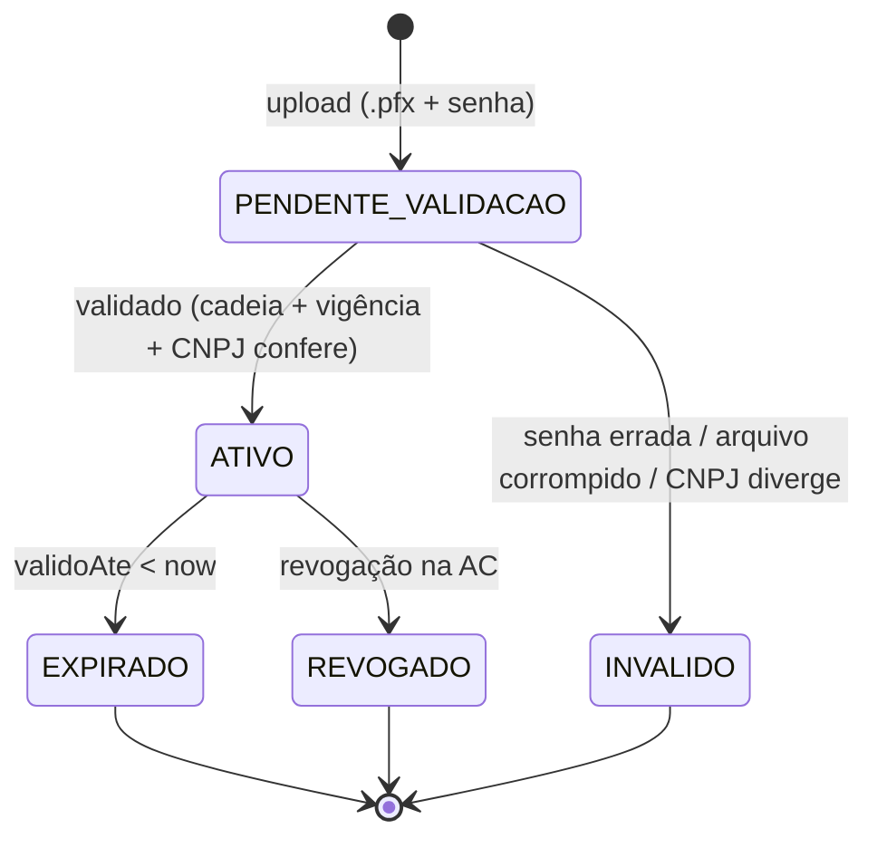
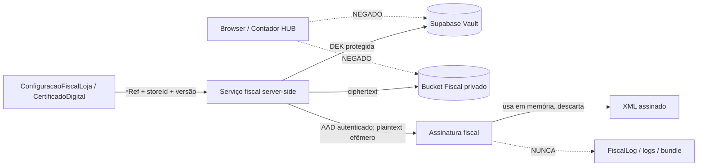

# 🔐 FISCAL_SECURITY — Segurança dos segredos fiscais

> **Documento oficial de arquitetura de segurança** dos segredos fiscais: certificado A1,
> senha do `.pfx`, CSC (NFC-e) e token de gateway.
> **Princípio fundador:** ADR-0008 **P6 — segredo só por referência**.
>
> ⚠️ **Este documento é arquitetura, não implementação.** O contrato foi fixado na ADR-0009 e o
> backend de produção foi fechado na ADR-0014: **Supabase Vault + Storage privado exclusivo do
> Fiscal**, com envelope encryption. **Nenhum `.pfx` real sobe antes de GOAL de implementação e
> provisionamento próprios.** Nada neste documento implementa cripto/cofre.

---

## 1. O que é segredo (e o que não é)

| Dado | Sensibilidade | Onde mora hoje (schema) |
|---|---|---|
| **`.pfx` (bytes do A1)** | 🔴 segredo crítico (permite emitir/assinar em nome do contribuinte) | `CertificadoDigital.blobRef` → **referência**; bytes **fora do banco** |
| **Senha do `.pfx`** | 🔴 segredo crítico | `CertificadoDigital.senhaRef` → **referência** |
| **Token CSC (NFC-e)** | 🔴 segredo (permite forjar QR válido) | `ConfiguracaoFiscalLoja.cscTokenRef` → **referência** |
| **Token de gateway** | 🔴 segredo (acesso à conta do emissor externo) | `ConfiguracaoFiscalLoja.providerTokenRef` → **referência** |
| `cscId` | 🟡 identificador (não-segredo) | coluna em claro (ok) |
| Serial/fingerprint/titular do cert | 🟢 metadado público | colunas em claro (ok) |
| CNPJ/IE/endereço da loja | 🟢 dado fiscal público | colunas em claro (ok) |

**Invariante (ADR-0008 P6):** todo campo 🔴 aparece no schema **apenas** como `*Ref` (um
ponteiro para o cofre). **Nunca** os bytes/senha/token em coluna, log, trace, `FiscalLog.detalhe`,
mensagem de erro ou bundle do cliente.

---

## 2. Certificado A1 — ciclo de vida



Mapeia o enum `CertificadoStatus`. Regras:
- **Upload** entrega `.pfx` + senha **direto ao cofre** (nunca ao banco). O banco grava só
  `blobRef`/`senhaRef` + metadados extraídos (serial, fingerprint, titular, `validoDe`/`validoAte`).
- **Validação** confere cadeia ICP-Brasil, vigência e se o CNPJ do titular bate com a loja.
- **Alerta de expiração** via `@@index([validoAte])` — avisar **antes** de vencer (ex.: 30/15/7 dias).
- **`ativo`** marca o certificado vigente da loja (`certificadoAtivoId` em `ConfiguracaoFiscalLoja`).

---

## 3. Estratégia de armazenamento (DECIDIDA — `ADR-0009` + `ADR-0014`)

> ✅ O schema é **agnóstico ao cofre**: `blobRef`/`senhaRef`/`cscTokenRef`/`providerTokenRef` são
> referências opacas resolvidas pelo port server-side `FiscalSecretVault`.
> **Piloto/homologação:** `EnvVault`, conforme ADR-0009 D2.
> **Produção/escala:** `SupabaseVaultStorageVault`, conforme ADR-0014, substituindo a escolha
> genérica da ADR-0009 D3. A troca de backend não muda schema nem callers.

### 3.1 Hierarquia criptográfica de produção

| Camada | Local | Regra obrigatória |
|---|---|---|
| **Root key / KEK do projeto** | Sistemas protegidos do Supabase | Criada e gerenciada pelo Supabase; fora da aplicação e separada dos blobs fiscais. O runtime fiscal nunca a busca/exporta. |
| **DEK** | Protegida como secret no Supabase Vault | Uma DEK aleatória e distinta **por segredo e por versão**; nunca global, por bucket, apenas por loja ou compartilhada entre lojas. |
| **Ciphertext** | Bucket Supabase Storage privado exclusivo do Fiscal | Um objeto versionado por segredo; nenhum plaintext ou DEK no objeto. |
| **Referência/metadados** | Schema de negócio (`*Ref`) | Apenas referência opaca, `storeId`, certificado/versão/finalidade e estado; nunca chave ou segredo. |

O Vault protege a DEK com a chave do projeto; a DEK cifra o valor fiscal. Esse é o envelope
encryption obrigatório. O bucket Fiscal, suas policies, grants, credenciais e roles de runtime
**não são compartilhados com o Contador HUB**. Só o padrão técnico e a infraestrutura Supabase
podem ser reutilizados.

### 3.2 Vínculo criptográfico e isolamento

Cada cifra autenticada usa AAD canônico e versionado com, no mínimo:

```text
storeId | certificadoId | versao | finalidadeFiscal | tipoSegredo | aadSchemaVersion
```

Qualquer divergência deve invalidar a autenticação antes de liberar plaintext. Para CSC/token sem
certificado material, `certificadoId` usa o identificador canônico do vínculo fiscal definido para
a versão. Path por `storeId`, policy e metadados são defesas adicionais; nenhum deles substitui AAD
ou autorização server-side.

### 3.3 Fronteiras de acesso

- `anon`, `authenticated`, browser/cliente e código Edge exposto não acessam `vault.secrets`, a
  view de segredos descriptografados, o bucket fiscal, a root key ou qualquer DEK/plaintext.
- Somente o serviço fiscal server-side autorizado resolve o material, com role/credencial dedicada
  e privilégio mínimo. Credencial administrativa ou `service_role` jamais vai ao cliente.
- Contador HUB e qualquer serviço não fiscal não recebem policy, grant, função ou credencial do
  cofre fiscal.
- Não há resolução apenas por `blobRef`, enumeração cross-store ou fallback global/`loja-1`.

AWS KMS ou Google Cloud KMS são evolução futura mediante nova ADR se houver requisito regulatório,
HSM dedicado, BYOK/HYOK, custódia independente do Supabase ou requisito técnico não atendido. Não
são fallback automático.

> **Port único (a implementar na F4 — conceitual):**
> ```
> interface FiscalSecretVault {
>   getCertificadoPfx(storeId, blobRef): Promise<Buffer | null>   // server-only; null = não emite
>   getCertificadoSenha(storeId, senhaRef): Promise<string | null>
>   getCscToken(storeId, cscTokenRef): Promise<string | null>
>   putCertificadoPfx(storeId, bytes, senha): Promise<{ blobRef; senhaRef }>  // admin-only, auditado
>   putCscToken(storeId, token): Promise<{ cscTokenRef }>
>   revoke(storeId, ref): Promise<void>
> }
> ```
> Backend resolvido por ambiente. `null` ⇒ **fail-closed** (não emite, sem fallback global).

---

## 4. Acesso ao segredo em runtime (regra de fluxo)



Regras inegociáveis de runtime (a serem honradas na F4):
1. O segredo é resolvido **só no momento da assinatura**, **server-side**, e mantido **só em
   memória** pelo tempo mínimo.
2. **Nunca** logar, serializar em `detalhe`, incluir em mensagem de erro, ou enviar ao cliente.
3. A assinatura roda **fora do client** (Node runtime, nunca Edge/browser).
4. Falha de cofre/segredo produz erro **genérico** ("certificado indisponível"), sem expor causa
   que revele o segredo.
5. O serviço valida autorização da loja, metadados, versão, finalidade e AAD antes de descriptografar.
6. Falha de autorização, Vault, Storage, auditoria obrigatória ou autenticação criptográfica é
   **fail-closed**: não assina, não emite e não tenta fallback.

---

## 5. Rotação

| Segredo | Gatilho de rotação | Procedimento (alvo) |
|---|---|---|
| **A1** | Expiração anual / revogação | Nova versão, novo ciphertext e **nova DEK exclusiva** → valida → ativa atomicamente → atualiza `certificadoAtivoId`. Documentos antigos permanecem (XML imutável). |
| **Senha do `.pfx`** | Rotação do certificado | Nova versão e **DEK própria**, diferente da DEK do `.pfx`; nunca sobrescreve a versão anterior. |
| **CSC** | Política da SEFAZ/UF ou suspeita de vazamento | Novo `cscId`/`cscTokenRef`, nova versão e nova DEK; QRs já autorizados continuam válidos. |
| **Token de gateway** | Política do gateway / incidente | Novo `providerTokenRef`, nova versão e nova DEK; sem reemitir documentos. |

**Princípio:** rotacionar segredo **nunca** altera documento já autorizado (P4) — só muda o que
será usado **daqui para frente**. Versões são imutáveis; é proibido atualizar um secret “in place”
quando isso apagaria a identidade criptográfica da versão anterior.

### 5.1 Revogação, remoção e recuperação

- **Revogação:** bloqueia imediatamente novas resoluções/emissões antes da limpeza assíncrona.
- **Remoção segura:** destrói a DEK protegida (crypto-shredding), remove o objeto pela API do
  Storage, verifica a exclusão e mantém apenas tombstone/metadados não secretos para auditoria.
  Excluir só a linha de metadados em `storage.objects` não remove o objeto físico.
- **Recuperação:** Vault, Storage e metadados têm restore coordenado. O runbook cobre restore no
  mesmo projeto, migração/restore em outro projeto, preservação administrativa da root key sem
  passá-la pela aplicação, teste periódico e reemissão do A1 se a recuperação for impossível.
- **Estados mínimos:** `PENDENTE_VALIDACAO`, `ATIVA`, `REVOGADA` e `REMOVIDA`; somente `ATIVA` pode
  servir a uma nova emissão.

---

## 6. Criptografia (camadas)

- **Em trânsito:** TLS para SEFAZ/gateway e para o cofre. A assinatura XMLDSig usa o A1
  (RSA-SHA1/SHA256 conforme layout) — isso é assinatura, não confidencialidade.
- **Em repouso no piloto:** segredo fora das tabelas de negócio, em env de plataforma por loja,
  conforme ADR-0009 D2.
- **Em repouso em produção:** ciphertext no bucket Fiscal privado; DEK própria por segredo/versão,
  protegida no Vault; root key gerenciada pelo Supabase fora da aplicação e separada do blob.
- **Autenticidade/contexto:** AEAD + AAD canônico vincula `storeId`, `certificadoId`, versão,
  finalidade fiscal, tipo de segredo e versão do schema de AAD.
- **Backups:** tabelas de negócio e dumps nunca contêm plaintext. Backups do Vault contêm somente
  secrets cifrados e precisam da root key correta; recuperação segue o runbook coordenado.

---

## 7. Permissões (autorização)

- **Configuração fiscal e upload de certificado:** **admin-only** (já garantido por
  `lib/fiscal/guard-fiscal-admin.ts`, GOAL_002). Operador de PDV **não** acessa segredo.
- **Multi-loja estrito:** todo acesso a config/certificado é escopado por `storeId`
  (ADR-0003) — uma loja jamais lê o segredo de outra.
- **Princípio do menor privilégio:** só o serviço de assinatura (server, F4) resolve o segredo;
  o pipeline, o provider e a UI **nunca** o recebem (o provider trabalha só sobre snapshot — P3).
- **Separação de papéis:** quem configura (admin) ≠ quem opera o PDV ≠ o processo que assina.
- **Deny-by-default:** `anon`, `authenticated`, browser e módulos não fiscais não recebem grants
  no Vault nem policies no bucket Fiscal; a view descriptografada não é uma API de aplicação.
- **Separação de domínio:** Contador HUB não compartilha bucket, policy, role, função ou credencial
  com o Fiscal.
- **Credenciais poderosas:** chaves administrativas/`service_role` ficam fora do cliente e não
  substituem o desenho de role fiscal dedicada e autorização por `storeId`.
- **Piloto SP/Matriz:** o `storeId` é sempre lido do registro `Store` real e deve coincidir em
  configuração, certificado, série, nota, job e contexto. Nome “Matriz”, primeira posição, literal
  historicamente conhecido ou `loja-1` nunca são usados como fallback.
- **Sem herança:** nenhuma outra loja recebe identidade fiscal, CSC, certificado, série, provider
  ou ambiente da Matriz RafaCell; criação de loja/configuração permanece default-off.

---

## 8. Auditoria

- **`FiscalLog`** registra toda interação fiscal (montar/assinar/transmitir/consultar + `cStat`),
  com `operador` e `detalhe` — **sem** o segredo. Trilha append-only (nunca deletada).
- **Eventos de segredo auditáveis:** criação, leitura/resolução, validação, ativação, rotação,
  revogação, recuperação e remoção — registrar ator/serviço, operação, `storeId`, certificado,
  versão, finalidade, resultado, correlation id e timestamp.
- **Nunca auditar material sensível:** sem plaintext, chave, DEK, conteúdo cifrado ou AAD completo
  que revele dados desnecessários.
- **Verificação contínua (métrica ADR-0008 §6):** 0 ocorrências de `.pfx`/senha/CSC/token em
  log/bundle/coluna. Auditável por varredura (grep no `.next/static`, no schema e nos logs).
- **Fail-closed da auditoria obrigatória:** se o evento de acesso exigido não puder ser persistido,
  a resolução do segredo não prossegue.

---

## 9. Modelo de ameaças (resumo)

| Ameaça | Vetor | Mitigação arquitetural |
|---|---|---|
| Vazamento de A1 | Backup; log; bundle | Ciphertext no bucket Fiscal; DEK no Vault; root key fora da aplicação; nunca logar; server-only |
| Emissão indevida | Acesso ao A1 por ator não-admin | Admin-only + menor privilégio + multi-loja estrito |
| Forja de QR NFC-e | CSC vazado | CSC por referência; rotação; nunca em claro |
| Sequestro de conta gateway | Token vazado | Token por referência; rotação; escopo por loja |
| Cross-loja | Bug de escopo/troca de blob | `storeId` na autorização, metadados, policy/path e AAD autenticado; sem fallback |
| Segredo em erro/trace | Stack trace detalhado | Erros genéricos para falha de segredo; sanitização |
| Movimento lateral do Contador HUB | Bucket/policy/credencial compartilhada | Recursos e permissões separados; apenas padrão técnico comum |
| Cópia ou adulteração de ciphertext | Troca entre certificado/versão/finalidade | AEAD + AAD canônico; falha de autenticação é fail-closed |
| Perda/incompatibilidade da root key | Restore/migração de projeto | Runbook coordenado, teste de restore e reemissão do A1 como último recurso |

---

## 10. Checklist de segurança por fase (gate)

Antes de mergear qualquer fase que toque segredo (F1, F4, F5):
- [ ] Segredo aparece **só** como `*Ref` — nada em coluna/claro.
- [ ] Nenhum segredo em `FiscalLog.detalhe`, log de app, mensagem de erro ou bundle do cliente.
- [ ] Assinatura roda **server-side** (Node), nunca Edge/browser.
- [ ] Acesso a config/certificado é **admin-only** e escopado por `storeId`.
- [ ] Produção usa DEK distinta por segredo/versão e AAD com loja, certificado, versão e finalidade.
- [ ] Bucket privado é exclusivo do Fiscal e não compartilha policies/permissões com Contador HUB.
- [ ] `anon`, `authenticated` e browser não acessam Vault, plaintext, bucket, root key ou DEK.
- [ ] Rotação, revogação, versionamento, remoção segura e recuperação estão descritos e testáveis.
- [ ] Falhas de Vault/Storage/AAD/autorização/auditoria produzem fail-closed.
- [ ] ADRs do cofre (ADR-0009 + ADR-0014) aprovadas **antes** de qualquer `.pfx` real.
- [ ] Piloto resolve a Matriz pelo `Store.id` real e prova bloqueio de outra loja/UF/ambiente.
- [ ] Nenhuma credencial, CSC, certificado ou código real aparece em docs, logs ou fixtures.
- [ ] Varredura confirma 0 segredo em `.next/static` e no schema.

---

## 11. Referências

- Princípio: `docs/decisions/ADR-0008-fiscal-architecture.md` (P6).
- Contrato do cofre/piloto: `docs/decisions/ADR-0009-fiscal-secret-vault.md`.
- Backend de produção: `docs/decisions/ADR-0014-supabase-vault-backend-kms-fiscal.md`.
- Escopo do piloto: `docs/decisions/ADR-0016-piloto-homologacao-sp-matriz-rafacell.md`.
- Padrão precedente de segredo por env: **ADR-0006** (WhatsApp `tokenEnvKey`).
- Supabase Vault: <https://supabase.com/docs/guides/database/vault>.
- Supabase Storage privado/RLS: <https://supabase.com/docs/guides/storage/buckets/fundamentals> e
  <https://supabase.com/docs/guides/storage/security/access-control>.
- Dados: `docs/architecture/FISCAL_SCHEMA_DESIGN.md` (`CertificadoDigital`, `ConfiguracaoFiscalLoja`).
- Código: `lib/fiscal/guard-fiscal-admin.ts`, `lib/fiscal/fiscal-identity-service.ts`,
  `prisma/schema.prisma` (`blobRef`/`senhaRef`/`cscTokenRef`/`providerTokenRef`).
- Gaps: `docs/audits/AUDITORIA_FISCAL_GAPS_v01.md` (P0-3 assinatura, P1-6 cofre).
