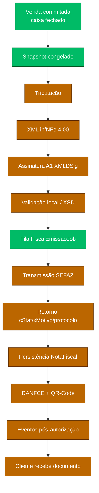
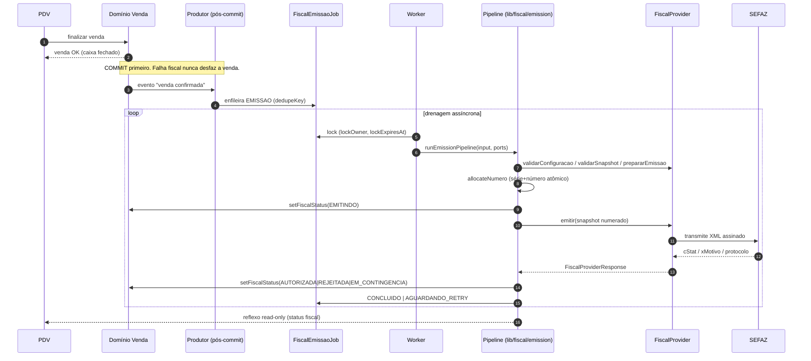
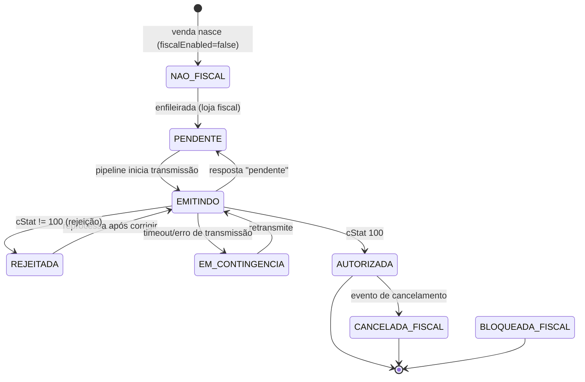

# 🧾 NFCE_ARCHITECTURE — Pipeline de emissão NFC-e

> **Documento oficial** do fluxo de emissão fiscal, ponta a ponta. É o `NFCE_ARCHITECTURE`
> citado por `lib/fiscal/venda-fiscal-state-machine.ts:13` (§17/§18 → §6/§7 deste doc).
> **Princípios:** `docs/decisions/ADR-0008-fiscal-architecture.md`.
> **Dados:** `docs/architecture/FISCAL_SCHEMA_DESIGN.md`.
>
> ⚠️ Hoje as etapas **Tributação → XML → Assinatura → SEFAZ → QR** são **simuladas** (`STUB`)
> e **sem chamador** no fluxo de venda. Este doc descreve a arquitetura-alvo e marca, em cada
> etapa, o que **existe** vs o que é **fase futura** (F2–F12).

---

## 1. Fluxo macro (a esteira)

**Legenda:** verde = existe (mesmo que dormente/simulado) · laranja = fase futura.

> **Ponto crítico (ADR-0008 P1/P2):** o limite entre "online" e "assíncrono" é a **fila** (G).
> Tudo de A→F **pode** acontecer no momento da venda (são operações locais, sem rede), mas a
> transmissão (H) **sempre** ocorre fora da transação, drenada pelo worker. O balcão nunca
> espera a SEFAZ.

---

## 2. Sequência ponta a ponta (alvo F7+)

> **Hoje:** os passos `Prod→Job`, `Wk→Job lock` e `Prov→SEFAZ` **não existem** (F7/F5). O que
> está implementado e testado é o miolo `runEmissionPipeline` com provider **STUB** (sem rede).

---

## 3. Contrato transversal de cada etapa

Todas as etapas seguem o mesmo contrato conceitual (espelha `FiscalProviderResponse` /
`EmissionOutcome` reais):

- **Entrada:** dados **congelados** (snapshot) + contexto (loja, modelo, ambiente, numeração).
- **Saída:** resultado canônico `ok | pendente | rejeitado | erro` + dados + pendências + trilha.
- **Falha:** normalizada (nunca exceção crua vazando); cada falha tem `errorCode` estável.
- **Idempotência:** reexecutar uma etapa sobre o mesmo estado **não duplica** efeito.
- **Trilha:** toda etapa grava `FiscalLog` (`acao`, `cStat`, `detalhe`) — sem segredo.

---

## 4. Etapas detalhadas

### Etapa 1 — Snapshot ✅ (existe — GOAL_005)
- **Entrada:** `Venda` + `ConfiguracaoFiscalLoja` (emitente) + `Cliente` (destinatário) +
  itens com `getProdutoFiscal` (NCM/CEST/CFOP/origem de `Produto.metadata.fiscal`).
- **Processo:** `buildVendaFiscalSnapshot` congela tudo (`deepFreeze`); serviço grava
  `NotaFiscal` RASCUNHO + `NotaFiscalItem`, idempotente por `localKey nfce-snapshot:{store}:{venda}`.
- **Saída:** snapshot imutável + diagnóstico (`prontoParaEmissao`, `pendencias`, `itensSemFiscal`).
- **Falhas:** `loja_sem_identidade_fiscal` (CNPJ/UF/razão ausentes) → **não cria snapshot**;
  `venda_sem_itens`; produto sem fiscal → snapshot **com pendência** (não inventa dado).
- **Rollback:** nenhum — operação aditiva; reexecução reaproveita a nota vigente (idempotente).
- **Idempotência:** `@@unique([storeId, localKey])` + nota vigente única; P2002 em corrida.

### Etapa 2 — Tributação ❌ (F2 — gap P0-1)
- **Entrada:** snapshot (regime da loja, CSOSN/CST/origem por item, UF).
- **Processo (alvo):** `lib/fiscal/tributos/*` (puro) calcula base/alíquota/ICMS e total de
  tributos (Lei da Transparência) por item. **Começa por NFC-e B2C Simples Nacional** (menor matriz).
- **Saída:** `NotaFiscalItem.baseCalculoIcms/aliquotaIcms/valorIcms/valorTributos` (hoje `0`) +
  `NotaFiscal.valorTotalTributos`.
- **Falhas:** regime não suportado, CSOSN×CFOP incompatível → pendência (não emite).
- **Rollback:** recálculo é **determinístico** sobre o snapshot; nunca lê preço vivo (P3).
- **Idempotência:** função pura — mesma entrada, mesma saída.

### Etapa 3 — Geração de XML ❌ (F3 — gap P0-2)
- **Entrada:** snapshot + tributos.
- **Processo (alvo):** `lib/fiscal/xml/*` serializa `infNFe` 4.00 (ide/emit/dest/det/total/pgto/
  infAdic) + calcula **chave de acesso** (44 dígitos: UF+AAMM+CNPJ+mod+serie+nNF+tpEmis+cNF+cDV).
- **Saída:** XML não assinado + `chaveAcesso` (grava em `NotaFiscal.chaveAcesso @unique`).
- **Falhas:** campo obrigatório ausente, XSD inválido → `snapshot_incompleto`/rejeição local.
- **Rollback:** nenhum efeito externo; XML descartável até assinar.
- **Idempotência (P4):** o XML é serializado **uma vez**; reprocessar **não re-serializa** —
  reutiliza o XML já gerado. A chave de acesso é determinística para o mesmo `(serie, numero, cNF)`.

### Etapa 4 — Assinatura digital ❌ (F4 — gap P0-3, depende do cofre F1)
- **Entrada:** XML do `infNFe` + certificado A1 carregado do **cofre** (via `blobRef`/`senhaRef`).
- **Processo (alvo):** `lib/fiscal/assinatura/*` aplica XMLDSig (RSA-SHA1/SHA256) ao `infNFe`;
  `digestValue` vai para `NotaFiscal.digestValue`. O segredo nunca entra em log/trace (P6).
- **Saída:** `NotaFiscal.xmlAssinado` + `status = ASSINADA`.
- **Falhas:** certificado expirado/revogado (`CertificadoStatus`), senha incorreta, cofre
  indisponível → erro **sem vazar segredo**; não transmite.
- **Rollback:** nenhum — assinar não tem efeito externo. XML assinado é mantido para reprocessar.
- **Idempotência:** assinar o mesmo XML produz documento equivalente; reprocessar reusa o assinado.

### Etapa 5 — Validação local / XSD ❌ (F3/F5)
- **Entrada:** XML assinado.
- **Processo (alvo):** validação contra XSD oficial (homologação) **antes** de transmitir —
  barra rejeição previsível sem gastar request na SEFAZ. É também o coração do **Dry-Run**
  (`docs/architecture/FISCAL_DRY_RUN.md`).
- **Saída:** ok → segue para a fila; inválido → rejeição local com diagnóstico.
- **Falhas:** schema inválido → não enfileira transmissão; volta para correção do snapshot.
- **Rollback/Idempotência:** validação é pura sobre o XML; sem efeito.

### Etapa 6 — Fila ✅ tabela / ❌ produtor+worker (F7 — gap P0-6)
- **Entrada:** documento pronto (validado) + `FiscalEmissaoJob` enfileirado **pós-commit**.
- **Processo (alvo):**
  - **Produtor:** após a venda commitar (fora da transação), enfileira `EMISSAO` com `dedupeKey`.
  - **Worker:** drena por `@@index([status, proximaTentativaEm])`, faz **lock**
    (`lockOwner`/`lockedAt`/`lockExpiresAt`), chama `runEmissionPipeline`, atualiza o job.
- **Saída:** job `CONCLUIDO` | `AGUARDANDO_RETRY` | `FALHA` (dead-letter ao esgotar `maxTentativas`).
- **Falhas:** lock expira (worker morreu) → outro worker reassume após `lockExpiresAt`; SEFAZ
  fora → `AGUARDANDO_RETRY` com backoff (`proximaTentativaEm`).
- **Rollback:** desabilitar a loja (`fiscalEnabled = false`) **para de enfileirar**; jobs
  pendentes ficam para reprocessar/cancelar. Falha fiscal **nunca** desfaz a venda (P1).
- **Idempotência:** `@@unique([storeId, dedupeKey])` — reenfileirar a mesma venda **não** duplica
  job; o pipeline é idempotente (AUTORIZADA → no-op; EMITINDO → no-op). Ver §7.

### Etapa 7 — Transmissão SEFAZ ❌ (F5 — gap P0-4, Gate humano: provider)
- **Entrada:** XML assinado + provider real (`SEFAZ_DIRETO` **ou** gateway).
- **Processo (alvo):** `FiscalProvider.emitir` transmite (SOAP/REST por UF ou API do gateway).
  Resolver troca a impl por `ConfiguracaoFiscalLoja.provider` (P5). **Só homologação até F11/F12.**
- **Saída:** `cStat`/`xMotivo`/`protocolo`/`dataAutorizacao` (Etapa 8).
- **Falhas:** timeout/instabilidade → `EM_CONTINGENCIA` (recuperável); rejeição (cStat≠100) →
  `REJEITADA`; denegação → `DENEGADA`.
- **Rollback:** não se "desfaz" transmissão; trata-se por **retry/contingência/evento**.
- **Idempotência:** consulta por `chaveAcesso` antes de retransmitir evita duplicar autorização.

### Etapa 8 — Retorno + Persistência ❌ (F5)
- **Entrada:** resposta da SEFAZ.
- **Processo:** `interpretarEmissao` mapeia para `Venda.fiscalStatus` (ver §6) e grava o resultado
  em `NotaFiscal` (chave/protocolo/cStat/xMotivo/`xmlAutorizado`/`status = AUTORIZADA`).
- **Saída:** documento persistido; trilha em `FiscalLog` (`acao = emissao.resultado`, `cStat`).
- **Falhas:** persistência parcial → o job permanece e reprocessa; consulta confirma se a SEFAZ
  autorizou mesmo sem termos persistido (evita duplicar).
- **Idempotência:** `chaveAcesso @unique` impede dois documentos autorizados iguais.

### Etapa 9 — DANFCE + QR-Code ❌ (F8/F6 — gaps P1-1/P0-5)
- **Entrada:** **XML autorizado** (nunca o carrinho — ADR-0008 P3/P4) + CSC para o QR.
- **Processo (alvo):** `lib/fiscal/qrcode/*` gera hash do QR conforme CSC + URL de consulta por
  UF/ambiente; DANFCE renderiza o cupom sobre o XML autorizado, **unificado** (não os 3 pipelines
  de impressão não-fiscais atuais).
- **Saída:** `qrCodeData`/`urlConsulta` + cupom imprimível.
- **Falhas:** CSC ausente/errado → QR inválido → documento inválido no cupom.
- **Idempotência:** QR/DANFCE são derivados puros do documento autorizado.

### Etapa 10 — Eventos ❌ (F9 — gap P1-2)
- Cancelamento (janela legal), CC-e, inutilização sobre nota autorizada → `EventoFiscal`.
  Detalhe completo: `docs/architecture/FISCAL_EVENTS.md`.

### Etapa 11 — Cliente
- NFC-e autorizada + DANFCE/QR entregue (impressão/− digital). Status fiscal refletido no
  PDV/recibo (read-only). Documento consultável no portal da SEFAZ pela chave/QR.

---

## 5. Estado fiscal da venda (reflexo colapsado)

`Venda.fiscalStatus` é a **única escrita de negócio** do pipeline (ADR-0008; porta
`setFiscalStatus`). Transições reais de `interpretarEmissao` + `runEmissionPipeline`:

**Gate de início (`STARTABLE`):** só inicia emissão a partir de `NAO_FISCAL`, `PENDENTE`,
`REJEITADA`, `EM_CONTINGENCIA`. `AUTORIZADA`/`EMITINDO` → no-op idempotente;
`CANCELADA_FISCAL`/`BLOQUEADA_FISCAL` → bloqueada (`estado_bloqueado`).

---

## 6. Interação com a máquina de estados da venda (§17/§18 do código)

A `venda-fiscal-state-machine.ts` decide se a venda pode ser **corrigida/cancelada
operacionalmente** conforme `fiscalStatus` (gates `assert*` em 6 rotas `corrigir*`/`cancelar`):

| Estado | Editar venda | Cancelar operacional | Observação |
|---|---|---|---|
| `NAO_FISCAL` | ✅ | ✅ | Comportamento atual (default-off) |
| `PENDENTE` | ✅ | ✅ | Ainda não emitiu |
| `REJEITADA` | ✅ | ✅ | Corrige e reenvia |
| `EMITINDO` | ⛔ 409 | ⛔ 409 | XML em trânsito |
| `EM_CONTINGENCIA` | ⛔ 409 | ⛔ 409 | Resolver transmissão antes |
| `AUTORIZADA` | ⛔ 409 | ⛔ 409 | Só **cancelamento fiscal** (evento) |
| `CANCELADA_FISCAL` | ⛔ 409 | ⛔ 409 | Tudo operacional bloqueado |
| `BLOQUEADA_FISCAL` | ⛔ 409 | ⛔ 409 | Bloqueado |

> **Invariante de compatibilidade:** enquanto `fiscalEnabled = false`, toda venda é `NAO_FISCAL`
> ⇒ todos os gates liberam ⇒ as rotas se comportam **exatamente como hoje** (risco atual nulo).

---

## 7. Idempotência, retry e contingência (consolidado)

### 7.1 Camadas de idempotência
| Fronteira | Chave | Efeito de reexecutar |
|---|---|---|
| Snapshot | `nfce-snapshot:{store}:{venda}` + nota vigente única | Reaproveita nota; não duplica |
| Numeração | `(storeId, modelo, serie, ambiente)` atômico + nota já numerada = `reused` | Não toca contador |
| Documento | `chaveAcesso @unique` | Não autoriza dois iguais |
| Fila | `@@unique([storeId, dedupeKey])` | Não cria job duplicado |
| Pipeline | gate `STARTABLE` + `AUTORIZADA/EMITINDO` no-op | Não retransmite |
| Evento | `@@unique([notaFiscalId, tipo, sequencia])` | Não duplica evento |

### 7.2 Retry (fila)
- Backoff via `proximaTentativaEm`; teto `maxTentativas` (default 5).
- Lock com expiração (`lockExpiresAt`) → worker morto não trava o job.
- Esgotou tentativas → **dead-letter** (`status = FALHA`) para inspeção/reprocessamento manual.

### 7.3 Contingência
- Timeout/SEFAZ fora → `EM_CONTINGENCIA` (venda) + `CONTINGENCIA` (nota) + `TipoEmissao.
  CONTINGENCIA_OFFLINE`, `dataContingencia`/`justContingencia`.
- Saída da contingência: job `CONTINGENCIA_TRANSMISSAO` retransmite quando a SEFAZ volta.
- **Nunca** desfaz a venda; o documento espera a janela de transmissão posterior (F10).

---

## 8. Falhas e rollback (mapa)

| Onde falha | Sintoma | Tratamento | Desfaz a venda? |
|---|---|---|---|
| Snapshot | loja sem identidade / item sem fiscal | Pendência; corrige config/produto | ❌ nunca |
| Tributos/XML | campo obrigatório ausente / XSD inválido | Rejeição local; corrige snapshot e reprocessa | ❌ |
| Assinatura | certificado expirado / cofre fora | Erro sem vazar segredo; corrige certificado | ❌ |
| Transmissão | timeout / SEFAZ fora | `EM_CONTINGENCIA` + retry/contingência | ❌ |
| Transmissão | rejeição (cStat≠100) | `REJEITADA`; corrige e reenvia (nova tentativa) | ❌ |
| Transmissão | denegação | `DENEGADA` (problema cadastral/fiscal do destinatário) | ❌ |
| Persistência | gravação parcial | Job reprocessa; consulta por chave evita duplicar | ❌ |
| Loja inteira | incidente fiscal | Kill-switch `fiscalEnabled = false` (para de enfileirar) | ❌ |

> **Regra de ouro (ADR-0008 P1):** o domínio fiscal **nunca** faz rollback da venda. Venda
> commita primeiro; o pior caso fiscal é "documento pendente/em contingência", não "venda perdida".

---

## 9. O que existe vs o que falta (rastreabilidade)

| Etapa | Existe? | Evidência / Fase |
|---|---|---|
| Snapshot | ✅ dormente | `venda-fiscal-snapshot*.ts` (GOAL_005) |
| Numeração | ✅ dormente | `numbering/*` (GOAL_008) |
| Orquestração do pipeline | ✅ simulada | `emission/*` (GOAL_007) |
| Provider (contrato + STUB) | ✅ | `provider/*` (GOAL_006) |
| State machine | ✅ no-op | `venda-fiscal-state-machine.ts` (GOAL_003) |
| Tributação | ❌ | F2 (P0-1) |
| XML + chave | ❌ | F3 (P0-2) |
| Assinatura A1 | ❌ | F4 (P0-3) + cofre F1 |
| Transmissão SEFAZ | ❌ | F5 (P0-4) |
| QR-Code/CSC | ❌ | F6 (P0-5) |
| Fila produtor+worker | ❌ (só tabela) | F7 (P0-6) |
| DANFCE | ❌ | F8 (P1-1) |
| Eventos | ❌ (stub) | F9 (P1-2) — `FISCAL_EVENTS.md` |
| Contingência real | ❌ | F10 (P1-3) |

---

## 10. Referências

- Princípios: `docs/decisions/ADR-0008-fiscal-architecture.md`.
- Dados: `docs/architecture/FISCAL_SCHEMA_DESIGN.md`.
- Eventos: `docs/architecture/FISCAL_EVENTS.md` · Dry-Run: `docs/architecture/FISCAL_DRY_RUN.md`.
- Segurança: `docs/architecture/FISCAL_SECURITY.md`.
- Plano/fases: `docs/governance/MASTER_FISCAL_EXECUTION_PLAN.md`.
- Código: `lib/fiscal/emission/emission-pipeline.ts`, `provider/types.ts`, `numbering/*`,
  `venda-fiscal-state-machine.ts`, `venda-fiscal-snapshot.ts`.
