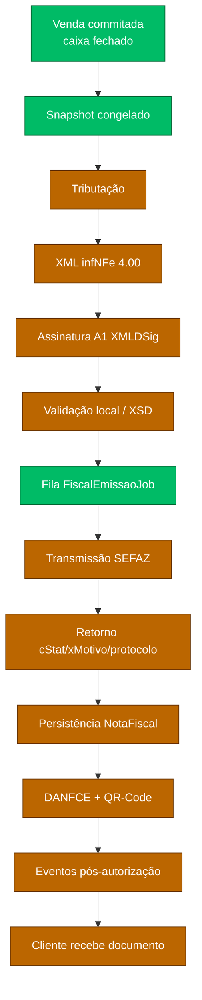
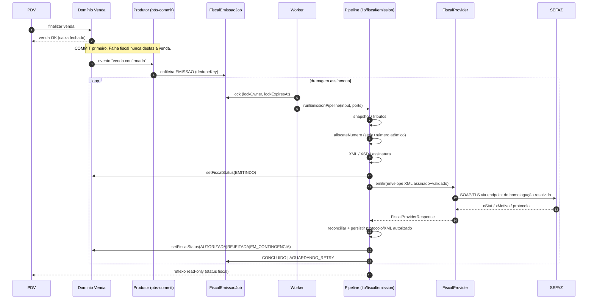
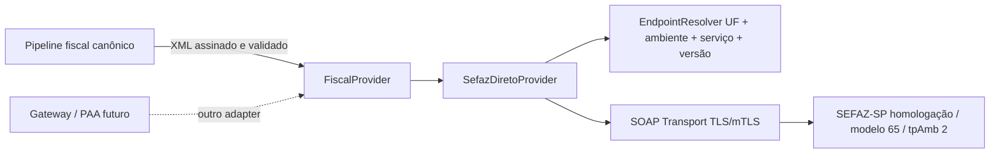
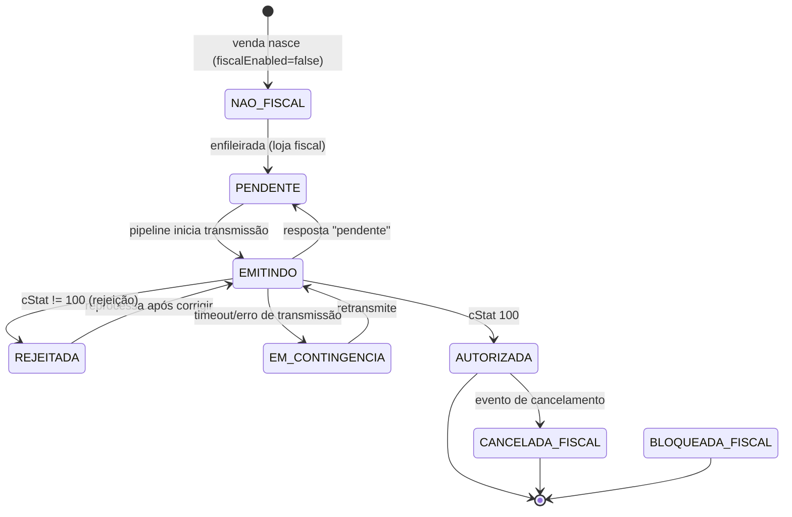

# 🧾 NFCE_ARCHITECTURE — Pipeline de emissão NFC-e

> **Documento oficial** do fluxo de emissão fiscal, ponta a ponta. É o `NFCE_ARCHITECTURE`
> citado por `lib/fiscal/venda-fiscal-state-machine.ts:13` (§17/§18 → §6/§7 deste doc).
> **Princípios:** `docs/decisions/ADR-0008-fiscal-architecture.md`.
> **Provider inicial:** ADR-0015 — SEFAZ direta, exclusivamente em homologação, atrás de
> `FiscalProvider`; gateway/PAA permanecem alternativas futuras.
> **Escopo inicial:** ADR-0016 — somente Matriz RafaCell Assistec, Taguaí/SP, SEFAZ-SP,
> NFC-e modelo 65 e `tpAmb=2`, identificada pelo `Store.id` real.
> **Dados:** `docs/architecture/FISCAL_SCHEMA_DESIGN.md`.
>
> ⚠️ Hoje as etapas **Tributação → XML → Assinatura → SEFAZ → QR** permanecem **simuladas** (`STUB`).
> A solicitação já produz uma outbox transacional e o worker já invoca o pipeline somente com o
> provider simulado. Este doc descreve a arquitetura-alvo e marca, em cada
> etapa, o que **existe** vs o que é **fase futura** (F2–F12).

---

## 1. Fluxo macro (a esteira)

**Legenda:** verde = existe (mesmo que dormente/simulado) · laranja = fase futura.

> **Ponto crítico (ADR-0008 P1/P2):** o limite entre "online" e "assíncrono" é a **fila** (G).
> Tudo de A→F **pode** acontecer no momento da venda (são operações locais, sem rede), mas a
> transmissão (H) **sempre** ocorre fora da transação, drenada pelo worker. O balcão nunca
> espera a SEFAZ.

---

## 2. Sequência ponta a ponta (alvo F7+)

> **Hoje:** `Prod→Job` e `Wk→Job lock` estão implementados e testados no GOAL-011.
> `Prov→SEFAZ` **não existe** (F5): o worker falha fechado fora de
> `STUB_HOMOLOGACAO + NFC-e + HOMOLOGACAO`, sem rede.

---

## 3. Contrato transversal de cada etapa

Todas as etapas seguem o mesmo contrato conceitual (espelha `FiscalProviderResponse` /
`EmissionOutcome` reais):

- **Entrada:** dados **congelados** (snapshot) + contexto (loja, modelo, ambiente, numeração).
- **Saída:** resultado canônico `ok | pendente | rejeitado | erro` + dados + pendências + trilha.
- **Falha:** normalizada (nunca exceção crua vazando); cada falha tem `errorCode` estável.
- **Idempotência:** reexecutar uma etapa sobre o mesmo estado **não duplica** efeito.
- **Trilha:** toda etapa grava `FiscalLog` (`acao`, `cStat`, `detalhe`) — sem segredo.

### 3.1 Fronteira do provider real (ADR-0015)

O OmniGestão é dono do snapshot, tributos, numeração, XML, XSD, assinatura, reconciliação e
persistência legal. `FiscalProvider` é a porta de integração externa, não um segundo motor fiscal.

Antes da primeira transmissão real, o contrato atual baseado em `FiscalProviderRequest`/snapshot
deve evoluir para entregar ao provider um envelope imutável com XML assinado e validado, chave,
ambiente, UF, versão e identificadores de idempotência/correlação. Nenhum tipo de domínio expõe
SOAP, WSDL, URL ou peculiaridade de autorizador.

Na primeira integração, o adapter aceita somente `HOMOLOGACAO`/`tpAmb=2` e catálogo oficial de
homologação. Qualquer ambiente/endpoint de produção falha antes da rede. Gateway e PAA não fazem
parte do runtime inicial e não são fallback automático.

### 3.2 Escopo e preflight da loja-piloto (ADR-0016)

O piloto fica restrito ao registro `Store` real da Matriz RafaCell Assistec em Taguaí/SP. O valor
literal do ID não aparece na arquitetura nem vira constante: deve ser carregado da relação real e
permanecer idêntico em configuração fiscal, certificado, série, nota, job e contexto autorizado.
Nome “Matriz”, posição na lista, ID historicamente conhecido ou `loja-1` nunca são fallback.

Antes da rede, preflight server-side e fail-closed valida:

- CNPJ, IE, razão social, endereço, município, código IBGE, UF e CRT/regime;
- série ativa para `(storeId, modelo 65, HOMOLOGACAO)` e numeração atômica;
- CSC de homologação e A1 de teste ativo/compatível, apenas por referência ao cofre;
- `SEFAZ_DIRETO`, SEFAZ-SP, UF SP, NFC-e 65, `HOMOLOGACAO` e `tpAmb=2`;
- snapshot, tributos, XML, XSD, assinatura, chave e idempotência consistentes.

Ausência ou divergência bloqueia antes da rede. Demais lojas permanecem default-off e não herdam
identidade, série, CSC, certificado, provider ou ambiente da Matriz. Fixtures e logs nunca recebem
credenciais, CSC, certificado ou códigos reais.

---

## 4. Etapas detalhadas

### Etapa 1 — Snapshot ✅ (existe — GOAL_005)
- **Entrada:** `Venda` + `ConfiguracaoFiscalLoja` (emitente) + `Cliente` (destinatário) +
  itens com `getProdutoFiscal` (NCM/CEST/CFOP/origem de `Produto.metadata.fiscal`).
- **Processo:** `buildVendaFiscalSnapshot` congela tudo (`deepFreeze`); serviço grava
  `NotaFiscal` RASCUNHO + `NotaFiscalItem`, idempotente por `localKey nfce-snapshot:{store}:{venda}`.
- **Saída:** snapshot imutável + diagnóstico (`prontoParaEmissao`, `pendencias`, `itensSemFiscal`).
- **Falhas:** `loja_sem_identidade_fiscal` (CNPJ/UF/razão ausentes) → **não cria snapshot**;
  `venda_sem_itens`; produto sem fiscal → snapshot **com pendência** (não inventa dado).
- **Rollback:** nenhum — operação aditiva; reexecução reaproveita a nota vigente (idempotente).
- **Idempotência:** `@@unique([storeId, localKey])` + nota vigente única; P2002 em corrida.

### Etapa 2 — Tributação ❌ (F2 — gap P0-1)
- **Entrada:** snapshot (regime da loja, CSOSN/CST/origem por item, UF).
- **Processo (alvo):** `lib/fiscal/tributos/*` (puro) calcula base/alíquota/ICMS e total de
  tributos (Lei da Transparência) por item. **Começa por NFC-e B2C Simples Nacional** (menor matriz).
- **Saída:** `NotaFiscalItem.baseCalculoIcms/aliquotaIcms/valorIcms/valorTributos` (hoje `0`) +
  `NotaFiscal.valorTotalTributos`.
- **Falhas:** regime não suportado, CSOSN×CFOP incompatível → pendência (não emite).
- **Rollback:** recálculo é **determinístico** sobre o snapshot; nunca lê preço vivo (P3).
- **Idempotência:** função pura — mesma entrada, mesma saída.

### Etapa 3 — Geração de XML ❌ (F3 — gap P0-2)
- **Entrada:** snapshot + tributos.
- **Processo (alvo):** `lib/fiscal/xml/*` serializa `infNFe` 4.00 (ide/emit/dest/det/total/pgto/
  infAdic) + calcula **chave de acesso** (44 dígitos: UF+AAMM+CNPJ+mod+serie+nNF+tpEmis+cNF+cDV).
- **Saída:** XML não assinado + `chaveAcesso` (grava em `NotaFiscal.chaveAcesso @unique`).
- **Falhas:** campo obrigatório ausente, XSD inválido → `snapshot_incompleto`/rejeição local.
- **Rollback:** nenhum efeito externo; XML descartável até assinar.
- **Idempotência (P4):** o XML é serializado **uma vez**; reprocessar **não re-serializa** —
  reutiliza o XML já gerado. A chave de acesso é determinística para o mesmo `(serie, numero, cNF)`.

### Etapa 4 — Assinatura digital ❌ (F4 — gap P0-3, depende do cofre F1)
- **Entrada:** XML do `infNFe` + certificado A1 carregado do **cofre** (via `blobRef`/`senhaRef`).
- **Processo (alvo):** `lib/fiscal/assinatura/*` aplica XMLDSig (RSA-SHA1/SHA256) ao `infNFe`;
  `digestValue` vai para `NotaFiscal.digestValue`. O segredo nunca entra em log/trace (P6).
- **Saída:** `NotaFiscal.xmlAssinado` + `status = ASSINADA`.
- **Falhas:** certificado expirado/revogado (`CertificadoStatus`), senha incorreta, cofre
  indisponível → erro **sem vazar segredo**; não transmite.
- **Rollback:** nenhum — assinar não tem efeito externo. XML assinado é mantido para reprocessar.
- **Idempotência:** assinar o mesmo XML produz documento equivalente; reprocessar reusa o assinado.

### Etapa 5 — Validação local / XSD ❌ (F3/F5)
- **Entrada:** XML assinado.
- **Processo (alvo):** validação contra XSD oficial (homologação) **antes** de transmitir —
  barra rejeição previsível sem gastar request na SEFAZ. É também o coração do **Dry-Run**
  (`docs/architecture/FISCAL_DRY_RUN.md`).
- **Saída:** ok → segue para a fila; inválido → rejeição local com diagnóstico.
- **Falhas:** schema inválido → não enfileira transmissão; volta para correção do snapshot.
- **Rollback/Idempotência:** validação é pura sobre o XML; sem efeito.

### Etapa 6 — Fila ✅ produtor + worker simulado (GOAL-011)
- **Entrada:** snapshot fiscal vigente e `FiscalEmissaoJob` de tipo `EMISSAO`.
- **Produtor:** a rota de solicitação congela/reutiliza o snapshot e, em uma única transação,
  cria por upsert a outbox e muda a venda de `NAO_FISCAL` para `PENDENTE`. A chave é
  `fiscal:emissao:v1:venda:{vendaId}` dentro do escopo único `(storeId, dedupeKey)`.
  A rota não chama emissão.
- **Drenagem:** endpoint Node interno, fail-closed sem `FISCAL_QUEUE_INTERNAL_SECRET`, invoca lotes
  limitados. Não há cron ou recurso externo provisionado neste GOAL.
- **Lock:** seleção previsível por prioridade/próxima tentativa/criação/id e aquisição por
  compare-and-swap. O lease usa `lockOwner`, `lockedAt`, `lockExpiresAt`, heartbeat e takeover
  somente depois da expiração. Resultado e liberação exigem o mesmo owner e lease ainda válido.
- **Retry:** erro transitório retorna a `PENDENTE` com backoff exponencial e teto; erro terminal
  ou tentativa esgotada vai a `FALHA`. Erros persistidos são sanitizados, sem XML completo ou
  campos sensíveis.
- **Operação:** pausa global ou por `storeId`, cancelamento seguro, métricas e reprocessamento
  manual de `FALHA` são server-side e auditados em `FiscalLog`. Reprocessar preserva tentativas
  e concede no máximo uma nova tentativa explícita.
- **Saída:** `CONCLUIDO`, `PENDENTE` para retry, `FALHA` (dead-letter) ou `CANCELADO`.
- **Trava externa:** uma transmissão externa ambígua não pode ser repetida sem marcador de
  consulta autorizadora. No GOAL-011 toda execução válida permanece simulada e marca
  `externalTransmissionAttempted=false`.
- **Idempotência:** `@@unique([storeId, dedupeKey])` impede job duplicado; o pipeline também
  preserva `AUTORIZADA` como no-op. Ver §7.

### Etapa 7 — Transmissão SEFAZ ❌ (F5 — gap P0-4, Gate G-F5 resolvido pela ADR-0015)
- **Entrada:** envelope imutável com XML assinado + XSD válido + chave/contexto canônico;
  `SefazDiretoProvider` como primeiro provider real.
- **Processo (alvo):** o provider traduz a operação canônica para o Web Service oficial de
  homologação. Resolver interno escolhe autorizador/endpoint por `(UF, ambiente, modelo, serviço,
  versão)`; o transporte encapsula SOAP, namespaces, TLS/mTLS, timeout e parsing. O domínio não
  conhece URL, WSDL ou regra específica de UF.
- **Ambiente:** exclusivamente `HOMOLOGACAO`/`tpAmb=2`; tentativa de produção falha antes da rede.
- **Escopo:** somente Matriz RafaCell Assistec/Taguaí, UF SP, SEFAZ-SP e NFC-e modelo 65, sempre
  pelo `storeId` real propagado no contexto; nenhuma outra loja herda a configuração.
- **Saída:** `cStat`/`xMotivo`/`protocolo`/`dataAutorizacao` (Etapa 8).
- **Falhas:** timeout/retorno desconhecido após envio mantém a nota `TRANSMITINDO`, estaciona a
  emissão sem data de retry e cria/reencontra `CONSULTA`; rejeição conclusiva consome o número e
  segue para `REJEITADA`; denegação segue para `DENEGADA`.
- **Rollback:** não se "desfaz" transmissão; trata-se por **retry/contingência/evento**.
- **Idempotência:** resultado incerto exige consulta por `chaveAcesso`/recibo antes de retransmitir.
- **Alternativas futuras:** gateway, PAA ou provider alternativo entram como outro adapter e exigem
  decisão explícita; não há fallback automático nesta homologação.

### Etapa 8 — Retorno + Persistência ❌ (F5)
- **Entrada:** resposta da SEFAZ.
- **Processo:** `interpretarEmissao` normaliza a resposta e mapeia para `Venda.fiscalStatus` (ver
  §6). O pipeline reconcilia resultado incerto e grava chave, recibo/protocolo, `cStat`, `xMotivo`,
  data/autorizador/versão, hash, XML assinado enviado e XML autorizado/protocolado imutável.
- **Saída:** documento persistido; trilha em `FiscalLog` (`acao = emissao.resultado`, `cStat`).
- **Falhas:** persistência parcial após tentativa não autoriza reprocessar o builder/signing; a
  consulta por chave confirma o resultado e a retomada, quando liberada por `NOT_FOUND`, usa os
  mesmos bytes assinados persistidos antes da primeira transmissão.
- **Idempotência:** `chaveAcesso @unique` impede dois documentos autorizados iguais.

### Etapa 9 — DANFCE + QR-Code ❌ (F8/F6 — gaps P1-1/P0-5)
- **Entrada:** **XML autorizado** (nunca o carrinho — ADR-0008 P3/P4) + CSC para o QR.
- **Processo (alvo):** `lib/fiscal/qrcode/*` gera hash do QR conforme CSC + URL de consulta por
  UF/ambiente; DANFCE renderiza o cupom sobre o XML autorizado, **unificado** (não os 3 pipelines
  de impressão não-fiscais atuais).
- **Saída:** `qrCodeData`/`urlConsulta` + cupom imprimível.
- **Falhas:** CSC ausente/errado → QR inválido → documento inválido no cupom.
- **Idempotência:** QR/DANFCE são derivados puros do documento autorizado.

### Etapa 10 — Eventos ❌ (F9 — gap P1-2)
- Cancelamento (janela legal), CC-e, inutilização sobre nota autorizada → `EventoFiscal`.
  Detalhe completo: `docs/architecture/FISCAL_EVENTS.md`.

### Etapa 11 — Cliente
- NFC-e autorizada + DANFCE/QR entregue (impressão/− digital). Status fiscal refletido no
  PDV/recibo (read-only). Documento consultável no portal da SEFAZ pela chave/QR.

---

## 5. Estado fiscal da venda (reflexo colapsado)

`Venda.fiscalStatus` é a **única escrita de negócio** do pipeline (ADR-0008; porta
`setFiscalStatus`). Transições reais de `interpretarEmissao` + `runEmissionPipeline`:

**Gate de início (`STARTABLE`):** só inicia emissão a partir de `NAO_FISCAL`, `PENDENTE`,
`REJEITADA`, `EM_CONTINGENCIA`. `AUTORIZADA`/`EMITINDO` → no-op idempotente;
`CANCELADA_FISCAL`/`BLOQUEADA_FISCAL` → bloqueada (`estado_bloqueado`).

---

## 6. Interação com a máquina de estados da venda (§17/§18 do código)

A `venda-fiscal-state-machine.ts` decide se a venda pode ser **corrigida/cancelada
operacionalmente** conforme `fiscalStatus` (gates `assert*` em 6 rotas `corrigir*`/`cancelar`):

| Estado | Editar venda | Cancelar operacional | Observação |
|---|---|---|---|
| `NAO_FISCAL` | ✅ | ✅ | Comportamento atual (default-off) |
| `PENDENTE` | ✅ | ✅ | Ainda não emitiu |
| `REJEITADA` | ✅ | ✅ | Corrige e reenvia |
| `EMITINDO` | ⛔ 409 | ⛔ 409 | XML em trânsito |
| `EM_CONTINGENCIA` | ⛔ 409 | ⛔ 409 | Resolver transmissão antes |
| `AUTORIZADA` | ⛔ 409 | ⛔ 409 | Só **cancelamento fiscal** (evento) |
| `CANCELADA_FISCAL` | ⛔ 409 | ⛔ 409 | Tudo operacional bloqueado |
| `BLOQUEADA_FISCAL` | ⛔ 409 | ⛔ 409 | Bloqueado |

> **Invariante de compatibilidade:** enquanto `fiscalEnabled = false`, toda venda é `NAO_FISCAL`
> ⇒ todos os gates liberam ⇒ as rotas se comportam **exatamente como hoje** (risco atual nulo).

---

## 7. Idempotência, retry e contingência (consolidado)

### 7.1 Camadas de idempotência
| Fronteira | Chave | Efeito de reexecutar |
|---|---|---|
| Snapshot | `nfce-snapshot:{store}:{venda}` + nota vigente única | Reaproveita nota; não duplica |
| Numeração | `(storeId, modelo, serie, ambiente)` atômico + nota já numerada = `reused` | Não toca contador |
| Documento | `chaveAcesso @unique` | Não autoriza dois iguais |
| Fila | `@@unique([storeId, dedupeKey])` | Não cria job duplicado |
| Pipeline | gate `STARTABLE` + `AUTORIZADA/EMITINDO` no-op | Não retransmite |
| Evento | `@@unique([notaFiscalId, tipo, sequencia])` | Não duplica evento |

### 7.2 Retry (fila)
- Backoff exponencial determinístico via `proximaTentativaEm`, com teto de 30 minutos por padrão;
  teto de tentativas `maxTentativas` (default 5).
- Lock com expiração (`lockExpiresAt`) → worker morto não trava o job.
- Esgotou tentativas → **dead-letter** (`status = FALHA`) para inspeção/reprocessamento manual.
- Reprocessamento exige ator e motivo, preserva `tentativas` e concede uma tentativa explícita;
  não existe loop automático infinito.
- Timeout após envio não entra diretamente em retransmissão: primeiro consulta/reconcilia a chave
  ou o recibo, porque a SEFAZ pode ter autorizado apesar da perda da resposta local.
- Enquanto a consulta não conclui, o job `EMISSAO` permanece `AGUARDANDO_RETRY` com
  `proximaTentativaEm = null`; esse estado não é elegível para drenagem automática.
- Somente `CONSULTA=NOT_FOUND` cria uma autorização consumível para uma retransmissão. A retomada
  relê `xmlAssinado`, verifica SHA-256 e não executa builder, XSD, assinatura nem numeração.
- `CONSULTA=AUTHORIZED` conclui sem retransmitir. `CONSULTA=REJECTED` preserva o número consumido e
  marca a demanda de inutilização futura (GOAL-019).

### 7.3 Estado incerto e reconciliação (GOAL-012)

- Chave, série, número, XML assinado exato e estado `TRANSMITINDO` são persistidos antes do
  provider.
- O reconciliador varre apenas notas envelhecidas, com threshold configurável, respeitando pausa,
  `storeId` e lease ainda válido.
- `@@unique([storeId, dedupeKey])` torna a consulta por nota idempotente mesmo com varreduras
  concorrentes.
- Métricas cobrem backlog/idade, consultas pendentes e resultados `AUTHORIZED`, `NOT_FOUND` e
  `REJECTED`.
- A implementação permanece desligada de provider real: apenas stub/teste, sem SEFAZ ou produção.

### 7.4 Contingência
- Timeout/SEFAZ fora → `EM_CONTINGENCIA` (venda) + `CONTINGENCIA` (nota) + `TipoEmissao.
  CONTINGENCIA_OFFLINE`, `dataContingencia`/`justContingencia`.
- Saída da contingência: job `CONTINGENCIA_TRANSMISSAO` retransmite quando a SEFAZ volta.
- **Nunca** desfaz a venda; o documento espera a janela de transmissão posterior (F10).

---

## 8. Falhas e rollback (mapa)

| Onde falha | Sintoma | Tratamento | Desfaz a venda? |
|---|---|---|---|
| Snapshot | loja sem identidade / item sem fiscal | Pendência; corrige config/produto | ❌ nunca |
| Tributos/XML | campo obrigatório ausente / XSD inválido | Rejeição local; corrige snapshot e reprocessa | ❌ |
| Assinatura | certificado expirado / cofre fora | Erro sem vazar segredo; corrige certificado | ❌ |
| Transmissão | timeout / resultado desconhecido após envio | mantém `TRANSMITINDO`; consulta obrigatória; sem retry direto | ❌ |
| Transmissão | rejeição (cStat≠100) | `REJEITADA`; corrige e reenvia (nova tentativa) | ❌ |
| Transmissão | denegação | `DENEGADA` (problema cadastral/fiscal do destinatário) | ❌ |
| Persistência | gravação parcial | Job reprocessa; consulta por chave evita duplicar | ❌ |
| Loja inteira | incidente fiscal | Kill-switch `fiscalEnabled = false` (para de enfileirar) | ❌ |

> **Regra de ouro (ADR-0008 P1):** o domínio fiscal **nunca** faz rollback da venda. Venda
> commita primeiro; o pior caso fiscal é "documento pendente/em contingência", não "venda perdida".

---

## 9. O que existe vs o que falta (rastreabilidade)

| Etapa | Existe? | Evidência / Fase |
|---|---|---|
| Snapshot | ✅ dormente | `venda-fiscal-snapshot*.ts` (GOAL_005) |
| Numeração | ✅ dormente | `numbering/*` (GOAL_008) |
| Orquestração do pipeline | ✅ simulada | `emission/*` (GOAL_007) |
| Provider (contrato + STUB) | ✅ | `provider/*` (GOAL_006) |
| Decisão do provider inicial | ✅ arquitetura | ADR-0015 — SEFAZ direta, só homologação |
| State machine | ✅ no-op | `venda-fiscal-state-machine.ts` (GOAL_003) |
| Tributação | ❌ | F2 (P0-1) |
| XML + chave | ❌ | F3 (P0-2) |
| Assinatura A1 | ❌ | F4 (P0-3) + cofre F1 |
| Transmissão SEFAZ | ❌ | F5 (P0-4) |
| QR-Code/CSC | ❌ | F6 (P0-5) |
| Fila produtor+worker | ❌ (só tabela) | F7 (P0-6) |
| DANFCE | ❌ | F8 (P1-1) |
| Eventos | ❌ (stub) | F9 (P1-2) — `FISCAL_EVENTS.md` |
| Contingência real | ❌ | F10 (P1-3) |

---

## 10. Referências

- Princípios: `docs/decisions/ADR-0008-fiscal-architecture.md`.
- Provider inicial: `docs/decisions/ADR-0015-sefaz-direta-homologacao-inicial.md`.
- Piloto SP/Matriz: `docs/decisions/ADR-0016-piloto-homologacao-sp-matriz-rafacell.md`.
- Dados: `docs/architecture/FISCAL_SCHEMA_DESIGN.md`.
- Eventos: `docs/architecture/FISCAL_EVENTS.md` · Dry-Run: `docs/architecture/FISCAL_DRY_RUN.md`.
- Segurança: `docs/architecture/FISCAL_SECURITY.md`.
- Plano/fases: `docs/governance/MASTER_FISCAL_EXECUTION_PLAN.md`.
- Código: `lib/fiscal/emission/emission-pipeline.ts`, `provider/types.ts`, `numbering/*`,
  `venda-fiscal-state-machine.ts`, `venda-fiscal-snapshot.ts`.
- Especificação oficial: [MOC NF-e/NFC-e](https://www.nfe.fazenda.gov.br/PORTAl/listaConteudo.aspx?tipoConteudo=ndIjl+iEFdE=)
  e [Web Services de homologação](https://hom.nfe.fazenda.gov.br/portal/WebServices.aspx) do Portal NF-e.
- Piloto SP: [portal NFC-e da SEFAZ-SP](https://portal.fazenda.sp.gov.br/servicos/nfce/).
