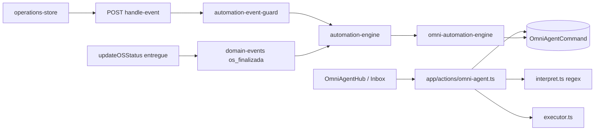

# Auditoria final — Omni Agent HUB (pós-correções P0/P1)

**Data:** 26/05/2026  
**Modo:** Revalidação somente leitura + validações de build  
**Escopo:** `app/dashboard/omni-agent`, `components/omni-agent`, `app/actions/omni-agent.ts`, `app/actions/operacoes.ts`, `lib/omni-agent`, `lib/automation`, `app/api/automation/handle-event`, `docs/ai/AGENT_HUB.md`  
**Referência anterior:** `docs/audits/AUDITORIA_OMNI_AGENT_HUB.md` (7 P0, 18 P1, 22 P2)

---

## 1. Resumo executivo

| Veredito | Conclusão |
|----------|-----------|
| **P0 operacionais (segurança, multi-loja, copy enganosa)** | **Resolvidos** — nenhum bloqueador para piloto interno |
| **P0 estrutural (auditoria Prisma `storeId`)** | **Mitigado** — `storeId`/`tenantId` em `metadata` JSON; coluna Prisma **não** criada (escopo explícito sem migration) |
| **P1 alvo desta rodada** | **Resolvidos** (canal, OS entregue, `conta_receber_vencida` documentado) |
| **Fase atual fechável?** | **Sim**, como **Fase 1 + endurecimento operacional** (piloto enterprise interno). **Não** como produto Agentic AI externo |
| **Novos bugs críticos** | **Nenhum** introduzido nas correções revisadas |

---

## 2. Validações técnicas

| Comando | Resultado | Notas |
|---------|-----------|-------|
| `npx tsc --noEmit` | **0 erros** | 26/05/2026 |
| `npx next build --webpack` | **OK** | Rota `ƒ /dashboard/omni-agent` presente; compilação ~51s |
| `npm run build` (completo) | **Falhou** | `prisma generate` → `EPERM` ao renomear `query_engine-windows.dll.node` (ficheiro bloqueado — típico com dev server/AV no Windows). **Não indica erro de código**; repetir com processos que usam Prisma encerrados. |

---

## 3. Revalidação dos 7 P0 (auditoria anterior)

Contagem original: **B10, B11, B12, U07, RO01, RO02, RO03, RO04** (7 IDs únicos; RO01 ≈ U07, RO02 ≈ B10, RO03 ≈ B12, RO04 ≈ B11).

| ID | Problema original | Estado pós-correção | Evidência |
|----|-------------------|---------------------|-----------|
| **B10 / RO02** | `POST /api/automation/handle-event` sem auth/loja | **Resolvido** | `lib/omni-agent/automation-event-guard.ts`: `sec-fetch-site`/origin, `payload.storeId` obrigatório, header `x-assistec-loja-id` = payload, sessão NextAuth + `requireEnterpriseWith` **ou** `requireOpsSubscription`; rota delega ao guard |
| **B12 / RO03** | Fallback `LEGACY_PRIMARY_STORE_ID` (`loja-1`) no Hub | **Resolvido** | `OmniAgentHub.tsx`: `storeId = (lojaAtivaId ?? "").trim()`; `storeReady` bloqueia abas; `OmniAgentStoreRequired`; **zero** `loja-1` em `components/omni-agent` e `lib/omni-agent` |
| **U07 / RO01** | Catálogo prometia venda/despesa/estoque sem executor | **Resolvido** | `COMMAND_GROUPS_REAL` vs `COMMAND_GROUPS_TRIAGE`; badges «triagem»; resultados explícitos («não lança despesa no financeiro», etc.) |
| **B11 / RO04** | `LogsAuditoria` sem coluna `storeId` | **Mitigado (P0 estrutural residual)** | Schema inalterado (`prisma/schema.prisma` L928–939). Escritas Omni usam `omniAgentAuditMetadata()` → JSON com `storeId`, `tenantId`, `module: "omni_agent"` em `executor.ts`, `omni-automation-engine.ts`, `app/actions/omni-agent.ts` (`logExec`) |
| **Actions** | Server Actions sem fail em loja vazia | **Resolvido** | `assertStoreId()` em `app/actions/omni-agent.ts` — erro explícito se `storeId` vazio |

**Conclusão P0:** não há **P0 operacionais abertos** no escopo Omni Agent. Permanece **1 débito de compliance** (coluna `storeId` em `logs_auditoria`) tratado só por convenção em `metadata` até fase com migration.

---

## 4. Revalidação dos P1 corrigidos

| P1 | Pedido | Estado | Evidência |
|----|--------|--------|-----------|
| Canal real no modal | Persistir `canal` no submit | **Resolvido** | `NewCommandModal` → `modalChannelToOmniCanal()` → `onSendInbox`/`onExecute` com `canal`; `submitOmniAgentCommand` usa `normalizeOmniAgentCanal()` (`lib/omni-agent/canal.ts`) |
| Canal no feed/inbox | Exibir canal | **Resolvido** | `canalDisplayLabel()` em `lib/omni-agent/hub-display.ts`; badges em feed, histórico Comandos IA, `OmniAgentInboxReal`, detalhes |
| Evento OS entregue | Disparar `os_finalizada` / automação `os_entregue` | **Resolvido (caminho principal)** | `emitOsFinalizadaOmniEvent()` em `lib/omni-agent/domain-events.ts`; chamado em `updateOSStatus` quando transição → `entregue` (`app/actions/operacoes.ts` L362–372). API legada PATCH OS desativada (410) |
| `conta_receber_vencida` | Documentar sem emissor | **Resolvido** | Card Automações no Hub (L1691–1696); `docs/ai/AGENT_HUB.md` L24, L57; evento aceite na API mas **sem** emissor em `lib/financeiro` |

### Lacuna documentada (não regressão nova)

- **`updateOSPayload`** com mudança de `status` para `entregue` **sem** passar por `updateOSStatus` **não** emite `os_finalizada`. O fluxo V2 normal usa `updateOSStatus` / ação «Entregar» (L721–731). Risco baixo se UI HUB não alterar status só via payload patch.

---

## 5. Verificações adicionais (pedido da auditoria)

### 5.1 Novos bugs introduzidos

| Área | Achado | Severidade |
|------|--------|------------|
| Guard + PDV | `lib/operations-store.tsx` envia `x-assistec-loja-id` no fetch de eventos | OK |
| `handleEvent` | Ignora eventos sem `storeId` (`automation-engine.ts` L85–86) | OK |
| Modal sem loja | `open={newCmdOpen && storeReady}` — «Novo» não abre modal sem unidade | OK (header ainda mostra botões — UX menor) |
| Dependência `operacoes` → `domain-events` → `automation-engine` | Build/tsc OK; sem ciclo quebrado | OK |
| **Nenhum** novo P0/P1 de segurança ou multi-loja detectado | — | — |

### 5.2 UI promete vs executor

| Superfície | Alinhamento |
|------------|-------------|
| `COMMAND_GROUPS_REAL` | Intenções com executor: `OS_OPEN`, buscas, caixa, financeiro leitura, lembrete/auditoria |
| `COMMAND_GROUPS_TRIAGE` | Copy honesta: triagem / lembrete, sem PDV/financeiro/estoque |
| Modal canal **Voz** | Badge «Persistido; execução igual a texto» — alinhado com `normalizeOmniAgentCanal` |
| Overview sugestões | `buildOverviewSuggestions(stats)` — contagens reais (`hubStats`), não números fictícios |
| WhatsApp Agent | Comandos reais Prisma; **sem** outbound Meta no Agent — documentado |
| Settings / Online-Pausar | Ainda **localStorage** / decorativo — não prometido como gate servidor |

**Conclusão:** desalinhamento grave U07/RO01 **corrigido**. Promessas residuais são abas mock/settings (P2), não o pipeline Inbox/executor.

### 5.3 Loja ativa obrigatória no Hub

- UI: sem `lojaAtivaId` → banner `OmniAgentStoreRequired`; pipeline não monta abas operacionais.
- Server: `assertStoreId` em todas as mutations/listagens relevantes.
- **Sem fallback `loja-1`** no módulo Omni Agent.

### 5.4 Fallback `loja-1`

- **Omni Agent:** ausente (confirmado por grep no escopo).
- **Projeto:** `LEGACY_PRIMARY_STORE_ID` permanece noutros módulos (PDV, WhatsApp automation hub, cadastros) — **fora do escopo** desta auditoria; não reintroduzido no Agent.

---

## 6. Pipeline real (estado atual)

| Capacidade | Real / Parcial / Mock |
|------------|----------------------|
| Inbox Prisma + confirm/reject | **Real** |
| Interpretador regex (sem LLM) | **Real** |
| Executor OS/cliente/produto/caixa/financeiro leitura/lembrete auditoria | **Real** (lembrete = auditoria, não entidade agenda) |
| Automações `venda_finalizada`, `os_entregue` | **Real** (com emissores acima) |
| `conta_receber_vencida` | **API + regra UI**; **sem emissor** |
| WhatsApp bidirecional no Agent | **Parcial** (canal persistido; HUB WA separado) |
| Settings / agentOnline | **Mock/local** |
| LLM | **Ausente** (explícito) |

---

## 7. P1 / P2 restantes (não bloqueiam fecho da fase atual)

### P1 — Importantes (próxima fase)

| ID | Item | Notas |
|----|------|-------|
| P1-A | Migration `LogsAuditoria.storeId` + queries scoped | Fecha RO04 estrutural; hoje só JSON em `metadata` |
| P1-B | Emissor `conta_receber_vencida` (cron/job financeiro) | Documentado; automação inerte até implementar |
| P1-C | `updateOSPayload` → `entregue` emitir mesmo evento que `updateOSStatus` | Evitar buraco se patch direto for usado |
| P1-D | «Reexecutar» no feed (`mode: "run"`) duplica registos | B06 original |
| P1-E | Fallback interpret → `REMINDER_CREATE` baixa confiança | B07 — quase todo texto vira triagem |
| P1-F | WhatsApp Cloud status global (env), não por `Store` | RO07 |
| P1-G | `logExec` / falhas auditoria silenciosas (`catch {}`) | B04 |
| P1-H | Integrações executor: venda/despesa/estoque reais | Roadmap; UI já não promete execução |

### P2 — UX / polish / doc

| ID | Item |
|----|------|
| P2-A | `min-h-screen` no wrapper Hub (conflito AppShell) |
| P2-B | `agentOnline` / Pausar sem efeito no servidor |
| P2-C | Settings, onboarding, memória timeline, favoritos — `localStorage` |
| P2-D | «Simular» grava comando real (demo vs produção) |
| P2-E | Seletor «Módulo» no modal não altera interpretação servidor |
| P2-F | Atualizar `CURRENT_STATUS` / docs gerais que ainda dizem «Mock» no Agent |
| P2-G | LLM governado, memória operacional unificada, voz com política servidor |

---

## 8. Respostas diretas (critério de encerramento)

### Ainda há P0?

- **P0 operacionais (B10, B12, U07/RO01, RO02, RO03, actions storeId):** **Não.**
- **P0 de schema (B11/RO04 — coluna `storeId` em `logs_auditoria`):** **Mitigado**, não eliminado. Tratar como **P1-A** na próxima fase com Prisma autorizado.

### A fase atual pode ser fechada?

**Sim**, para o objetivo declarado:

- Fase 1 núcleo real (comandos, inbox, executor parcial, automações enfileiradas).
- Endurecimento P0 operacional (API eventos, loja obrigatória, copy honesta).
- P1 de canal, OS entregue (caminho principal), documentação `conta_receber_vencida`.

**Não fechar** como «Agentic AI SaaS» ou «automação financeira vencida ativa» sem P1-B, LLM e executores completos.

### P1/P2 restantes

Ver secção **7** (8 itens P1, 7 itens P2 listados).

---

## 9. Arquivos-chave verificados (pós-correção)

| Ficheiro | Papel na revalidação |
|----------|----------------------|
| `lib/omni-agent/automation-event-guard.ts` | Auth + anti cross-tenant |
| `app/api/automation/handle-event/route.ts` | Delegação ao guard |
| `lib/omni-agent/audit-log.ts` | Metadata `storeId` |
| `lib/omni-agent/canal.ts`, `hub-display.ts` | Canal persistido + UI |
| `lib/omni-agent/domain-events.ts` | OS entregue → event bus |
| `app/actions/operacoes.ts` | Emissão em `updateOSStatus` |
| `app/actions/omni-agent.ts` | `assertStoreId`, canal normalizado |
| `components/omni-agent/OmniAgentHub.tsx` | Loja obrigatória, catálogo split, automações copy |
| `components/omni-agent/OmniAgentInboxReal.tsx` | Badge canal |
| `docs/ai/AGENT_HUB.md` | Gatilhos e limitações |

---

## 10. `docs/ai/CURRENT_STATUS.md`

**Não atualizado** nesta tarefa (auditoria somente leitura + relatório). Recomenda-se entrada curta na próxima alteração funcional: «Omni Agent — P0 operacionais fechados 26/05/2026; ver `AUDITORIA_FINAL_OMNI_AGENT_HUB.md`».

---

*Auditoria final — nenhum código alterado · nenhum commit.*
