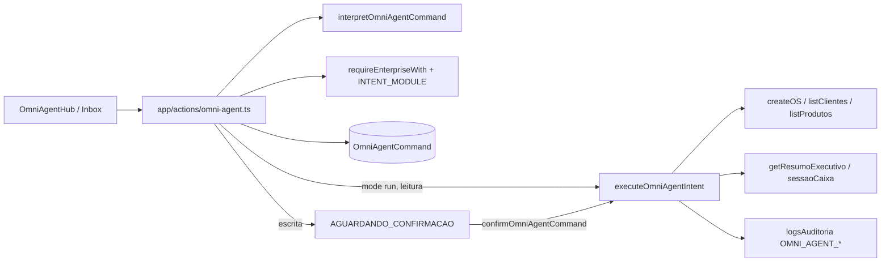

# Auditoria Omni Agent HUB

**Data:** 26/05/2026  
**Modo:** AUDITORIA PROFUNDA — somente leitura (nenhum código alterado)  
**Rota:** `/dashboard/omni-agent`  
**Documentação de referência:** `docs/ai/AGENT_HUB.md`, `docs/ai/CURRENT_STATUS.md` (secção 21/05/2026), `docs/ai/ENTERPRISE_MODULE_MAP.md`

---

## 1. Escopo analisado

| Área | Caminho | Papel |
|------|---------|-------|
| Rota App Router | `app/dashboard/omni-agent/page.tsx`, `OmniAgentClient.tsx` | Entry dinâmica (`ssr: false`) |
| UI principal | `components/omni-agent/OmniAgentHub.tsx` (~2 688 linhas) | 8 abas, modais, feed, automações, memória, relatórios, settings |
| Inbox real | `components/omni-agent/OmniAgentInboxReal.tsx` | Lista/confirmar/recusar comandos Prisma |
| Server Actions | `app/actions/omni-agent.ts` | CRUD comandos, stats, relatórios, automações, status WhatsApp env |
| Motor | `lib/omni-agent/interpret.ts`, `executor.ts`, `types.ts`, `hub-display.ts` | Interpretação regex + execução |
| Automações | `lib/omni-agent/omni-automation-engine.ts`, `omni-automation-triggers.ts` | Event bus → comando PENDENTE |
| Integração eventos | `lib/automation/automation-engine.ts`, `app/api/automation/handle-event/route.ts` | Ponte PDV/API → Omni + WhatsApp automations |
| Permissões | `lib/auth/guard-enterprise.ts`, `enterprise-permissions.ts`, `proxy-enterprise-dashboard.ts` | `workspace.omniAgent` + gates por intenção |
| Prisma | `OmniAgentCommand`, `OmniAgentAutomation`, `OmniAgentAutomationRun` | Persistência real |
| Docs IA | `docs/ai/AGENT_HUB.md`, trechos `CURRENT_STATUS.md`, `MASTER_CONTEXT.md` | Estado declarado vs código |
| Adjacente (leitura) | `/dashboard/ia-mestre/*`, WhatsApp HUB, PDV `operations-store`, APIs OS | Ecossistema IA separado |

**Arquivos `.ts`/`.tsx` lidos ou inspecionados de forma relevante:** **22** (núcleo Omni Agent + integrações citadas).

**Validações executadas (somente leitura do projeto):**

| Comando | Resultado |
|---------|-----------|
| `npx tsc --noEmit` | **0 erros** |
| `npm run build` | **OK** (Next.js 16.2.0; rota `ƒ /dashboard/omni-agent` presente) |

---

## 2. Resumo executivo

O **Omni Agent HUB** evoluiu de demonstração Lovable para um **núcleo híbrido real**: comandos persistidos em `OmniAgentCommand`, interpretador determinístico, executor com integrações pontuais (OS, cadastros, caixa, resumo financeiro), inbox com confirmação humana e automações por event bus que **só enfileiram** na Inbox (sem auto-execução perigosa).

Ainda **não é um produto Agentic AI vendável** no sentido de mercado (LLM com ferramentas, memória operacional, WhatsApp bidirecional, sandbox, créditos, métricas de modelo). Grande parte da superfície (~2 700 linhas num único ficheiro) mistura **pipeline real** com **UX demo** (localStorage, toggles sem efeito no servidor, copy que promete ações de venda/despesa/estoque que o motor não executa).

| Veredito | Detalhe |
|--------|---------|
| **Pipeline núcleo** | **Pronto para piloto interno** (comandos + inbox + confirmação + auditoria parcial) |
| **Produto SaaS Agentic** | **Não pronto** — faltam LLM governado, integrações OS/Financeiro completas, WhatsApp real, segurança do event API, alinhamento doc/UI |
| **Risco principal** | Expectativa do utilizador vs capacidade real (catálogo de comandos e sugestões “IA”) |

---

## 3. Estado atual do Omni Agent

### 3.1 Telas e abas

| Aba | ID | Estado geral |
|-----|-----|--------------|
| Visão Geral | `overview` | **Híbrido** — KPIs/feed **reais** (Prisma); sugestões “IA” **decorativas** |
| Inbox IA | `inbox` | **Real** — `OmniAgentInboxReal` + Server Actions |
| WhatsApp Agent | `whatsapp` | **Parcial** — grava comandos `canal: whatsapp`; **sem** threads Meta nem resposta outbound |
| Comandos IA | `commands` | **Híbrido** — histórico real + catálogo com **promessas > capacidade** |
| Automações | `auto` | **Real** — CRUD Prisma + runs; depende de **emissores** de eventos |
| Memória Cliente | `memory` | **Parcial** — `listClientes` real; notas/timeline **local/mock** |
| Relatórios IA | `reports` | **Híbrido** — snapshot Prisma + financeiro; **sem LLM** (explícito na UI) |
| Configurações | `settings` | **Mock/local** — `localStorage` (`omni-settings`, etc.) |

### 3.2 Header / globais

- Badge **「Fase 2 · real」** (linha ~494) — nomenclatura inconsistente com `AGENT_HUB.md` (Fase 1/3).
- **Online/Pausar** (`agentOnline`, `useLS`) — **não bloqueia** submissão de comandos (apenas UI/auditoria local).
- **Simular** — envia comando **real** aleatório (`RANDOM_CMDS` + `submitOmniAgentCommand` mode `run`).
- **Novo** — modal com pipeline real; canais «WhatsApp mock» / «Voz mock» no rótulo.
- **Command palette** (`/`) — navegação + simular; funcional.
- **Floating status** + sino de pendências — dados reais do feed Prisma.

### 3.3 Fluxo de comando (real)



---

## 4. Mapa de arquivos/componentes

```
app/dashboard/omni-agent/
  page.tsx              → force-dynamic, delega OmniAgentClient
  OmniAgentClient.tsx   → dynamic import OmniAgentHub (ssr: false)

components/omni-agent/
  OmniAgentHub.tsx      → monólito UI (8 abas + modais + palette)
  OmniAgentInboxReal.tsx → inbox operacional

app/actions/omni-agent.ts
  listOmniAgentCommands, submitOmniAgentCommand, confirm/reject
  getOmniAgentHubStats, getOmniAgentReportsSnapshot
  getOmniAgentWhatsAppCloudStatus
  list/create/update/delete OmniAgentAutomation (+ runs)

lib/omni-agent/
  interpret.ts          → regex / frases (sem LLM)
  executor.ts           → efeitos colaterais limitados
  types.ts              → INTENT_MODULE (enterprise gates)
  hub-display.ts        → DTO → feed UI
  omni-automation-engine.ts → handleOmniAgentSystemEvents
  omni-automation-triggers.ts → mapeamento evento → triggerKey

Integrações externas ao núcleo:
  lib/automation/automation-engine.ts → handleEvent → handleOmniAgentSystemEvents
  app/api/automation/handle-event/route.ts → POST eventos (PDV browser)
  app/api/ordens-servico/[id]/route.ts → os_finalizada (REST legado)
  lib/operations-store.tsx → venda_finalizada (PDV)
```

**Componentes “mortos” / legado:** não há ficheiros órfãos no namespace `omni-agent`; o “legado” está **dentro** de `OmniAgentHub.tsx` (estado React + `useLS`, não um segundo hub).

**Hooks:** `useLojaAtiva`, `useLS` (local), `useCallback`/`useEffect` locais — **sem** React Query/SWR para comandos (refresh manual).

**APIs REST dedicadas ao Omni Agent:** **nenhuma** — só Server Actions + `POST /api/automation/handle-event` (indireto).

---

## 5. O que já é real e funcional

| ID | Capacidade | Evidência |
|----|------------|-----------|
| R01 | Persistir comando por loja | `OmniAgentCommand` + `where: { storeId }` nas actions |
| R02 | Interpretar texto (determinístico) | `interpretOmniAgentCommand` — 7 intenções + fallback triagem |
| R03 | Inbox com filtros e estados | `OmniAgentInboxReal` + enum Prisma |
| R04 | Confirmação antes de OS/lembrete | `intentRequiresConfirmation` + status `AGUARDANDO_CONFIRMACAO` |
| R05 | Recusar comando pendente | `rejectOmniAgentCommand` → ERRO |
| R06 | Executar busca cliente/produto | `executor` → `listClientes` / `listProdutos` |
| R07 | Consultar caixa aberto | `prisma.sessaoCaixa` |
| R08 | Resumo financeiro (leitura) | `getResumoExecutivo` + gate `FINANCE_SUMMARY` |
| R09 | Abrir OS após confirmação | `createOS` via executor; ambiguidade de cliente na UI |
| R10 | Lembretes → auditoria | `OMNI_AGENT_LEMBRETE` em `logsAuditoria` (não entidade lembrete) |
| R11 | Stats/overview reais | `getOmniAgentHubStats` |
| R12 | Automações CRUD + runs | actions + Prisma; defaults idempotentes |
| R13 | Automação por evento → Inbox PENDENTE | `handleOmniAgentSystemEvents` |
| R14 | Permissões enterprise por intenção | `INTENT_MODULE` + `requireEnterpriseWith` |
| R15 | Log execução OK/erro | `OMNI_AGENT_EXEC_OK` / `OMNI_AGENT_EXEC_ERRO` |
| R16 | Relatórios: contagens + financeiro | `getOmniAgentReportsSnapshot` |
| R17 | Status env WhatsApp (servidor) | `getOmniAgentWhatsAppCloudStatus` (env global, não por loja) |

---

## 6. O que ainda é mock/parcial/decorativo

| ID | Item | Classificação | Notas |
|----|------|---------------|-------|
| M01 | Sugestões «Próximas ações pela IA» (overview) | **Decorativo** | Textos fixos («4 itens», «3 clientes vencidos») — não ligados a dados |
| M02 | Onboarding «4 passos» | **localStorage** | Checkboxes manuais; não validam WhatsApp/OS reais |
| M03 | `agentOnline` / Pausar | **Decorativo** | Não impede `submitOmniAgentCommand` |
| M04 | Configurações (permissões, autonomia, prompt, horário) | **localStorage** | Badge «localStorage» presente; **não** altera servidor |
| M05 | Plano / créditos IA (settings) | **Em breve** | Copy explícita |
| M06 | Canal voz; rótulos «WhatsApp mock» no modal | **Em breve / mock label** | Execução ignora canal no modal (não passa `canal` ao submit) |
| M07 | Chat WhatsApp Agent | **Simulação UI** | Mensagens sessão React; comando vai ao Prisma, **não** ao HUB WhatsApp |
| M08 | Lista conversas Meta | **Ausente** | Card aponta para `/dashboard/whatsapp` |
| M09 | Memória timeline IA | **Declarado inativo** | Placeholder na aba Memória |
| M10 | Notas cliente | **localStorage** (`omni-notes`) | |
| M11 | «Resumo automático» cliente | **Cadastro only** | Dialog honesto: sem LLM |
| M12 | Catálogo Financeiro/Vendas/Estoque (Comandos IA) | **Copy enganosa** | Ex.: «Cria despesa» → intenção `REMINDER_CREATE` triagem |
| M13 | Auditoria settings (sessão) | **Memória React** | Perde-se ao recarregar; distinto de `logsAuditoria` |
| M14 | Favoritos comandos | **localStorage** | |
| M15 | LLM / OpenRouter | **Ausente** | Badge «Sem LLM» em Relatórios; alinhado com código |

---

## 7. Bugs encontrados

| ID | Arquivo | Linha ~ | Problema | Impacto | Recomendação | Pri. |
|----|---------|---------|----------|---------|--------------|------|
| B01 | `OmniAgentHub.tsx` | 997–1048 | Modal «Novo comando» permite canal whatsapp/voz mas **não envia** `canal` em `onSendInbox`/`onExecute` | Comandos sempre `texto_interno` | Passar `canal` mapeado para `submitOmniAgentCommand` | P1 |
| B02 | `OmniAgentHub.tsx` | 688–691 | Sugestões mostram contagens fictícias («4 itens aguardando») | Utilizador confia em número falso | Ligar a `hubStats` ou remover números | P1 |
| B03 | `OmniAgentHub.tsx` | 214 | `min-h-screen` no wrapper do hub | Conflito com regra AppShell (scroll único) | Remover `min-h-screen`; confiar no shell | P2 |
| B04 | `app/actions/omni-agent.ts` | 24–37 | `logExec` engole erros (`catch {}`) | Falhas de auditoria silenciosas | Log estruturado ou rethrow em dev | P2 |
| B05 | `OmniAgentHub.tsx` | 135–138 | `refreshHubData` falha silenciosa (`catch` vazio) | Feed/stats vazios sem feedback | `toast.error` ou banner | P2 |
| B06 | `OmniAgentHub.tsx` | 242–250 | «Reexecutar» usa `mode: "run"` sempre | Duplica registos; pode reexecutar leituras sem necessidade | Confirmar ou usar inbox; deduplicar | P1 |
| B07 | `interpret.ts` | 157–163 | Fallback universal → `REMINDER_CREATE` baixa confiança | Quase todo texto vira «triagem» | UNKNOWN + mensagem clara ou LLM futuro | P1 |
| B08 | `executor.ts` | 183–199 | «Lembrete» só grava auditoria | Não existe lembrete consultável/agenda | Modelo `Lembrete` ou integração calendário | P2 |
| B09 | `OmniAgentHub.tsx` | 1014–1016 | «Interpretar» no modal usa `moduleHint` manual que **não** altera interpretação servidor | UI mostra módulo errado | Remover seletor ou usar só display | P2 |
| B10 | `app/api/automation/handle-event/route.ts` | 22–38 | POST **sem** auth NextAuth / validação loja do utilizador | Injeção de eventos/automações se URL exposta | Exigir sessão + `storeId` autorizado | **P0** |
| B11 | `LogsAuditoria` (schema) | 928–939 | Tabela **sem** `storeId` | Auditoria Omni não filtrável por loja em relatórios | Migração + queries scoped | **P0** |
| B12 | `OmniAgentHub.tsx` | 111 | `storeId = lojaAtivaId ?? LEGACY_PRIMARY_STORE_ID` | Comandos na loja errada se contexto loja falhar | Bloquear UI sem loja ativa | **P0** |

---

## 8. Botões/cards sem ação real

| ID | Arquivo | Linha ~ | Elemento | Realidade | Pri. |
|----|---------|---------|----------|-----------|------|
| U01 | `OmniAgentHub.tsx` | 552–554 | **Pausar / Ativar** agente | Só `useLS`; pipeline continua | P1 |
| U02 | `OmniAgentHub.tsx` | 647–654 | Onboarding passos (clique) | Marca localStorage; não abre fluxos | P2 |
| U03 | `OmniAgentHub.tsx` | 1997–1999 | **Resumo automático** | Só campos cadastro (dialog honesto) | P2 |
| U04 | `OmniAgentHub.tsx` | 2434–2435 | **Aprovação automática** (settings) | localStorage; servidor ignora | P1 |
| U05 | `OmniAgentHub.tsx` | 2447–2455 | **Permissões demo** (settings) | Não ligadas a `INTENT_MODULE` | P1 |
| U06 | `OmniAgentHub.tsx` | 2504–2507 | **Salvar** settings | Toast «gravado no navegador» apenas | P2 |
| U07 | `COMMAND_GROUPS` | 1303–1310 | Cards «Registrar despesa/venda/entrada estoque» | Triagem `REMINDER_CREATE`, não CRUD financeiro/estoque | **P0** (expectativa) |
| U08 | `OmniAgentHub.tsx` | 1220–1228 | **Modo humano** WhatsApp | Só suprime bubble local; não controla Cloud API | P2 |
| U09 | `AutomationsTab` | 1838–1846 | **Ir à Inbox** no log | Só `toast.info`; não muda aba | P2 |

---

## 9. Integrações com módulos do Omni

| Módulo | Integração atual | Classificação | Lacuna |
|--------|------------------|---------------|--------|
| **WhatsApp HUB** | Status env; comandos `canal: whatsapp` simulados na aba Agent; **sem** webhook → OmniAgent | **Parcial** | Inbound Meta não cria comandos; outbound não usa `/api/whatsapp/send` |
| **Automação WhatsApp** | Paralelo em `whatsAppAutomation` no mesmo `handleEvent` | **Real separado** | Dois motores (WhatsApp vs Omni) — documentar para utilizador |
| **Financeiro** | Leitura `getResumoExecutivo`; triagem texto «gastei/vendi» | **Parcial** | Sem criar CP/CR/movimento via Agent |
| **Vendas/PDV** | Evento `venda_finalizada` via `operations-store` → automação Omni | **Parcial** | Sem executor de venda; só inbox |
| **Operações/OS** | `createOS` no executor; evento `os_finalizada` só na **API REST** `[id]/route` | **Híbrido** | Server Actions `operacoes.ts` **não** emitem `os_finalizada` → automação OS pode não disparar no HUB V2 |
| **Estoque** | `PRODUCT_SEARCH` apenas | **Parcial** | «entrada estoque» → triagem lembrete |
| **Clientes/CRM** | `CLIENT_SEARCH` + lista memória | **Parcial** | Sem timeline unificada |
| **Event Bus** | `handleOmniAgentSystemEvents` após automações WA | **Real limitado** | `conta_receber_vencida` sem emissor no financeiro |
| **IA/LLM/OpenRouter** | **Não integrado** ao Omni Agent | **Ausente** | IA Mestre/marketing são outras rotas |
| **Créditos IA** | Menção «em preparação» em settings | **Ausente** | `/api/credits/*` não referenciado |
| **Notificações/inbox** | Sino + aba Inbox (pendências reais) | **Real** | Sem push/email |
| **IA Mestre** | `/dashboard/ia-mestre` separado | **Duplicado conceitual** | Dois «centros IA» no menu enterprise |

---

## 10. Riscos operacionais

| ID | Risco | Impacto | Mitigação recomendada | Pri. |
|----|-------|---------|----------------------|------|
| RO01 | Catálogo promete ações que só geram triagem/lembrete | Erro operacional / perda de confiança | Alinhar copy ou implementar executores | **P0** |
| RO02 | API `handle-event` aberta | Automações/inbox spam cross-store | Auth + validação `storeId` sessão | **P0** |
| RO03 | Fallback `loja-1` sem loja ativa | Dados na loja errada | Hard fail UI | **P0** |
| RO04 | Auditoria sem `storeId` | Compliance multi-loja frágil | Schema + backfill | **P0** |
| RO05 | OS HUB V2 sem eventos → automações OS inativas | Regras «OS entregue» nunca disparam | Emitir eventos nas Server Actions | P1 |
| RO06 | `conta_receber_vencida` sem cron/emissor | Automação financeira morta | Job server-side financeiro | P1 |
| RO07 | WhatsApp Cloud status global (env) | Multi-loja: falso positivo/negativo | Config por `Store` | P1 |
| RO08 | Doc `AUDITORIA_GERAL` linha 17 ainda «Mock» | Decisões de produto erradas | Atualizar para Híbrido | P2 |
| RO09 | Confirmação humana bypass mental via «Simular» run | Escritas podem ir direto a AGUARDANDO ou executar leituras | UX: separar demo vs produção | P2 |

---

## 11. Comparação com padrão Agentic AI moderno

| Capacidade mercado | Omni Agent hoje | Gap |
|--------------------|-----------------|-----|
| Command center unificado | Inbox + feed | Falta histórico acionável global, busca, atribuição |
| LLM + tool calling | Regex only | Crítico para SaaS «IA» |
| Memória operacional | Notas LS + cadastro | Sem timeline PDV/OS/WA/financeiro |
| Confirmação ações sensíveis | **Sim** (OS, lembrete) | Bom núcleo |
| Sandbox / preview | Interpretar no modal | Sem diff do que será gravado no DB |
| Sugestões proativas | Cards estáticos | Não preditivo |
| Agentes por módulo | Labels de intenção | Não agents isolados |
| Permissões por ação | `INTENT_MODULE` server | UI settings não reflete |
| Logs auditáveis | Parcial `logsAuditoria` | Sem `storeId`; sessão UI volátil |
| Tarefas recorrentes | Automações evento | Sem cron/recorrência |
| Alertas proativos | Sino pendências | Sem push |
| Resumo executivo IA | Resumo cadastro / financeiro read | Sem narrativa LLM |
| WhatsApp real | HUB separado | Agent não orquestra WA |
| Voz / multimodal | Rótulo «em preparação» | — |
| Métricas acerto IA | `accuracyPercent` exec/(exec+erro) | Não é qualidade semântica |
| Créditos / limite plano | Não ligado | Billing separado |

---

## 12. O que falta para virar produto vendável

1. **Motor de interpretação** — LLM com JSON schema + limite de tools, mantendo confirmação humana.  
2. **Executores de negócio** — venda, despesa, entrada estoque, mensagem WhatsApp, consultas OS abertas.  
3. **Integração WhatsApp** — inbound webhook → comando; outbound com política e templates.  
4. **Eventos completos** — OS via Server Actions; financeiro vencido; documentação única com WhatsApp automation.  
5. **Memória por cliente** — timeline real (somente leitura inicialmente).  
6. **Segurança** — auth no `handle-event`, auditoria com `storeId`, sem fallback `loja-1`.  
7. **UX honesta** — remover números fictícios; catálogo = capacidades reais.  
8. **Observabilidade** — dashboard de falhas, latência, créditos consumidos.  
9. **Unificação narrativa** — Omni Agent vs IA Mestre: papéis claros no menu.  
10. **Refactor** — dividir `OmniAgentHub.tsx` por aba (manutenção).

---

## 13. Priorização P0/P1/P2

| Prioridade | Quantidade | IDs principais |
|------------|------------|----------------|
| **P0** | **7** | B10, B11, B12, U07, RO01, RO02, RO03, RO04 |
| **P1** | **18** | B01, B02, B06, B07, U01, U04, U05, RO05, RO06, RO07, R-* gaps OS/WA/finance exec, M12, integrações OS events |
| **P2** | **22** | B03–B05, B08–B09, U02–U03, U06–U09, M01–M11, M14, RO08–RO09, refactor, gráfico hora, palette polish |

*(Contagem de achados com ID: **47** registados; P0: **7**, P1: **18**, P2: **22**.)*

---

## 14. Sequência recomendada de correção

1. **Segurança e multi-loja (P0):** auth `handle-event`, remover fallback `loja-1`, `storeId` em auditoria.  
2. **Honestidade UX (P0):** catálogo Comandos IA + sugestões overview sem promessas falsas.  
3. **Integrações evento (P1):** emitir `os_finalizada` / `conta_receber_vencida` nos fluxos reais.  
4. **Canal WhatsApp (P1):** passar `canal` no modal; opcional bridge webhook → `submitOmniAgentCommand`.  
5. **Executores negócio (P1):** venda/despesa mínimos ou bloquear frases até existirem.  
6. **LLM fase 2 (P1/P2):** OpenRouter com tools whitelist + confirmação.  
7. **Refactor UI (P2):** split componentes; remover `min-h-screen`.  
8. **Docs (P2):** `AUDITORIA_GERAL`, `CURRENT_STATUS` — estado Híbrido Fase 2/3.

---

## 15. Veredito final

O Omni Agent HUB **já entrega valor técnico verificável**: trilha de comandos em PostgreSQL, interpretação determinística, inbox com confirmação, abertura de OS e consultas reais, automações que respeitam o princípio «só enfileirar». Isso **supera** o rótulo «Mock» ainda presente em documentação antiga.

Para **venda como Agentic AI**, o produto ainda **induz capacidades que não existem** (catálogo, sugestões, settings locais, WhatsApp «agent» sem conversas reais) e tem **brechas de segurança/multi-loja** no event endpoint e na auditoria.

**Recomendação:** manter em **piloto enterprise interno** com copy ajustada; **não** promover externamente como «IA autónoma» até P0/P1 fechados e pelo menos um ciclo LLM+tools com governança.

---

## Apêndice A — Checklist «O Omni Agent consegue hoje?»

| Pergunta | Resposta |
|----------|----------|
| Interpretar comando? | **Sim** (regex, servidor e preview local) |
| Salvar comando? | **Sim** (Prisma) |
| Mandar para inbox? | **Sim** (`mode: inbox`) |
| Executar ação real? | **Parcial** (ver intenções em §5) |
| Pedir confirmação? | **Sim** (OS, lembrete/triagem) |
| Cancelar ação? | **Sim** (`rejectOmniAgentCommand`) |
| Registrar auditoria? | **Parcial** (sem `storeId` na tabela) |
| Acionar automação? | **Sim** (evento → PENDENTE; requer emissor) |
| Consultar dados reais? | **Sim** (cliente, produto, caixa, financeiro read) |
| Responder WhatsApp? | **Não** (usar WhatsApp HUB) |
| Criar lembrete? | **Parcial** (só log auditoria) |
| Gerar relatório? | **Parcial** (stats + resumo financeiro; sem LLM) |
| Operar financeiro/vendas/OS/estoque? | **OS sim**; resto triagem ou leitura |

---

## Apêndice B — Capacidades do interpretador (`interpret.ts`)

| Intenção | Confirmação | Executor |
|----------|-------------|----------|
| `OS_OPEN` | Sim | `createOS` |
| `CLIENT_SEARCH` | Não | Lista clientes |
| `PRODUCT_SEARCH` | Não | Lista produtos |
| `CASHBOX_QUERY` | Não | `sessaoCaixa` |
| `FINANCE_SUMMARY` | Não | `getResumoExecutivo` |
| `REMINDER_CREATE` | Sim | `logsAuditoria` apenas |
| `UNKNOWN` | — | Erro explícito (raro; fallback é REMINDER triagem) |

Frases «vendi/gastei/entrada estoque» → `REMINDER_CREATE` (triagem), **não** PDV/financeiro.

---

*Fim do relatório — nenhum ficheiro de produção foi modificado nesta auditoria.*
