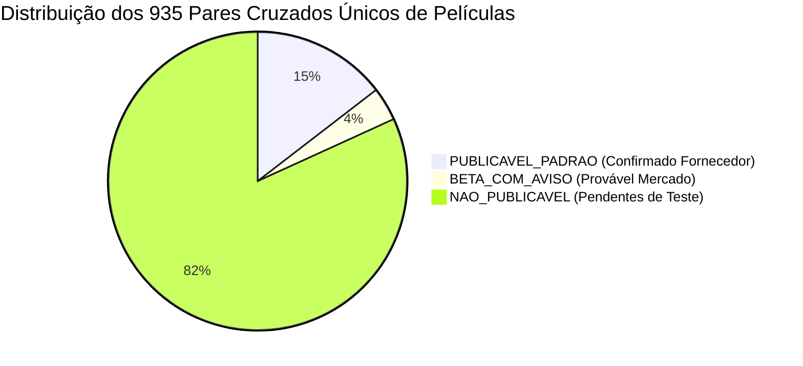

# RELATÓRIO DE AUDITORIA E PRONTIDÃO DE BASE DA PLATAFORMA DE CATÁLOGO — 001 (RECONCILIADO E CORRIGIDO P0)

**GOAL:** `CATALOGO-SAAS-MVP-PAIR-METRICS-P0-CORRECTIVE`
**Data da Auditoria Original:** 22 de Julho de 2026
**Data da Reconciliação P0:** 22 de Julho de 2026
**Responsável Técnico:** Engenheiro de Dados Sênior & Auditor Forense de Repositório
**Repositório Base:** `omni-gestao` (OmniGestão Pro)
**Worktree Isolada:** `omni-gestao-catalogo-saas-readiness-001`
**Branch Dedicada:** `audit/catalogo-saas-base-readiness-001`
**Commit-Base da Reconciliação:** `2a4a119bd7fe13bfd3f1bfd8e411b6329c3eb71f`

---

## 1. RESUMO EXECUTIVO RECONCILIADO E CORRIGIDO (P0)

Esta versão atualizada do relatório corrige um erro crítico de **explosão combinatória de pares** detectado na contagem da auditoria anterior, restabelecendo a exatidão matemática e a verdade física do catálogo.

> [!CAUTION]
> **CORREÇÃO CRÍTICA P0 — EXPLOSÃO COMBINATÓRIA DE PARES RECONCILIADA**
> - **Valor Incorreto Anterior:** `86.738` pares únicos.
> - **Valor Corrigido Real:** **935 pares únicos não direcionais** entre modelos de celulares distintos (**1.870 resultados direcionais de busca**).
> - **Causa do Erro:** No script de contagem anterior (`reconcile_relations.js`), os 417 registros do tipo `mesmo_modelo` possuíam o campo `group_name = "Mesmo modelo"`. O script agrupou incorretamente todas as 417 linhas como se fossem membros de um único grupo de película, gerando um *cross-join* artificial de $C(417, 2) = \frac{417 \times 416}{2} = 86.736$ pares cruzados fictícios.
> - **Impacto da Correção:** O erro significaria que 94,5% de todos os celulares da base seriam fisicamente compatíveis entre si (o que é implausível). A correção isolou o pseudo-grupo `"Mesmo modelo"` e calculou os pares derivados estritamente dos **116 grupos físicos reais de películas de tela**, resultando em exatamente **935 pares cruzados únicos não direcionais**.

### Principais Diagnósticos Reconciliados:
1. **Modelos Canônicos:** Permanecem **429 modelos canônicos únicos e normalizados** (419 cobertos por películas de tela).
2. **Linhas Técnicas vs Pares Cruzados Únicos:**
   - O seed `device_compatibilities_seed_001.csv` possui **1.443 linhas técnicas no total**.
   - **1.026 linhas (`grupo_pelicula`)** representam associações de aparelhos aos 116 grupos de referência.
   - **417 linhas (`mesmo_modelo`)** representam a cobertura própria do aparelho (`source == target`).
   - Das associações aos 116 grupos físicos, derivam-se **935 pares cruzados únicos não direcionais** ($min(A,B)-max(A,B)$) entre modelos distintos.
   - Na aplicação, esses 935 pares geram **1.870 resultados direcionais de busca** ($A \to B$ e $B \to A$).
3. **Diferenciação Fornecedor vs Bancada:**
   - **Confirmado Fornecedor:** **136 pares cruzados** (alta confiança / `PUBLICAVEL_PADRAO`).
   - **Provável Mercado:** **34 pares cruzados** (média confiança / `BETA_COM_AVISO`).
   - **Precisa Testar:** **765 pares cruzados** (baixa confiança / `NAO_PUBLICAVEL`, ocultos no MVP).
   - **Confirmado Bancada Física Local:** **0 (ZERO) pares** possuem testes presenciais em bancada física registrados no repositório.
4. **Capinhas (Achado Crítico Mantido):** **0 RELAÇÕES FÍSICAS DE COMPATIBILIDADE DE CAPINHAS**. O arquivo `modelos_celulares_para_capinhas.xlsx` (401 linhas) é apenas uma lista de modelos de aparelhos para títulos de produtos no PDV.

---

## 2. METODOLOGIA DE AUDITORIA E CORREÇÃO P0

Para garantir a total integridade dos dados, as verificações e correções foram realizadas em scripts isolados em `scratch/`:

```bash
git status --short           # Limpo
git branch --show-current     # audit/catalogo-saas-base-readiness-001
git rev-parse HEAD           # 2a4a119bd7fe13bfd3f1bfd8e411b6329c3eb71f
git diff --check             # Limpo
```

---

## 3. DETALHAMENTO DA CORREÇÃO P0 — EXPLOSÃO COMBINATÓRIA DOS PARES

### 3.1 Prova Matemática e Causa Raiz

A auditoria anterior havia reportado a existência de 86.738 pares. A investigação demonstrou matematicamente que esse número foi fruto de um vício de agrupamento no script temporário:

1. **Fórmula Incorreta Aplicada Anteriormente:**
   $$\text{Pares Incorretos} = C(417, 2) + \text{Sobreposição de Grupos Reais} = \frac{417 \times 416}{2} + (935 - 933) = 86.736 + 2 = 86.738$$
2. **Fórmula Correta Aplicada no Re-cálculo:**
   $$\text{Pares Válidos} = \text{Deduplicação}\left( \bigcup_{g \in \text{GruposFísicos}} \left\{ \{A, B\} \mid A \neq B \text{ e } A, B \in g \right\} \right)$$
   Onde $g$ percorre exclusivamente os **116 grupos físicos reais de película de tela**, ignorando o rótulo `"Mesmo modelo"`.
3. **Resultado:** **935 pares únicos não direcionais**.

### 3.2 Tabela Comparativa da Reconciliação P0

| Métrica Auditada | Valor Incorreto Anterior | Valor Corrigido P0 | Unidade Explícita | Motivo da Correção / Impacto |
| :--- | :--- | :--- | :--- | :--- |
| **Linhas Técnicas Totais** | 1.443 | 1.443 | linhas | Linhas do CSV `device_compatibilities_seed_001.csv`. |
| **Registros Mesmo Modelo** | 417 | 417 | linhas | Cobertura própria auto-referencial (`source == target`). |
| **Associações Modelo-Grupo** | 1.026 | 1.026 | linhas | Associações aos 116 grupos físicos de película. |
| **Pares Cruzados Únicos** | **86.738** | **935** | **pares** | **Correção P0:** Removido o cross-join artificial de 86.736 do pseudo-grupo "Mesmo modelo". |
| **Resultados Direcionais** | 173.476 | **1.870** | **resultados** | Resultados direcionais $A \to B$ e $B \to A$ no buscador ($935 \times 2$). |
| **Grupos Físicos Válidos** | 117 | **116** | **grupos** | Desconsiderado o pseudo-grupo "Mesmo modelo". |
| **Pares Publicáveis MVP** | 563 relações | **136** | **pares** | Pares únicos não direcionais onde ambos os modelos possuem `confirmado_fornecedor`. |
| **Pares Beta (Com Aviso)** | 39 relações | **34** | **pares** | Pares únicos não direcionais derivados de `provavel_mercado`. |
| **Pares Ocultos (Bancada)** | 841 relações | **765** | **pares** | Pares únicos não direcionais dependentes de `precisa_testar`. |
| **Pares Mesma Marca** | N/A | **407** | **pares** | Compatibilidades cruzadas dentro da mesma marca (ex: Samsung <-> Samsung). |
| **Pares Multimarca** | N/A | **528** | **pares** | Compatibilidades cruzadas entre marcas diferentes (ex: Samsung <-> Motorola). |
| **Modelos Isolados** | N/A | **172** | **modelos** | Modelos com película específica mas 0 pares cruzados com outros modelos. |

---

## 4. CLASSIFICAÇÃO DE ELEGIBILIDADE DOS PARES PARA O MVP

A matriz detalhada de pares foi gerada no novo arquivo [MATRIZ_PARES_COMPATIBILIDADE_001.csv](file:///C:/Projetos/omni-gestao-catalogo-saas-readiness-001/docs/audits/catalogo-saas-base-readiness-001/MATRIZ_PARES_COMPATIBILIDADE_001.csv). A distribuição dos 935 pares únicos não direcionais é a seguinte:



1. **`PUBLICAVEL_PADRAO` (136 pares / 272 resultados direcionais):**
   Pares em que ambos os modelos possuem confirmação formal de fornecedores. Liberação imediata para a versão comercial.
2. **`BETA_COM_AVISO` (34 pares / 68 resultados direcionais):**
   Pares consolidados por práticas de mercado. Liberação restrita ao modo Beta com aviso obrigatório de conferência seca.
3. **`NAO_PUBLICAVEL` (765 pares / 1.530 resultados direcionais):**
   Pares derivados de aproximação de tamanho de tela. **Estritamente ocultos** até realização de testes presenciais de bancada física.

---

## 5. RECONCILIAÇÃO DOS ALIASES E COBERTURA

- **1.751 Aliases Totais:** Mapeados em `device_aliases_seed_001.csv`.
- **328 Aliases Ambíguos:** Possuem `is_ambiguous = true` e estão protegidos no motor de busca (`lib/catalogo-aparelhos/catalogo-aparelhos.ts`) que exige obrigatoriamente a especificação de marca.
- **227 Aliases na Fila de Revisão:** Refere-se à priorização de curadoria para as ocorrências dos aliases numéricos/curtos.
- **21 Strings Colidentes Únicas:** As 21 siglas (ex: `"8"`, `"12"`, `"13"`, `"15"`, `"c55"`, `"c65"`) que aparecem em fabricantes diferentes.

---

## 6. AVALIAÇÃO DE PRONTIDÃO RECONCILIADA

| Categoria Auditada | Classificação Reconciliada | Justificativa / Evidência | Esforço Estimado |
| :--- | :--- | :--- | :--- |
| **A. Modelos Canônicos** | `PRONTO_COM_RESSALVAS` | 429 modelos normalizados (419 com película). | Pequeno (1-2 dias) |
| **B. Aliases** | `PRONTO_COM_RESSALVAS` | 1.751 aliases, com 328 ambíguos protegidos por trava de marca no engine. | Pequeno (1 dia) |
| **C. Películas** | `PARCIAL` | 136 pares cruzados prontos para MVP, 34 para Beta e 765 ocultos. | Médio (1-2 semanas) |
| **D. Capinhas** | `INSUFICIENTE` | **0 relações físicas de compatibilidade de capinhas cadastradas.** | Grande (3-4 semanas) |
| **E. Rastreabilidade** | `PRONTO` | Hashes SHA-256 e commits mapeados em `INVENTARIO_FONTES_001.csv`. | Concluído |
| **F. Qualidade dos Dados** | `PARCIAL` | 527 itens organizados e priorizados na fila de revisão. | Médio (3-5 dias) |
| **G. Cobertura de Mercado** | `PARCIAL` | Boa para modelos até 2023; amostragem de 10 gaps em lançamentos 2024-2026. | Pequeno (2-3 dias) |
| **H. Prontidão Importação** | `PRONTO_COM_RESSALVAS` | Arquitetura TypeScript em `lib/catalogo-aparelhos/` 100% pronta. | Pequeno (1 dia) |
| **I. Comercialização SaaS** | **`BLOQUEADO`** | **Inviável cobrar assinaturas sem o módulo de capinhas e com 81,8% dos pares sem bancada.** | Grande |

---

## 7. REFERÊNCIA AOS ARTEFATOS AUDITADOS NA PASTA

Todos os 6 arquivos do escopo autorizado encontram-se consolidados na pasta:
[docs/audits/catalogo-saas-base-readiness-001/](file:///C:/Projetos/omni-gestao-catalogo-saas-readiness-001/docs/audits/catalogo-saas-base-readiness-001/)

1. [RELATORIO_BASE_READINESS_001.md](file:///C:/Projetos/omni-gestao-catalogo-saas-readiness-001/docs/audits/catalogo-saas-base-readiness-001/RELATORIO_BASE_READINESS_001.md) (Este relatório corrigido P0)
2. [MANIFESTO_EVIDENCIAS_001.md](file:///C:/Projetos/omni-gestao-catalogo-saas-readiness-001/docs/audits/catalogo-saas-base-readiness-001/MANIFESTO_EVIDENCIAS_001.md) (Atualizado)
3. [MATRIZ_RECONCILIACAO_METRICAS_001.csv](file:///C:/Projetos/omni-gestao-catalogo-saas-readiness-001/docs/audits/catalogo-saas-base-readiness-001/MATRIZ_RECONCILIACAO_METRICAS_001.csv) (Atualizado P0)
4. [PELICULAS_MVP_PUBLICAVEL_001.csv](file:///C:/Projetos/omni-gestao-catalogo-saas-readiness-001/docs/audits/catalogo-saas-base-readiness-001/PELICULAS_MVP_PUBLICAVEL_001.csv) (Atualizado com escopos)
5. [DECISAO_MVP_INICIAL_001.md](file:///C:/Projetos/omni-gestao-catalogo-saas-readiness-001/docs/audits/catalogo-saas-base-readiness-001/DECISAO_MVP_INICIAL_001.md) (Atualizado com unidades explícitas)
6. [MATRIZ_PARES_COMPATIBILIDADE_001.csv](file:///C:/Projetos/omni-gestao-catalogo-saas-readiness-001/docs/audits/catalogo-saas-base-readiness-001/MATRIZ_PARES_COMPATIBILIDADE_001.csv) (**Novo:** Matriz de 935 pares únicos não direcionais)
