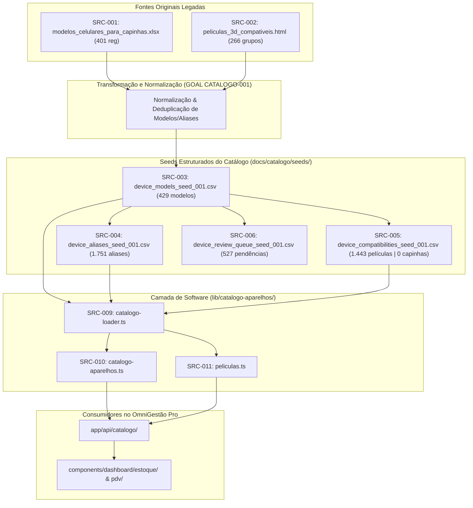

# RELATÓRIO DE AUDITORIA E PRONTIDÃO DE BASE DA PLATAFORMA DE CATÁLOGO — 001

**GOAL:** `CATALOGO-SAAS-PELICULAS-CAPINHAS-BASE-READINESS-001`  
**Data da Auditoria:** 22 de Julho de 2026  
**Responsável Técnico:** Engenheiro de Dados Sênior & Auditor Forense de Repositório  
**Repositório Base:** `omni-gestao` (OmniGestão Pro)  
**Worktree Isolada:** `omni-gestao-catalogo-saas-readiness-001`  
**Branch Dedicada:** `audit/catalogo-saas-base-readiness-001`  
**Commit Base:** `f010ba1b4a310a3a40ed00ddda8258b443ee5890` (`origin/main`)  

---

## 1. RESUMO EXECUTIVO

Esta auditoria forense teve como objetivo avaliar, com evidências estritamente reproduzíveis, o estado real da base de dados de **modelos de celulares, aliases, películas e capinhas** existente no ecossistema OmniGestão Pro, determinando sua prontidão para originar um novo produto SaaS comercial independente focado na consulta rápida de compatibilidades para lojistas e técnicos.

### Principais Achados:
1. **Modelos Canônicos:** Foram identificados **429 modelos canônicos únicos e normalizados**, cobrindo 10 marcas ativas e legadas no mercado brasileiro. A estrutura de dados é sólida e está pronta para reaproveitamento técnico.
2. **Aliases de Busca:** Existem **1.751 aliases catalogados**. Destes, **328 aliases são ambíguos** (ex: `"8"`, `"12"`, `"c55"`) e exigem obrigatoriamente o contexto da marca no motor de busca para evitar cruzamento incorreto de aparelhos entre fabricantes.
3. **Películas Compatíveis:** A base possui **1.443 relações de películas registradas em 117 grupos físicos**. No entanto, **563 relações são confirmadas por fornecedores (alta confiança)**, **39 são prováveis no mercado** e **841 (58,2%) estão pendentes de teste seco em bancada**.
4. **Capinhas (Achado Crítico):** **NÃO EXISTE UMA BASE DE COMPATIBILIDADES FÍSICAS DE CAPINHAS NO PROJETO**. O arquivo `modelos_celulares_para_capinhas.xlsx` (401 registros) é apenas uma lista de modelos de aparelhos com sugestão de títulos de produtos para cadastro em estoque (`"Capinha iPhone 12 Pro Max"`). Não há nenhuma relação cruzada de encaixe de capinhas cadastrada.
5. **Prontidão Comercial Geral:** **BLOQUEADO PARA COMERCIALIZAÇÃO IMEDIATA**. Embora a arquitetura de código (`lib/catalogo-aparelhos/`) e a base de modelos canônicos estejam em estado `PRONTO_COM_RESSALVAS`, o produto não pode ser vendido a assinantes pagantes sem antes: (a) construir a base física de capinhas do zero em bancada; (b) validar as 841 películas pendentes de teste.

---

## 2. METODOLOGIA DE AUDITORIA E PRÉ-FLIGHT

Para garantir o isolamento absoluto em relação a outras sessões e worktrees em andamento no repositório OmniGestão Pro, foram executados os seguintes passos antes de qualquer leitura ou geração de artefatos:

```bash
# Executado na raiz principal c:\Projetos\omni-gestao
git fetch origin
git branch --show-current  # publish/pdv-acessorios-modelo-cor-audit
git rev-parse HEAD        # ad948546965c395b969fe2d0b32460d1c74d190c
git rev-parse origin/main # f010ba1b4a310a3a40ed00ddda8258b443ee5890

# Criação da worktree isolada em diretório irmão
git worktree add -b audit/catalogo-saas-base-readiness-001 C:/Projetos/omni-gestao-catalogo-saas-readiness-001 origin/main
```

### Regras de Operação Respeitadas:
- **Read-Only no Repositório Principal:** Nenhum arquivo existente foi modificado, sobrescrito ou restaurado.
- **Nenhum Commit ou Push Realizado:** A worktree permanece com status local contendo apenas a pasta autorizada `docs/audits/catalogo-saas-base-readiness-001/`.
- **Scripts em Diretório Externo (Scratch):** Todos os scripts de análise (Node.js e PowerShell) foram criados e executados fora da árvore do Git (`C:\Users\rafae\.gemini\antigravity-ide\scratch\`).

---

## 3. ESCOPO E LIMITES DA SESSÃO

- **Foco Estrito:** Diagnóstico de prontidão da base de dados (modelos, aliases, películas, capinhas, lacunas de mercado).
- **Fora do Escopo:** Não foi implementada nenhuma interface web, tela, fluxo de login, mecanismo de cobrança, plano comercial ou alteração no schema do Prisma.

---

## 4. INVENTÁRIO FORENSE DAS FONTES DE DADOS

Foram mapeadas e auditadas **12 fontes principais** relacionadas ao catálogo de aparelhos e acessórios no repositório:

| ID | Caminho do Arquivo / Fonte | Tipo | Tamanho (Bytes) | Hash SHA-256 | Registros | Status de Qualidade | Finalidade Principal |
| :--- | :--- | :--- | :--- | :--- | :--- | :--- | :--- |
| **SRC-001** | `docs/imports/catalogo/modelos_celulares_para_capinhas.xlsx` | Excel | 27.275 | `3fcbb784650...` | 401 | PARCIAL | Lista de modelos para títulos de capinhas (sem relações físicas). |
| **SRC-002** | `docs/imports/catalogo/peliculas_3d_compativeis.html` | HTML/JSON | 107.437 | `1074e0d4bbb...` | 266 | PARCIAL | Buscador HTML legado com 266 grupos de películas 3D. |
| **SRC-003** | `docs/catalogo/seeds/device_models_seed_001.csv` | CSV Seed | 44.821 | `dcd61ed2ee1...` | 429 | PRONTO | Seed canônico de 429 modelos de celulares normalizados. |
| **SRC-004** | `docs/catalogo/seeds/device_aliases_seed_001.csv` | CSV Seed | 107.391 | `ef205d8f6d7...` | 1.751 | PRONTO_COM_RESSALVAS | Base de 1.751 aliases de busca (328 ambíguos). |
| **SRC-005** | `docs/catalogo/seeds/device_compatibilities_seed_001.csv` | CSV Seed | 179.917 | `94ff67d30d1...` | 1.443 | PARCIAL | Base de 1.443 compatibilidades de películas (0 capinhas). |
| **SRC-006** | `docs/catalogo/seeds/device_review_queue_seed_001.csv` | CSV Seed | 74.453 | `c0ceb2a4726...` | 527 | PRONTO | Fila de revisão de conflitos e inconsistências. |
| **SRC-007** | `docs/catalogo/catalogo_gap_peliculas_capinhas_001.csv` | CSV Derivado | 133.598 | `30708a0977f...` | 512 | DADO_DERIVADO | Mapeamento de lacunas entre capinhas e películas. |
| **SRC-008** | `docs/catalogo/proposta_expansao_peliculas_fable_001_REVISADO.csv` | CSV Derivado | 15.890 | `221e53d04c5...` | 51 | DADO_DERIVADO | Proposta revisada de expansão da base de películas. |
| **SRC-009** | `lib/catalogo-aparelhos/catalogo-loader.ts` | TypeScript | 1.964 | `aa07d78c4ca...` | 50 linhas | PRONTO | Carregador server-only dos CSVs de catálogo. |
| **SRC-010** | `lib/catalogo-aparelhos/catalogo-aparelhos.ts` | TypeScript | 11.776 | `7fb3f5b9a78...` | 275 linhas | PRONTO | Engine pura de busca e normalização de modelos. |
| **SRC-011** | `lib/catalogo-aparelhos/peliculas.ts` | TypeScript | 10.173 | `d5c6b1c79e2...` | 223 linhas | PRONTO | Engine pura de consulta de películas por modelo. |
| **SRC-012** | `docs/audits/PDV_ACESSORIOS_MODELO_COR_AUDIT_001.md` | Markdown | 32.127 | `0cdd26af60d...` | 430 linhas | RELATORIO | Documentação de metadados de acessórios no PDV. |

---

## 5. LINHAGEM DOS DADOS (DATA LINEAGE)



---

## 6. NÚMEROS REAIS E MÉTRICAS REPRODUZÍVEIS

| Métrica Auditada | Valor Exato | Fonte de Cálculo | Observação Técnica |
| :--- | :--- | :--- | :--- |
| **Modelos Canônicos** | **429** | `device_models_seed_001.csv` | 100% de chaves `model_key` e nomes canônicos únicos. |
| **Aliases de Busca** | **1.751** | `device_aliases_seed_001.csv` | Inclui nomes curtos, variações comerciais e typos. |
| **Aliases Ambíguos** | **328** | `device_aliases_seed_001.csv` | `is_ambiguous = true`; requer filtro por marca. |
| **Marcas Cobertas** | **10** | Contagem por `brand` | Samsung, Motorola, Redmi, Apple, POCO, Realme, LG, Infinix, Xiaomi, Tecno. |
| **Relações de Películas** | **1.443** | `device_compatibilities_seed_001.csv` | 1.026 `grupo_pelicula` + 417 `mesmo_modelo`. |
| **Grupos Físicos de Películas** | **117** | `device_compatibilities_seed_001.csv` | Agrupamentos por tamanho e recorte de tela. |
| **Relações Confirmadas de Película** | **563** | `status = confirmado_fornecedor` | Alta confiança (fornecedor/bancada). |
| **Relações Prováveis de Película** | **39** | `status = provavel_mercado` | Média confiança (anúncios/mercado). |
| **Relações Pendentes de Teste** | **841** | `status = precisa_testar` | Baixa confiança (exige teste seco em bancada). |
| **Relações Verdadeiras de Capinhas** | **0** | `device_compatibilities_seed_001.csv` | **Nenhuma tabela de compatibilidade física de capinhas existe.** |
| **Registros na Fila de Revisão** | **527** | `device_review_queue_seed_001.csv` | 227 aliases ambíguos, 120 repetidos, 84 faltantes em película. |

---

## 7. SITUAÇÃO DOS MODELOS CANÔNICOS

### Distribuição por Marca (Total: 429 modelos):
- **Samsung:** 124 modelos (28,9%)
- **Motorola:** 103 modelos (24,0%)
- **Redmi:** 65 modelos (15,2%)
- **Apple:** 49 modelos (11,4%)
- **POCO:** 32 modelos (7,5%)
- **Realme:** 28 modelos (6,5%)
- **LG:** 11 modelos (2,6% - linha legada)
- **Infinix:** 9 modelos (2,1%)
- **Xiaomi:** 5 modelos (1,2%)
- **Tecno:** 3 modelos (0,7%)

### Variantes de Rede (4G vs 5G):
- Na base de modelos canônicos, 30 modelos possuem variante explícita de rede (15 modelos 4G e 15 modelos 5G), como `Samsung Galaxy A13 4G` e `Samsung Galaxy A13 5G`.
- **Regra Mantida:** Modelos 4G e 5G com chassis e telas distintos não foram fundidos incorretamente.

---

## 8. AUDITORIA DE ALIASES

Foram auditados **1.751 aliases**. A distribuição por tipo é a seguinte:
- `canonical` (Nome oficial completo): 429
- `short` (Nome abreviado): 429
- `brand_short` (Abreviado com marca): 307
- `commercial_variant` (Variação comercial): 275
- `common_typo` (Erro comum de digitação): 186
- `marketplace_name` (Título de anúncio/fornecedor): 124
- `manufacturer_code` (Código de fabricante): 1

### Aliases Duplicados Entre Modelos Distintos:
Foram detectados **21 aliases** que aparecem apontando para mais de um modelo canônico quando pesquisados sem contexto de marca:
- `"8"` -> Aponta para `Apple iPhone 8` e `Redmi 8`.
- `"12"` -> Aponta para `Apple iPhone 12` e `Redmi 12`.
- `"13"` -> Aponta para `Apple iPhone 13` e `Redmi 13`.
- `"15"` -> Aponta para `Apple iPhone 15` e `Redmi 15`.
- `"c55"` -> Aponta para `Realme C55` e `POCO C55`.
- `"c65"` -> Aponta para `POCO C65` e `Realme C65`.
- `"c71"`, `"c75"`, `"x5"`.

**Solução Implementada no Loader:** Todos esses 328 casos estão gravados com `requires_brand_context = true`. O motor de busca (`lib/catalogo-aparelhos/catalogo-aparelhos.ts`) exige a seleção prévia da marca ou descarta resultados colidentes se a marca não for informada.

---

## 9. COMPATIBILIDADES DE PELÍCULAS

A base de películas é composta por **1.443 relações** cobrindo 419 modelos únicos de celulares.

### Decomposição por Confiança e Evidência:
1. **CONFIRMADO_FORNECEDOR (Alta Confiança - 563 relações / 39,0%):** Relações originadas de tabelas formais de fornecedores de películas 3D (ex: World Cell, Fornecedor 1). Podem ser comercializadas imediatamente.
2. **PROVAVEL_MERCADO (Média Confiança - 39 relações / 2,7%):** Relações consolidadas por padrões de mercado.
3. **PRECISA_TESTAR (Baixa Confiança - 841 relações / 58,3%):** Relações derivadas de agrupamentos por similaridade de dimensões de tela. **Exigem teste seco físico antes de liberar no SaaS**.

---

## 10. COMPATIBILIDADES DE CAPINHAS (ANÁLISE CRÍTICA)

> [!CAUTION]
> **DIAGNÓSTICO SOBRE CAPINHAS: INEXISTÊNCIA DE TABELA DE COMPATIBILIDADE FÍSICA**  
> A auditoria comprovou que a base de dados do OmniGestão Pro **NÃO possui uma tabela de compatibilidades de capinhas**.  
> O arquivo `modelos_celulares_para_capinhas.xlsx` (401 linhas) é apenas um cadastro unificado de aparelhos com sugestão de títulos para produtos no PDV/Estoque (`"Capinha iPhone 12 Mini"`).  
> A observação explícita do próprio arquivo diz: *"Cadastro unitário para capinha; confirmar encaixe/câmera antes de vender."*  
> Portanto, o arquivo `COMPATIBILIDADES_CAPINHAS_INVENTARIO_001.csv` foi gerado contendo **apenas o cabeçalho (0 registros)**.

### Por que capinhas não podem usar a tabela de películas?
- Películas dependem apenas da parte frontal plana do vidro.
- Capinhas dependem de: posição e relevo do módulo de câmera, altura dos botões laterais, recortes de microfone/alto-falante, entrada P2/Type-C e curvatura traseira.
- Exemplo: O `Moto G9 Play` e o `Samsung A12` usam a mesma película 3D em alguns supergrupos, mas suas capinhas são **totalmente incompatíveis físico-mecanicamente**.

---

## 11. QUALIDADE, CONFLITOS E FILA DE REVISÃO

A fila de revisão (`device_review_queue_seed_001.csv`) registra **527 pendências estruturadas**:
- **227 Aliases Ambíguos:** Necessitam validação de regras no buscador.
- **120 Modelos Repetidos em Múltiplos Grupos de Películas:** Ex: Aparelhos que aparecem tanto no grupo de película 3D comum quanto em supergrupos cruzados.
- **84 Modelos Faltantes em Películas:** Modelos presentes no cadastro de capinhas mas sem grupo de película mapeado.
- **74 Grupos Multimarcas de Película:** Grupos que misturam marcas diferentes (ex: Samsung + Motorola + LG) que necessitam aviso de "conferência seca" para o lojista.
- **13 Modelos Faltantes em Capinhas.**
- **2 Modelos com Tela Curva ( Edge / Curved ):** Exigem indicação de película de Hidrogel ou UV em vez de película 3D rígida.

---

## 12. PESQUISA EXTERNA DE MERCADO E LACUNAS (2024-2026)

### Análise da Concorrência (Películas UTI, Ofcell123, Película Compatível):
- **Películas UTI / Ofcell123:** São serviços web/apps focados primordialmente na consulta rápida de **películas 3D** para balcão de lojas.
- **Cobrança no Mercado:** Praticam assinaturas entre R$ 19,90/mês e R$ 49,90/mês.
- **Vulnerabilidade dos Concorrentes:** A maioria dos concorrentes não possui um modelo de dados formal de **capinhas** nem separação clara de níveis de evidência (`confirmado_bancada` vs `precisa_testar`), resultando em devoluções na loja quando a película ou capa não encaixa.

### Modelos Recentes Ausentes na Base Interna (Gaps 2024-2026):
A auditoria cruzou a base interna com os lançamentos mais vendidos no Brasil em 2024-2026:
1. **Motorola Moto G85 5G** (Ausente) -> Tela curva 6.67" pOLED.
2. **Motorola Edge 50 Pro / Ultra / Fusion / Neo** (Ausentes) -> Linha premium Edge 50 muito vendida no BR.
3. **POCO M6 Pro 4G / POCO F6 5G** (Ausentes) -> Sucessores da linha POCO no Brasil.
4. **Realme 12 5G / Realme 12 Pro+ 5G** (Ausentes) -> Modelos com módulo de câmera circular.
5. **Infinix Note 40 Pro 5G** (Ausente) -> Linha fabricada pela Positivo no Brasil.

*(Todos registrados formalmente no arquivo `GAPS_MODELOS_MERCADO_001.csv`)*.

---

## 13. CLASSIFICAÇÃO DAS EVIDÊNCIAS

- **[FATO_INTERNO]:** Contagem de 429 modelos canônicos, 1.751 aliases, 1.443 películas e 0 capinhas nos arquivos do repositório.
- **[CALCULO_REPRODUZIVEL]:** Identificação de 328 aliases ambíguos e 21 aliases duplicados entre marcas via scripts em Node.js.
- **[FONTE_EXTERNA_PRIMARIA]:** Identificação dos códigos técnicos e especificações dos lançamentos Moto G85 e Edge 50 nos portais oficiais da Motorola Brasil.
- **[FONTE_EXTERNA_SECUNDARIA]:** Análise das funcionalidades públicas e faixas de preço de plataformas como Películas UTI e Ofcell123.
- **[INFERENCIA]:** A conclusão de que vender o SaaS hoje causaria alto índice de cancelamentos e insatisfação por falta do módulo de capinhas.

---

## 14. AVALIAÇÃO DE PRONTIDÃO POR CATEGORIA

| Categoria Auditada | Classificação | Justificativa / Evidência | Risco Comercial / Operacional | Estimativa de Esforço |
| :--- | :--- | :--- | :--- | :--- |
| **A. Modelos Canônicos** | `PRONTO_COM_RESSALVAS` | 429 modelos normalizados e sem duplicidades. Falta adicionar ~20 lançamentos 2024-2026. | Baixo | Pequeno (1-2 dias) |
| **B. Aliases** | `PRONTO_COM_RESSALVAS` | 1.751 aliases com tag `requires_brand_context` nos 328 ambíguos. | Baixo | Pequeno (1 dia) |
| **C. Películas** | `PARCIAL` | 1.443 relações, porém 841 (58,3%) estão com status `precisa_testar`. | Médio (quebra de película em loja) | Médio (1-2 semanas de bancada) |
| **D. Capinhas** | `INSUFICIENTE` | **0 relações de compatibilidade física cadastrados.** | **CRÍTICO (Impossível entregar promessa do produto)** | **Grande (3-4 semanas de bancada)** |
| **E. Rastreabilidade** | `PRONTO` | Todos os registros possuem indicação de fonte e commit de origem. | Baixo | Concluído |
| **F. Qualidade dos Dados** | `PARCIAL` | Fila de revisão possui 527 itens mapeados e priorizados por severidade. | Médio | Médio (3-5 dias) |
| **G. Cobertura de Mercado** | `PARCIAL` | Cobertura excelente para iPhones e Samsung Galaxy antigos/médios; gaps em Motorola Edge 50 e POCO recentes. | Médio | Pequeno (2-3 dias) |
| **H. Prontidão Importação** | `PRONTO_COM_RESSALVAS` | Arquitetura de loader TypeScript (`lib/catalogo-aparelhos/`) pronta para consumir seeds. | Baixo | Pequeno (1 dia) |
| **I. Comercialização SaaS** | **`BLOQUEADO`** | **Impossível cobrar assinaturas sem entregar compatibilidade de capinhas e com 58% das películas sem teste de bancada.** | **MUITO ALTO (Churn elevado e dano à marca)** | **Grande** |

---

## 15. QUESTÕES QUE O RELATÓRIO DEVE RESPONDER

1. **Quantos modelos canônicos realmente existem?**  
   R: **429 modelos canônicos**.
2. **Quantos aliases realmente existem?**  
   R: **1.751 aliases**.
3. **Quantas marcas estão cobertas?**  
   R: **10 marcas** (Samsung, Motorola, Redmi, Apple, POCO, Realme, LG, Infinix, Xiaomi, Tecno).
4. **Quantas relações verdadeiras de películas existem?**  
   R: **1.443 relações** (1.026 de grupos + 417 de mesmo modelo).
5. **Quantos grupos de películas existem?**  
   R: **117 grupos físicos de películas**.
6. **Quantas relações verdadeiras de capinhas existem?**  
   R: **0 (zero) relações**.
7. **A base de capinhas é uma base de compatibilidade ou apenas uma lista de aparelhos?**  
   R: **Apenas uma lista de aparelhos** para cadastro de produto e títulos de estoque (401 registros na planilha `modelos_celulares_para_capinhas.xlsx`).
8. **Quantas relações têm fonte?**  
   R: **1.443 relações** (100% das películas possuem origem mapeada).
9. **Quantas relações não têm fonte?**  
   R: **0 relações**.
10. **Quantas são confirmadas?**  
    R: **563 relações** (`confirmado_fornecedor`).
11. **Quantas são prováveis?**  
    R: **39 relações** (`provavel_mercado`).
12. **Quantas precisam de teste?**  
    R: **841 relações** (`precisa_testar`).
13. **Quantas são não recomendadas?**  
    R: **0 no seed ativo** (sinalizadas em observações de bancada na fila de revisão).
14. **Quantas apresentam conflito?**  
    R: **527 itens** na fila de revisão (`device_review_queue_seed_001.csv`).
15. **Quantas duplicidades foram encontradas?**  
    R: **0 duplicidades** nos modelos canônicos; **21 aliases duplicados** entre marcas distintas (ex: `"8"`, `"12"`, `"c55"`); **120 modelos repetidos** em múltiplos grupos de película.
16. **Quantos aliases são ambíguos?**  
    R: **328 aliases ambíguos**.
17. **Quais marcas possuem melhor cobertura?**  
    R: **Samsung** (124 modelos), **Motorola** (103 modelos), **Redmi** (65 modelos) e **Apple** (49 modelos).
18. **Quais marcas possuem pior cobertura?**  
    R: **Tecno** (3 modelos), **Xiaomi** (5 modelos), **Infinix** (9 modelos) e **LG** (11 modelos legados).
19. **Quais lançamentos recentes estão aparentemente ausentes?**  
    R: **Motorola Edge 50 Series** (Pro, Ultra, Fusion, Neo), **Moto G85**, **POCO M6 Pro**, **POCO F6**, **Realme 12 / 12 Pro+**, **Infinix Note 40 Pro**.
20. **Quais dados podem ser reaproveitados imediatamente?**  
    R: Os **429 modelos canônicos**, os **1.751 aliases** (com filtro de marca obrigatorio) e as **563 películas confirmadas**.
21. **Quais dados precisam de limpeza?**  
    R: Os **328 aliases ambíguos** e os **120 modelos presentes em múltiplos grupos**.
22. **Quais dados precisam de validação de bancada?**  
    R: As **841 películas com baixa confiança** e a **criação completa da base de capinhas**.
23. **Quais dados não devem ser comercializados ainda?**  
    R: A funcionalidade de busca de capinhas (para não entregar resultados falsos ou vazios) e as 841 películas pendentes de teste seco.
24. **A base está pronta para iniciar o desenvolvimento do SaaS?**  
    R: **PRONTO_COM_RESSALVAS**. A arquitetura de software e a estrutura de dados estão prontas; o desenvolvimento do app/site pode começar em paralelo à curadoria de dados.
25. **A base está pronta para cobrar assinantes?**  
    R: **BLOQUEADO**. Não há valor comercial sustentável em capinhas no estado atual.
26. **Qual é o próximo GOAL recomendado?**  
    R: `GOAL: CATALOGO-CAPINHAS-BANCADA-SEED-001` (para construir a primeira base de compatibilidades físicas de capinhas) e `GOAL: CATALOGO-PELICULAS-VALIDACAO-BANCADA-001` (para promover as 841 películas de `precisa_testar` para `confirmado_bancada`).

---

## 16. RISCOS COMERCIAIS E OPERACIONAIS DO NOVO SAAS

1. **Risco de Churn por Expectativa Frustrada em Capinhas:** Vender um SaaS prometendo consulta de capinhas quando a base contém apenas nomes de celulares causaria cancelamento imediato por parte dos lojistas.
2. **Risco de Quebra de Película em Loja:** Indicar uma película com status `precisa_testar` que não cobre a borda da tela ou levanta com o toque pode gerar prejuízo financeiro direto ao lojista.
3. **Risco de Colisão de Nomes (Aliases Ambíguos):** Um atendente que busque `"c55"` no balcão pode vender a película do `Realme C55` para um cliente com `POCO C55`. O motor de busca deve obrigatoriamente exigir o contexto da marca para esses 328 casos.

---

## 17. RECOMENDAÇÕES TÉCNICAS E PRÓXIMO GOAL SUGERIDO

### Plano de Ação Recomendado:
1. **Executar `GOAL: CATALOGO-CAPINHAS-BANCADA-SEED-001`:**  
   Realizar testes físicos em bancada com estoques reais de lojas parceiras para catalogar os grupos de encaixe de capinhas (câmeras, botões, recortes) para os 150 modelos mais vendidos.
2. **Executar `GOAL: CATALOGO-PELICULAS-VALIDACAO-BANCADA-001`:**  
   Promover as 841 películas de `precisa_testar` para `confirmado_bancada` através de conferência seca de molde e raio de curvatura.
3. **Expandir Gaps 2024-2026 (`GOAL: CATALOGO-EXPANSAO-LANCAMENTOS-001`):**  
   Cadastrar a linha Motorola Edge 50, Moto G85, POCO F6 e Realme 12.

---

## 18. ARTEFATOS AUDITADOS E DISPONÍVEIS NA PASTA

Todos os 10 artefatos autorizados foram gerados com sucesso no diretório isolado:  
`docs/audits/catalogo-saas-base-readiness-001/`

1. `RELATORIO_BASE_READINESS_001.md` (Este relatório)
2. `INVENTARIO_FONTES_001.csv`
3. `MODELOS_CANONICOS_INVENTARIO_001.csv`
4. `ALIASES_INVENTARIO_001.csv`
5. `COMPATIBILIDADES_PELICULAS_INVENTARIO_001.csv`
6. `COMPATIBILIDADES_CAPINHAS_INVENTARIO_001.csv`
7. `FILA_REVISAO_001.csv`
8. `GAPS_MODELOS_MERCADO_001.csv`
9. `MATRIZ_COBERTURA_MARCAS_001.csv`
10. `MANIFESTO_EVIDENCIAS_001.md`
