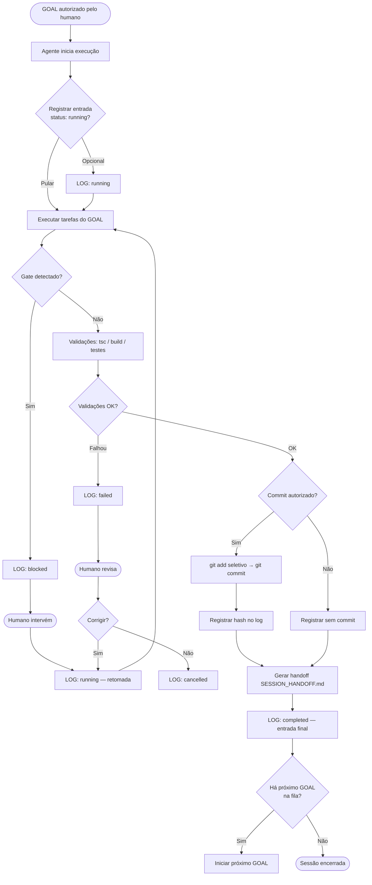

# 📋 Execution Log — Log oficial append-only

> **Registro imutável de toda execução de GOAL no OmniGestão Pro.**
> Nunca apague entradas. Nunca sobrescreva. Corrija com nova entrada marcada `superseded`.
> Consulte [`SESSION_HANDOFF.md`](./SESSION_HANDOFF.md) para handoffs relacionados.
> Consulte [`OVERNIGHT_QUEUE.md`](./OVERNIGHT_QUEUE.md) para rastreamento de filas.

---

## 1. Objetivo

O EXECUTION_LOG é a memória auditável do projeto. Permite:

- Rastrear **o que foi feito, por quem, quando e com qual resultado** — sem depender da memória de conversa.
- Identificar padrões de falha (GOALs que falham repetidamente na mesma área).
- Provar que uma área protegida **não foi tocada** em uma sessão.
- Retomar trabalho após interrupção com contexto completo.
- Auditar a evolução do projeto ao longo do tempo (Codex, Opus, humano).

---

## 2. Regra append-only

| Regra | Detalhe |
|---|---|
| **Nunca apagar** | Entradas antigas nunca são removidas — nem mesmo entradas de GOALs cancelados |
| **Nunca sobrescrever** | Se uma entrada está errada, criar nova entrada com status `superseded` apontando para a correta |
| **Correções = novas entradas** | Uma correção de GOAL gera uma nova entrada de log independente |
| **Sempre datar** | Toda entrada tem `data_hora` preenchido — nunca omitir |
| **Ordem cronológica** | Novas entradas sempre no **final** do arquivo — nunca intercaladas |

### 2.1 Como corrigir uma entrada errada

```yaml
# Entrada original (MANTER — não deletar)
- log_id: "LOG-042"
  status: completed
  observacoes: "commit hash incorreto registrado"

# Entrada de correção (ADICIONAR ao final)
- log_id: "LOG-042-COR"
  data_hora: "2026-06-26 09:00"
  tipo: docs
  status: superseded
  observacoes: "Corrige LOG-042 — hash correto é abc1234, não xyz9999"
  supersede: "LOG-042"
```

---

## 3. Estrutura obrigatória por entrada

```yaml
- log_id: "LOG-NNN"                    # [obrigatório] sequencial global, ex: LOG-001
  data_hora: "YYYY-MM-DD HH:MM"        # [obrigatório] horário local (Brasília)
  projeto: "OmniGestão Pro"            # [obrigatório] sempre este valor
  branch: "main | skill/<ticket>"      # [obrigatório]
  ferramenta: "Claude Code Sonnet | Claude Opus | ChatGPT | Codex | Antigravity | Humano"
  operador_humano: "Rafael"            # quem autorizou/supervisionou
  goal:
    id: ""                             # ex: BL-FISCAL-005, QUEUE-003, Bloco 2
    nome: ""                           # nome descritivo do GOAL
    tipo: ""                           # ver §4 — tipos permitidos
  status: ""                           # ver §5 — status permitidos
  arquivos_criados:
    - ""
  arquivos_alterados:
    - ""
  validacoes:
    tsc: "ok | falhou | n/a"
    build: "ok | falhou | n/a"
    testes: "N passed | falhou | n/a"  # ex: "253 passed"
  commit:
    realizado: true | false
    hash: ""                           # vazio se não commitado
    mensagem: ""
  push:
    realizado: false                   # padrão sempre false — só true com autorização explícita
    destino: ""                        # ex: "origin/main" — preencher somente se push=true
  riscos:
    - id: "R-NNN"
      descricao: ""
      severidade: "P0 | P1 | P2 | P3"
  proximo_passo: ""                    # próximo GOAL ou ação necessária
  handoff_relacionado: ""              # ID ou referência ao handoff desta sessão
  supersede: ""                        # preencher somente se esta entrada corrige outra
  observacoes: ""
```

---

## 4. Tipos permitidos

| Tipo | Quando usar |
|---|---|
| `docs` | Criação ou atualização de documentação em `docs/` |
| `implementation` | Implementação de feature, serviço, API ou componente |
| `audit` | Auditoria de código, segurança ou arquitetura (read-only ou com findings) |
| `design` | Protótipo, layout, UX (Antigravity / Cloud Design) |
| `hotfix` | Correção urgente fora do fluxo normal de GOAL |
| `refactor` | Refatoração dentro de área já existente, sem nova feature |
| `fiscal` | GOAL específico do módulo fiscal (NFC-e, tax engine, provider, etc.) |
| `pdv` | GOAL específico do módulo PDV / Caixa / Vendas |
| `estoque` | GOAL específico do módulo Estoque / Inventário |
| `operacoes` | GOAL específico do módulo Operações / OS |
| `overnight` | Entrada gerada por execução em modo Overnight Batch |

---

## 5. Status permitidos

| Status | Significado |
|---|---|
| `planned` | GOAL registrado mas ainda não iniciado |
| `running` | GOAL em execução no momento do registro |
| `completed` | GOAL finalizado com sucesso |
| `failed` | GOAL falhou — erro não resolvido |
| `blocked` | GOAL pausado em Gate obrigatório — aguarda intervenção humana |
| `cancelled` | GOAL descartado manualmente |
| `superseded` | Esta entrada corrige ou substitui outra entrada anterior |

---

## 6. Template copiável de nova entrada

```yaml
- log_id: "LOG-"                       # preencher com próximo número sequencial
  data_hora: ""                        # YYYY-MM-DD HH:MM
  projeto: "OmniGestão Pro"
  branch: "main"
  ferramenta: "Claude Code Sonnet"
  operador_humano: "Rafael"
  goal:
    id: ""
    nome: ""
    tipo: "docs"                       # ajustar conforme §4
  status: "completed"                  # ajustar conforme §5
  arquivos_criados:
    - ""
  arquivos_alterados:
    - ""
  validacoes:
    tsc: "n/a"
    build: "n/a"
    testes: "n/a"
  commit:
    realizado: false
    hash: ""
    mensagem: ""
  push:
    realizado: false
    destino: ""
  riscos: []
  proximo_passo: ""
  handoff_relacionado: ""
  supersede: ""
  observacoes: ""
```

---

## 7. Exemplos reais

### 7.1 Execution Engine V2 — Blocos 1 a 5

```yaml
- log_id: "LOG-001"
  data_hora: "2026-06-25 10:00"
  projeto: "OmniGestão Pro"
  branch: "main"
  ferramenta: "Claude Code Sonnet"
  operador_humano: "Rafael"
  goal:
    id: "Bloco 1"
    nome: "EXECUTION_RULES.md — regras de execução contínua"
    tipo: "docs"
  status: "completed"
  arquivos_criados:
    - "docs/execution/EXECUTION_RULES.md"
  arquivos_alterados:
    - "docs/execution/INDEX.md"
  validacoes:
    tsc: "n/a"
    build: "n/a"
    testes: "n/a"
  commit:
    realizado: true
    hash: "c9e3a2b"
    mensagem: "docs(execution): criar regras oficiais de execução contínua"
  push:
    realizado: false
    destino: ""
  riscos: []
  proximo_passo: "Bloco 2 — GOAL_TEMPLATE.md"
  handoff_relacionado: "HANDOFF CURTO 2026-06-25 Bloco 1"
  observacoes: "Stage seletivo — operacoes-v4-preview e design/ preservados fora do commit"

- log_id: "LOG-002"
  data_hora: "2026-06-25 11:00"
  projeto: "OmniGestão Pro"
  branch: "main"
  ferramenta: "Claude Code Sonnet"
  operador_humano: "Rafael"
  goal:
    id: "Bloco 2"
    nome: "GOAL_TEMPLATE.md — template oficial de GOALs"
    tipo: "docs"
  status: "completed"
  arquivos_criados:
    - "docs/execution/GOAL_TEMPLATE.md"
  arquivos_alterados:
    - "docs/execution/INDEX.md"
  validacoes:
    tsc: "n/a"
    build: "n/a"
    testes: "n/a"
  commit:
    realizado: true
    hash: "bb37747"
    mensagem: "docs(execution): criar template oficial de GOALs individuais"
  push:
    realizado: false
    destino: ""
  riscos: []
  proximo_passo: "Bloco 3 — EXECUTION_PROFILE.md"
  handoff_relacionado: "HANDOFF CURTO 2026-06-25 Bloco 2"
  observacoes: "20 campos obrigatórios + 3 exemplos (docs/impl/overnight)"

- log_id: "LOG-003"
  data_hora: "2026-06-25 12:00"
  projeto: "OmniGestão Pro"
  branch: "main"
  ferramenta: "Claude Code Sonnet"
  operador_humano: "Rafael"
  goal:
    id: "Bloco 3"
    nome: "EXECUTION_PROFILE.md — perfil das ferramentas"
    tipo: "docs"
  status: "completed"
  arquivos_criados:
    - "docs/execution/EXECUTION_PROFILE.md"
  arquivos_alterados:
    - "docs/execution/INDEX.md"
  validacoes:
    tsc: "n/a"
    build: "n/a"
    testes: "n/a"
  commit:
    realizado: false
    hash: ""
    mensagem: ""
  push:
    realizado: false
    destino: ""
  riscos: []
  proximo_passo: "Bloco 4 — OVERNIGHT_QUEUE.md"
  handoff_relacionado: "HANDOFF CURTO 2026-06-25 Bloco 3"
  observacoes: "6 ferramentas documentadas — ChatGPT, Sonnet, Opus, Antigravity, Codex, Cursor"

- log_id: "LOG-004"
  data_hora: "2026-06-25 13:00"
  projeto: "OmniGestão Pro"
  branch: "main"
  ferramenta: "Claude Code Sonnet"
  operador_humano: "Rafael"
  goal:
    id: "Bloco 4"
    nome: "OVERNIGHT_QUEUE.md — fila oficial de execução contínua"
    tipo: "docs"
  status: "completed"
  arquivos_criados:
    - "docs/execution/OVERNIGHT_QUEUE.md"
  arquivos_alterados:
    - "docs/execution/INDEX.md"
  validacoes:
    tsc: "n/a"
    build: "n/a"
    testes: "n/a"
  commit:
    realizado: false
    hash: ""
    mensagem: ""
  push:
    realizado: false
    destino: ""
  riscos: []
  proximo_passo: "Bloco 5 — SESSION_HANDOFF.md"
  handoff_relacionado: "HANDOFF CURTO 2026-06-25 Bloco 4"
  observacoes: "9 estados, 12 campos por GOAL, Mermaid, checklists, exemplo com fila dos Blocos 1-4"

- log_id: "LOG-005"
  data_hora: "2026-06-25 14:00"
  projeto: "OmniGestão Pro"
  branch: "main"
  ferramenta: "Claude Code Sonnet"
  operador_humano: "Rafael"
  goal:
    id: "Bloco 5"
    nome: "SESSION_HANDOFF.md — protocolo de continuidade"
    tipo: "docs"
  status: "completed"
  arquivos_criados:
    - "docs/execution/SESSION_HANDOFF.md"
  arquivos_alterados:
    - "docs/execution/INDEX.md"
  validacoes:
    tsc: "n/a"
    build: "n/a"
    testes: "n/a"
  commit:
    realizado: false
    hash: ""
    mensagem: ""
  push:
    realizado: false
    destino: ""
  riscos: []
  proximo_passo: "Bloco 6 — EXECUTION_LOG.md"
  handoff_relacionado: "HANDOFF CURTO 2026-06-25 Bloco 5"
  observacoes: "6 tipos de handoff, checklists, Mermaid, 4 exemplos fiscais BL-FISCAL-002..008"

- log_id: "LOG-006"
  data_hora: "2026-06-25 15:00"
  projeto: "OmniGestão Pro"
  branch: "main"
  ferramenta: "Claude Code Sonnet"
  operador_humano: "Rafael"
  goal:
    id: "Bloco 6"
    nome: "EXECUTION_LOG.md — log oficial append-only"
    tipo: "docs"
  status: "completed"
  arquivos_criados:
    - "docs/execution/EXECUTION_LOG.md"
  arquivos_alterados:
    - "docs/execution/INDEX.md"
  validacoes:
    tsc: "n/a"
    build: "n/a"
    testes: "n/a"
  commit:
    realizado: false
    hash: ""
    mensagem: ""
  push:
    realizado: false
    destino: ""
  riscos: []
  proximo_passo: "Bloco 7 — a definir"
  handoff_relacionado: ""
  observacoes: "Este arquivo. Inclui exemplos fiscais e Execution Engine V2 Blocos 1-6."
```

---

### 7.2 Fiscal — BL-FISCAL-002 a BL-FISCAL-008

```yaml
- log_id: "LOG-F001"
  data_hora: "2026-05-XX 00:00"
  projeto: "OmniGestão Pro"
  branch: "main"
  ferramenta: "Claude Code Sonnet"
  operador_humano: "Rafael"
  goal:
    id: "BL-FISCAL-002"
    nome: "Identidade fiscal por loja — CRUD config/certificado/série"
    tipo: "fiscal"
  status: "completed"
  arquivos_criados:
    - "app/api/fiscal/config/route.ts"
    - "app/api/fiscal/certificado/route.ts"
    - "app/api/fiscal/serie/route.ts"
    - "components/fiscal/FiscalIdentidadeSection.tsx"
  arquivos_alterados:
    - "docs/ai/CURRENT_STATUS.md"
  validacoes:
    tsc: "ok"
    build: "n/a"
    testes: "896 passed"
  commit:
    realizado: true
    hash: "549513d"
    mensagem: "feat(fiscal): identidade fiscal por loja — CRUD config/certificado/série"
  push:
    realizado: false
    destino: ""
  riscos:
    - id: "R-F001"
      descricao: "Segredo só por referência (blobRef/senhaRef/cscTokenRef) — nunca no DB"
      severidade: "P1"
  proximo_passo: "BL-FISCAL-003 — máquina de estados da venda fiscal"
  handoff_relacionado: "HANDOFF CURTO BL-FISCAL-002"
  observacoes: "Admin-only, multi-loja, dormente. 3 arquivos PWA pre-staged deixados intocados."

- log_id: "LOG-F002"
  data_hora: "2026-05-XX 00:00"
  projeto: "OmniGestão Pro"
  branch: "main"
  ferramenta: "Claude Code Sonnet"
  operador_humano: "Rafael"
  goal:
    id: "BL-FISCAL-003"
    nome: "Máquina de estados da venda fiscal"
    tipo: "fiscal"
  status: "completed"
  arquivos_criados:
    - "lib/fiscal/venda-fiscal-state-machine.ts"
  arquivos_alterados:
    - "app/api/ops/corrigir-cliente/route.ts"
    - "app/api/ops/corrigir-pagamento/route.ts"
    - "app/api/ops/corrigir-observacao/route.ts"
    - "app/api/ops/corrigir-desconto/route.ts"
    - "app/api/ops/cancelar/route.ts"
  validacoes:
    tsc: "ok"
    build: "n/a"
    testes: "918 passed"
  commit:
    realizado: true
    hash: "ca681ed"
    mensagem: "feat(fiscal): máquina de estados da venda fiscal — gate dormente"
  push:
    realizado: false
    destino: ""
  riscos:
    - id: "R-F002"
      descricao: "Asterisco em JSDoc quebra parse do TypeScript — evitar */ em comentários fiscais"
      severidade: "P2"
  proximo_passo: "BL-FISCAL-004 — produto fonte única fiscal"
  handoff_relacionado: "HANDOFF CURTO BL-FISCAL-003"
  observacoes: "NAO_FISCAL=no-op (comportamento idêntico). EMITINDO/AUTORIZADA/etc. → 409."

- log_id: "LOG-F003"
  data_hora: "2026-05-XX 00:00"
  projeto: "OmniGestão Pro"
  branch: "main"
  ferramenta: "Claude Code Sonnet"
  operador_humano: "Rafael"
  goal:
    id: "BL-FISCAL-004"
    nome: "Produto fonte única fiscal — persistência NCM/CEST/CFOP/origem"
    tipo: "fiscal"
  status: "completed"
  arquivos_criados:
    - "lib/produto-fiscal.ts"
  arquivos_alterados:
    - "app/api/produtos/route.ts"
    - "app/api/inventory/route.ts"
    - "lib/importador/legado.ts"
    - "lib/importador/avancado.ts"
  validacoes:
    tsc: "ok"
    build: "n/a"
    testes: "935 passed"
  commit:
    realizado: true
    hash: "04ce54d"
    mensagem: "feat(fiscal): produto fonte única fiscal — NCM/CEST/CFOP/origem"
  push:
    realizado: false
    destino: ""
  riscos: []
  proximo_passo: "BL-FISCAL-005 — snapshot fiscal da venda"
  handoff_relacionado: "HANDOFF CURTO BL-FISCAL-004"
  observacoes: "Persistência aditiva em Produto.metadata.fiscal (sem schema). Importador legado+avançado cobertos."

- log_id: "LOG-F004"
  data_hora: "2026-05-XX 00:00"
  projeto: "OmniGestão Pro"
  branch: "main"
  ferramenta: "Claude Code Sonnet"
  operador_humano: "Rafael"
  goal:
    id: "BL-FISCAL-005"
    nome: "Snapshot fiscal da venda — ponte Venda→NotaFiscal"
    tipo: "fiscal"
  status: "completed"
  arquivos_criados:
    - "lib/fiscal/snapshot/builder.ts"
    - "lib/fiscal/snapshot/service.ts"
    - "lib/fiscal/snapshot/index.ts"
  arquivos_alterados: []
  validacoes:
    tsc: "ok"
    build: "n/a"
    testes: "953 passed"
  commit:
    realizado: true
    hash: "b5177cf"
    mensagem: "feat(fiscal): snapshot fiscal da venda — dormente"
  push:
    realizado: false
    destino: ""
  riscos: []
  proximo_passo: "BL-FISCAL-006 — abstração de provider fiscal"
  handoff_relacionado: "HANDOFF CURTO BL-FISCAL-005"
  observacoes: "deepFreeze, getProdutoFiscal, idempotente por nota vigente + localKey nfce-snapshot."

- log_id: "LOG-F005"
  data_hora: "2026-05-XX 00:00"
  projeto: "OmniGestão Pro"
  branch: "main"
  ferramenta: "Claude Code Sonnet"
  operador_humano: "Rafael"
  goal:
    id: "BL-FISCAL-006"
    nome: "Abstração de provider fiscal — contrato + STUB_HOMOLOGACAO"
    tipo: "fiscal"
  status: "completed"
  arquivos_criados:
    - "lib/fiscal/provider/types.ts"
    - "lib/fiscal/provider/contract.ts"
    - "lib/fiscal/provider/stub-homologacao.ts"
    - "lib/fiscal/provider/resolver.ts"
    - "lib/fiscal/provider/index.ts"
  arquivos_alterados: []
  validacoes:
    tsc: "ok"
    build: "n/a"
    testes: "980 passed"
  commit:
    realizado: true
    hash: "a206dce"
    mensagem: "feat(fiscal): abstração de provider fiscal — contrato + stub homologação"
  push:
    realizado: false
    destino: ""
  riscos: []
  proximo_passo: "BL-FISCAL-007 — pipeline oficial de emissão fiscal"
  handoff_relacionado: "HANDOFF CURTO BL-FISCAL-006"
  observacoes: "8 métodos no contrato FiscalProvider. STUB chave SIM-... Dormente."

- log_id: "LOG-F006"
  data_hora: "2026-05-XX 00:00"
  projeto: "OmniGestão Pro"
  branch: "main"
  ferramenta: "Claude Code Sonnet"
  operador_humano: "Rafael"
  goal:
    id: "BL-FISCAL-007"
    nome: "Pipeline oficial de emissão fiscal — orquestração dormente"
    tipo: "fiscal"
  status: "completed"
  arquivos_criados:
    - "lib/fiscal/emission/pipeline.ts"
    - "lib/fiscal/emission/preparar.ts"
    - "lib/fiscal/emission/validar.ts"
    - "lib/fiscal/emission/emitir.ts"
    - "lib/fiscal/emission/reconstruct.ts"
    - "lib/fiscal/emission/index.ts"
  arquivos_alterados: []
  validacoes:
    tsc: "ok"
    build: "n/a"
    testes: "1010 passed"
  commit:
    realizado: true
    hash: "cd565c8"
    mensagem: "feat(fiscal): pipeline de emissão fiscal dormente"
  push:
    realizado: false
    destino: ""
  riscos:
    - id: "R-F006"
      descricao: "1ª run de build flaky worker crash Windows — re-run limpo"
      severidade: "P3"
  proximo_passo: "BL-FISCAL-008 — numeração fiscal por série"
  handoff_relacionado: "HANDOFF CURTO BL-FISCAL-007"
  observacoes: "ÚNICA escrita = Venda.fiscalStatus + fiscal_logs. Idempotente. Sem DANFE/QRCode/SEFAZ."

- log_id: "LOG-F007"
  data_hora: "2026-06-25 00:00"
  projeto: "OmniGestão Pro"
  branch: "main"
  ferramenta: "Claude Code Sonnet"
  operador_humano: "Rafael"
  goal:
    id: "BL-FISCAL-008"
    nome: "Numeração fiscal por série — alocador concorrência-segura"
    tipo: "fiscal"
  status: "completed"
  arquivos_criados:
    - "lib/fiscal/numbering/orchestrator.ts"
    - "lib/fiscal/numbering/adapter.ts"
    - "lib/fiscal/numbering/index.ts"
    - "lib/fiscal/numbering/numbering.test.ts"
  arquivos_alterados:
    - "lib/fiscal/pipeline/pipeline.ts"
  validacoes:
    tsc: "ok"
    build: "ok"
    testes: "1038 passed"
  commit:
    realizado: true
    hash: "2b88411"
    mensagem: "feat(fiscal): numeração fiscal por série — GOAL_008 dormente"
  push:
    realizado: false
    destino: ""
  riscos:
    - id: "R-F007"
      descricao: "Build 1ª run flaky spawn nativo Windows — re-run limpo"
      severidade: "P3"
  proximo_passo: "Ativação real fiscal (KMS, C14N estrito, XSD, SEFAZ, fila, DANFE, fiscalEnabled)"
  handoff_relacionado: "HANDOFF CURTO BL-FISCAL-008"
  observacoes: "allocateFiscalNumber PURO + reserveNextNumber atômico Prisma. Dormente. 0 callers produtivos."
```

---

### 7.3 Operações V4 Preview

```yaml
- log_id: "LOG-OPS001"
  data_hora: "2026-06-25 00:00"
  projeto: "OmniGestão Pro"
  branch: "main"
  ferramenta: "Claude Code Sonnet"
  operador_humano: "Rafael"
  goal:
    id: "Operacoes-V4-Preview"
    nome: "Shell cockpit V4 — top bar, icon rail, modos, context column"
    tipo: "operacoes"
  status: "completed"
  arquivos_criados:
    - "app/dashboard/operacoes-v4-preview/page.tsx"
    - "components/operacoes-v4-preview/OperacoesV4Preview.tsx"
    - "components/operacoes-v4-preview/mock-data.ts"
    - "components/operacoes-v4-preview/operacoes-v4-preview.module.css"
    - "components/operacoes-v4-preview/parts/ (múltiplos)"
    - "components/operacoes-v4-preview/tokens.ts"
    - "components/operacoes-v4-preview/types.ts"
    - "components/operacoes-v4-preview/use-v4-preview.ts"
    - "design/operacoes-v4/ (assets, handoff, standalone HTML)"
  arquivos_alterados:
    - "lib/navigation/dashboard-nav-items.ts"
  validacoes:
    tsc: "ok"
    build: "n/a"
    testes: "n/a"
  commit:
    realizado: false
    hash: ""
    mensagem: ""
  push:
    realizado: false
    destino: ""
  riscos: []
  proximo_passo: "Commit seletivo Operações V4 Preview — aguarda autorização"
  handoff_relacionado: ""
  observacoes: "Arquivos untracked no working tree — não incluídos nos commits de Execution Engine V2."
```

---

## 8. Política de atualização

### 8.1 Quando registrar

| Momento | Ação no log |
|---|---|
| GOAL iniciado (opcional) | Adicionar entrada com `status: running` |
| GOAL concluído | Adicionar entrada com `status: completed` |
| GOAL falhou | Adicionar entrada com `status: failed` + motivo em `observacoes` |
| GOAL bloqueado em Gate | Atualizar entrada `running` → adicionar nova `status: blocked` |
| GOAL retomado após bloqueio | Adicionar nova entrada `status: running` referenciando a blocked |
| Correção de entrada anterior | Adicionar nova entrada `status: superseded` com campo `supersede: "LOG-NNN"` |

### 8.2 Quem registra

O **agente executor** (Claude Code Sonnet) registra ao final de cada GOAL como parte do
relatório de encerramento. O humano pode registrar manualmente quando executa ações fora
do fluxo normal (hotfix, rollback manual, deploy).

### 8.3 Como referenciar commit

```yaml
commit:
  realizado: true
  hash: "abc1234"          # primeiros 7 caracteres do hash completo
  mensagem: "feat(scope): descrição"
```

Se o commit ainda não foi feito (GOAL sem commit autorizado):

```yaml
commit:
  realizado: false
  hash: ""
  mensagem: ""
```

### 8.4 Como referenciar handoff

```yaml
handoff_relacionado: "HANDOFF CURTO 2026-06-25 Bloco 3"
# ou
handoff_relacionado: "docs/governance/handoffs/2026-06-25-003.yaml"
```

### 8.5 Como marcar falha

```yaml
status: "failed"
observacoes: "tsc falhou em lib/fiscal/emission/pipeline.ts:87 — Type mismatch FiscalStatus × EmissionStatus. Aguarda correção."
proximo_passo: "Criar GOAL de correção alinhando tipos"
```

### 8.6 Como marcar retomada

Quando um GOAL `failed` ou `blocked` é retomado após intervenção:

```yaml
# Nova entrada — não editar a anterior
- log_id: "LOG-042-RETOMADA"
  goal:
    id: "BL-FISCAL-007"
    nome: "Pipeline de emissão — retomada após fix de tipos"
    tipo: "fiscal"
  status: "completed"
  observacoes: "Retomada de LOG-042 (failed). Tipos alinhados via FiscalEmissionStatus intermediário."
  supersede: ""            # não preencher — esta não substitui LOG-042, é continuação
```

---

## 9. Checklist antes de encerrar GOAL

Executar antes de declarar um GOAL como concluído:

```
[ ] Entrada adicionada neste log com todos os campos obrigatórios
[ ] Status correto: completed | failed | blocked | cancelled
[ ] Commit registrado (hash ou "não realizado" explícito)
[ ] Push confirmado como "não realizado" (ou documentado com autorização)
[ ] Validações registradas: tsc / build / testes (ou "n/a" justificado)
[ ] Próximo passo preenchido
[ ] Handoff gerado conforme SESSION_HANDOFF.md
[ ] Handoff referenciado nesta entrada de log
[ ] Riscos identificados registrados (ou lista vazia explícita)
[ ] Nenhum arquivo fora do escopo incluído no commit
```

---

## 10. Fluxo Mermaid



---

## Novas entradas

> Adicionar abaixo desta linha, em ordem cronológica. Nunca inserir acima de entradas existentes.

<!-- PRÓXIMA ENTRADA: LOG-007 -->
