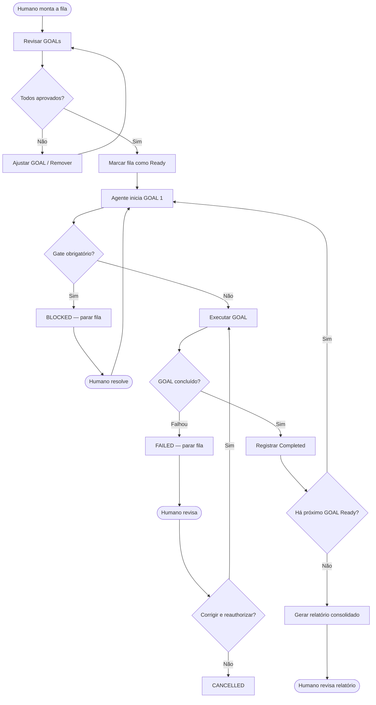

# 🌙 Overnight Queue — Fila oficial de execução contínua

> **Este documento define a estrutura e as políticas da fila de GOALs pré-aprovados para execução em batch.**
> O agente processa a fila sem pausas entre GOALs, parando apenas em Gates obrigatórios.
> Consulte [`EXECUTION_RULES.md`](./EXECUTION_RULES.md) §5 para as regras do modo overnight.
> Consulte [`GOAL_TEMPLATE.md`](./GOAL_TEMPLATE.md) para o formato de cada GOAL da fila.

---

## 1. Conceito

A **Overnight Queue** é uma lista ordenada de GOALs pré-aprovados pelo humano que o agente
executa em sequência, sem aguardar confirmação entre um GOAL e o próximo.

**Pré-condições obrigatórias para ativar a fila:**

1. Todos os GOALs foram revisados e aprovados pelo humano antes do início.
2. Nenhum GOAL toca área de Gate obrigatório (auth, schema, produção, push).
3. Todos os GOALs são tamanho **S (≤ 4h estimadas)**.
4. O humano confirmou explicitamente: *"fila aprovada — pode executar"*.
5. A fila está registrada neste documento com status `Ready`.

**O que a fila garante:**

- Execução sequencial e auditável (um GOAL por vez, na ordem da fila).
- Parada automática em qualquer Gate obrigatório detectado durante execução.
- Preservação do progresso: se a sessão for interrompida, retoma do último GOAL concluído.
- Relatório consolidado único ao final de toda a fila.
- Nunca faz push, nunca faz migration, nunca toca produção.

---

## 2. Estados da fila

Cada GOAL da fila percorre os seguintes estados:

| Estado | Significado |
|---|---|
| `Pending` | GOAL cadastrado, ainda não revisado pelo humano |
| `Ready` | GOAL revisado e aprovado pelo humano — elegível para execução |
| `Running` | GOAL sendo executado pelo agente agora |
| `Waiting` | GOAL pausado aguardando output de outro GOAL (dependência) |
| `Blocked` | GOAL detectou Gate obrigatório — exige intervenção humana |
| `Review` | GOAL concluído, aguardando revisão humana antes de prosseguir |
| `Completed` | GOAL finalizado com sucesso |
| `Failed` | GOAL falhou — erro não resolvido; fila parada |
| `Cancelled` | GOAL cancelado manualmente pelo humano |

### 2.1 Transições válidas

```
Pending → Ready (humano aprova)
Ready → Running (agente inicia)
Running → Completed (GOAL entregue)
Running → Failed (erro não resolvido)
Running → Blocked (Gate detectado)
Running → Waiting (aguardando dependência)
Waiting → Running (dependência satisfeita)
Blocked → Ready (humano resolve o Gate e reauthoriza)
Blocked → Cancelled (humano descarta)
Failed → Ready (humano revisa e reauthoriza com ajuste)
Failed → Cancelled (humano descarta)
Any → Cancelled (humano cancela a qualquer momento)
```

---

## 3. Fluxo visual



---

## 4. Estrutura de um GOAL na fila

Cada GOAL da fila deve ser registrado com os seguintes campos:

```yaml
- id: QUEUE-NNN                          # identificador único na fila (ex: QUEUE-001)
  nome: "Nome descritivo do GOAL"        # nome curto e claro
  hub: "FISCAL | PDV | FINANCEIRO | ..." # módulo afetado
  prioridade: 1                          # ordem de execução (1 = primeiro)
  dependencias:                          # IDs de GOALs que devem estar Completed antes
    - QUEUE-NNN
  allow_list:                            # paths que o GOAL pode tocar
    - "docs/execution/"
    - "lib/fiscal/queue/"
  deny_list:                             # paths explicitamente proibidos
    - "prisma/schema.prisma"
    - "auth.ts"
    - "app/"
    - "components/"
  status: Pending | Ready | Running | Waiting | Blocked | Review | Completed | Failed | Cancelled
  data_autorizacao: "YYYY-MM-DD"         # data em que o humano aprovou
  responsavel: "Claude Code Sonnet"      # ferramenta executora
  commit_autorizado: true | false        # se o GOAL pode commitar localmente
  commit_hash: ""                        # preenchido após conclusão
  observacoes: ""                        # notas do humano ou do agente
```

---

## 5. Template da fila (para copiar e preencher)

```yaml
# OVERNIGHT_QUEUE — <nome da sessão> — <data>
# Aprovação humana: concedida em <data>
# Modo: Overnight Batch

fila:
  - id: QUEUE-001
    nome: ""
    hub: ""
    prioridade: 1
    dependencias: []
    allow_list:
      - ""
    deny_list:
      - "prisma/schema.prisma"
      - "auth.ts"
      - "auth.config.ts"
      - "proxy.ts"
      - "app/"
      - "components/"
      - "lib/"
    status: Ready
    data_autorizacao: ""
    responsavel: "Claude Code Sonnet"
    commit_autorizado: false
    commit_hash: ""
    observacoes: ""

  - id: QUEUE-002
    nome: ""
    hub: ""
    prioridade: 2
    dependencias:
      - QUEUE-001
    allow_list:
      - ""
    deny_list:
      - "prisma/schema.prisma"
      - "auth.ts"
      - "auth.config.ts"
      - "proxy.ts"
      - "app/"
      - "components/"
      - "lib/"
    status: Ready
    data_autorizacao: ""
    responsavel: "Claude Code Sonnet"
    commit_autorizado: false
    commit_hash: ""
    observacoes: ""
```

---

## 6. Política de execução

### 6.1 Início da fila

O agente inicia a fila **somente** quando:

1. O humano enviou a mensagem explícita de aprovação (ex.: *"fila aprovada — pode executar"*).
2. Todos os GOALs têm status `Ready`.
3. A política de Gates abaixo foi confirmada como aplicável a toda a fila.

### 6.2 Execução de cada GOAL

- O agente executa um GOAL por vez, na ordem de `prioridade`.
- GOALs com `dependencias` só iniciam após todos os GOALs dependentes estarem `Completed`.
- Dentro de cada GOAL, o agente aplica as regras de [`EXECUTION_RULES.md`](./EXECUTION_RULES.md) §2 (Continuous Execution).
- O agente **nunca sai do escopo da `allow_list`** de cada GOAL.
- O agente **nunca mistura frentes** — arquivos de um GOAL não são incluídos no commit de outro.

### 6.3 Parada automática — Gates obrigatórios

O agente para a fila imediatamente e marca o GOAL como `Blocked` se detectar:

| Gate | Condição de parada |
|---|---|
| `git push` | Qualquer push sem autorização explícita separada |
| `db:push` / `migration` | Qualquer alteração de schema ou migration |
| `prisma/schema.prisma` | Qualquer tentativa de edição |
| Área protegida | auth, proxy, core PDV/Financeiro/Operações funcionais |
| Escopo extrapolado | Arquivo fora da `allow_list` do GOAL ativo |
| Produção / Vercel | Qualquer deploy ou ação em ambiente de produção |
| Erro não resolvido | Falha em tsc/build/testes que o agente não conseguiu corrigir dentro do escopo |

### 6.4 Não misturar frentes

- Se o working tree tiver arquivos de outra frente (operacoes-v4-preview, design/, fiscal em andamento), o agente:
  1. Relata os arquivos detectados.
  2. Não inclui esses arquivos em nenhum commit da fila.
  3. Usa stage seletivo em todos os commits (`git add <arquivo>` específico, nunca `git add .`).

---

## 7. Política de retomada

Se a sessão for interrompida (timeout, erro, reinício manual):

1. O agente lê este documento para identificar o estado atual da fila.
2. Localiza o último GOAL com status `Completed`.
3. O próximo GOAL elegível (`Ready` com dependências satisfeitas) é retomado do início — GOALs não são retomados do meio.
4. O agente **não reexecuta** GOALs já `Completed`.
5. O agente relata ao humano: *"Retomando fila. Último concluído: QUEUE-NNN. Iniciando: QUEUE-MMM."*

**Invariante de segurança:** em caso de dúvida sobre o estado, o agente **para e pergunta** — nunca assume que um GOAL incompleto foi concluído.

---

## 8. Checklist de início da fila

Executar antes de iniciar qualquer GOAL:

```
[ ] Todos os GOALs da fila têm status Ready
[ ] Nenhum GOAL toca área de Gate obrigatório
[ ] Todos os GOALs são tamanho S (≤ 4h)
[ ] Nenhum GOAL contém git push / db:push / migration / produção
[ ] As allow_lists de GOALs distintos não se sobrepõem em arquivos críticos
[ ] Working tree está limpo OU arquivos externos ao escopo estão identificados e serão preservados
[ ] Humano confirmou: "fila aprovada — pode executar"
[ ] Este documento está atualizado com a fila atual
```

---

## 9. Checklist de encerramento da fila

Executar após o último GOAL `Completed`:

```
[ ] Todos os GOALs têm status Completed ou Cancelled
[ ] Nenhum GOAL ficou em Running ou Waiting
[ ] git status confirma que apenas arquivos das allow_lists foram modificados
[ ] Nenhum push foi realizado
[ ] Nenhuma migration foi aplicada
[ ] Nenhuma área protegida foi tocada
[ ] Relatório consolidado gerado (ver §10)
[ ] Este documento atualizado com status final de cada GOAL
```

---

## 10. Relatório consolidado de fila

Emitir ao final de toda a fila:

```
# Relatório — Overnight Queue <nome da sessão>
Data: <YYYY-MM-DD>
GOALs executados: N
GOALs concluídos: N
GOALs com falha: N
GOALs cancelados: N

## Por GOAL

### QUEUE-001 — <nome>
- Status: ✅ Completed | ❌ Failed | ⏭️ Cancelled
- Arquivos criados: []
- Arquivos alterados: []
- Validações: tsc ✅/❌ | build ✅/❌/n.a. | testes N passed
- Commit: <hash> | não realizado
- Observações: []

### QUEUE-002 — <nome>
[...]

## Confirmações finais
- [ ] Nenhum push realizado
- [ ] Nenhuma migration aplicada
- [ ] Nenhuma área protegida tocada
- [ ] Nenhum arquivo fora do escopo commitado
```

---

## 11. Exemplo de fila preenchida

```yaml
# OVERNIGHT_QUEUE — Documentação Execution V2 — 2026-06-25
# Aprovação humana: concedida em 2026-06-25
# Modo: Overnight Batch

fila:
  - id: QUEUE-001
    nome: "EXECUTION_RULES.md — regras de execução contínua"
    hub: "GOVERNANCE"
    prioridade: 1
    dependencias: []
    allow_list:
      - "docs/execution/EXECUTION_RULES.md"
      - "docs/execution/INDEX.md"
    deny_list:
      - "prisma/schema.prisma"
      - "auth.ts"
      - "app/"
      - "components/"
      - "lib/"
    status: Completed
    data_autorizacao: "2026-06-25"
    responsavel: "Claude Code Sonnet"
    commit_autorizado: true
    commit_hash: "c9e3a2b"
    observacoes: "Concluído no Bloco 1"

  - id: QUEUE-002
    nome: "GOAL_TEMPLATE.md — template oficial de GOALs"
    hub: "GOVERNANCE"
    prioridade: 2
    dependencias:
      - QUEUE-001
    allow_list:
      - "docs/execution/GOAL_TEMPLATE.md"
      - "docs/execution/INDEX.md"
    deny_list:
      - "prisma/schema.prisma"
      - "auth.ts"
      - "app/"
      - "components/"
      - "lib/"
    status: Completed
    data_autorizacao: "2026-06-25"
    responsavel: "Claude Code Sonnet"
    commit_autorizado: true
    commit_hash: "bb37747"
    observacoes: "Concluído no Bloco 2"

  - id: QUEUE-003
    nome: "EXECUTION_PROFILE.md — perfil das ferramentas"
    hub: "GOVERNANCE"
    prioridade: 3
    dependencias:
      - QUEUE-001
    allow_list:
      - "docs/execution/EXECUTION_PROFILE.md"
      - "docs/execution/INDEX.md"
    deny_list:
      - "prisma/schema.prisma"
      - "auth.ts"
      - "app/"
      - "components/"
      - "lib/"
    status: Completed
    data_autorizacao: "2026-06-25"
    responsavel: "Claude Code Sonnet"
    commit_autorizado: false
    commit_hash: ""
    observacoes: "Concluído no Bloco 3 — commit pendente"

  - id: QUEUE-004
    nome: "OVERNIGHT_QUEUE.md — fila oficial de execução contínua"
    hub: "GOVERNANCE"
    prioridade: 4
    dependencias:
      - QUEUE-001
      - QUEUE-003
    allow_list:
      - "docs/execution/OVERNIGHT_QUEUE.md"
      - "docs/execution/INDEX.md"
    deny_list:
      - "prisma/schema.prisma"
      - "auth.ts"
      - "app/"
      - "components/"
      - "lib/"
    status: Completed
    data_autorizacao: "2026-06-25"
    responsavel: "Claude Code Sonnet"
    commit_autorizado: false
    commit_hash: ""
    observacoes: "Bloco 4 — este documento"
```
