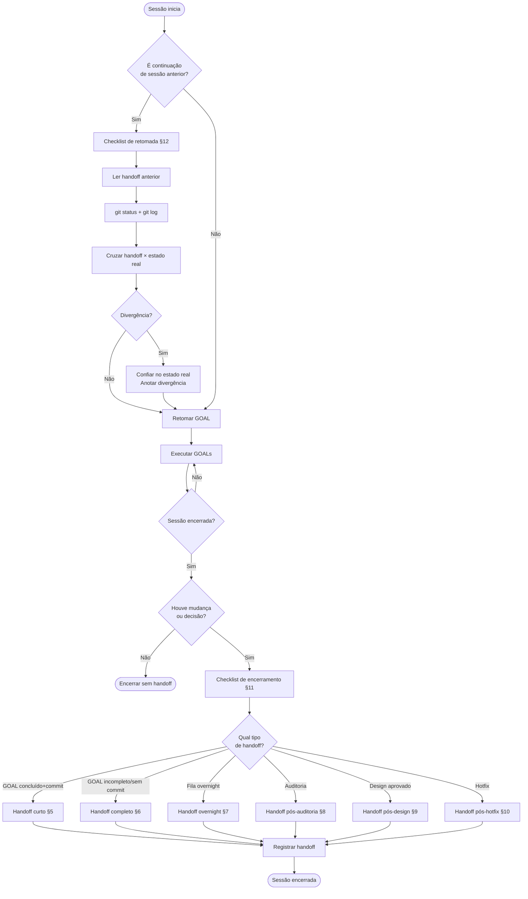

# 🔁 Session Handoff — Protocolo oficial de continuidade

> **Este documento define como encerrar e retomar sessões do agente sem perda de contexto.**
> Toda sessão que produz mudança ou decisão deve gerar um handoff antes de encerrar.
> Consulte [`EXECUTION_RULES.md`](./EXECUTION_RULES.md) para regras de execução.
> Consulte [`OVERNIGHT_QUEUE.md`](./OVERNIGHT_QUEUE.md) para handoff específico de filas.

---

## 1. Objetivo do handoff

Um handoff é o registro mínimo que permite a qualquer sessão futura — do mesmo agente ou de
outro — retomar exatamente de onde a sessão anterior parou, sem reler toda a conversa nem
repetir trabalho já feito.

**O handoff responde três perguntas:**

1. O que foi feito? (estado atual, commitado ou não)
2. O que estava em andamento? (trabalho incompleto, riscos abertos)
3. O que fazer a seguir? (próximo GOAL, dependências, bloqueios)

**O handoff NÃO é:**

- Um log de toda a conversa — é um snapshot mínimo e acionável.
- Uma auditoria de código — para isso existe `SKILL_AUDIT`.
- Um relatório de sprint — para isso existe o relatório final do GOAL.

---

## 2. Quando gerar handoff

Gerar handoff **obrigatoriamente** antes de encerrar a sessão quando:

| Situação | Tipo de handoff |
|---|---|
| GOAL concluído com commit | Handoff curto (§5) |
| GOAL concluído sem commit (pendente revisão) | Handoff completo (§6) |
| Sessão overnight encerrada (fila completa ou interrompida) | Handoff overnight (§7) |
| Auditoria concluída com findings abertos | Handoff pós-auditoria (§8) |
| Design aprovado, implementação pendente | Handoff pós-design (§9) |
| Hotfix aplicado em produção/staging | Handoff pós-hotfix (§10) |
| Sessão interrompida no meio de um GOAL | Handoff completo (§6) — estado parcial obrigatório |

Não gerar handoff somente quando: a sessão foi puramente de leitura/consulta, sem nenhuma
mudança em arquivo, sem nenhuma decisão tomada.

---

## 3. Quando consumir handoff

Consumir o handoff **ao iniciar** qualquer sessão quando:

1. A primeira mensagem do usuário referencia trabalho anterior ("continuar", "retomar", "onde paramos").
2. Há arquivos não-commitados ou GOAL parcialmente executado no working tree.
3. O usuário envia um novo GOAL que depende de trabalho anterior.
4. A sessão é continuação de uma fila overnight interrompida.

**Protocolo de consumo:**

1. Ler este documento — seção §12 (Checklist de retomada).
2. Ler o handoff mais recente da sessão anterior (último arquivo em `docs/governance/handoffs/` ou inline no chat).
3. Executar `git status` e `git log --oneline -5` para confirmar estado real.
4. Cruzar o estado real com o handoff — se houver divergência, confiar no estado real e anotar.
5. Relatar ao usuário: *"Retomando. Último estado: [resumo]. Próximo passo: [ação]."*

---

## 4. Estrutura obrigatória do handoff

Todo handoff deve conter os campos abaixo. Campos marcados `[obrigatório]` nunca ficam em branco.

```yaml
handoff:
  # --- IDENTIFICAÇÃO ---
  sessao_id: "YYYY-MM-DD-NNN"           # [obrigatório] data + sequência do dia
  tipo: "curto | completo | overnight | pos-auditoria | pos-design | pos-hotfix"
  gerado_em: "YYYY-MM-DD HH:MM"         # [obrigatório]
  gerado_por: "Claude Code Sonnet"      # [obrigatório]

  # --- CONTEXTO DA SESSÃO ---
  resumo_executivo: |                   # [obrigatório] 3-5 linhas do que aconteceu
    ""

  # --- ESTADO DO TRABALHO ---
  ultimo_goal_concluido:
    id: ""                              # ex: QUEUE-003 ou "Bloco 3"
    nome: ""
    resultado: "Completed | Failed | Cancelled"
    commit_hash: ""                     # vazio se não commitado
    observacoes: ""

  goal_em_andamento:                    # [obrigatório se houver] null se não houver
    id: ""
    nome: ""
    estado_parcial: |                   # o que foi feito, o que faltou
      ""
    arquivos_modificados_nao_commitados:
      - ""
    proxima_acao: ""

  proximo_goal:                         # [obrigatório] null se fila encerrada
    id: ""
    nome: ""
    pre_condicoes: ""                   # o que precisa estar pronto antes
    estimativa: "S | M | L"

  # --- ESTADO DO REPOSITÓRIO ---
  branch: ""                            # [obrigatório] branch ativa
  commits_locais_sem_push:              # lista de hashes commitados mas não pushados
    - ""
  arquivos_staged: []                   # arquivos em git index não commitados
  arquivos_modificados: []              # arquivos modified no working tree
  arquivos_nao_rastreados: []           # untracked relevantes para o próximo GOAL

  # --- ÁREA PROTEGIDA ---
  arquivos_protegidos_presentes:        # arquivos fora do escopo no working tree — NÃO commitar
    - ""

  # --- PENDÊNCIAS E RISCOS ---
  pendencias:
    - id: "P-NNN"
      descricao: ""
      bloqueante: true | false

  bloqueios:
    - id: "BL-NNN"
      descricao: ""
      gate: "push | schema | auth | escopo | outro"
      acao_necessaria: ""              # o que o humano precisa fazer para desbloquear

  riscos:
    - id: "R-NNN"
      descricao: ""
      severidade: "P0 | P1 | P2 | P3"

  # --- PRÓXIMOS PASSOS ---
  proximos_passos:
    - ordem: 1
      acao: ""
      responsavel: "Claude Code Sonnet | Humano | ChatGPT | Opus | Codex | Antigravity"
      dependencia: ""
```

---

## 5. Handoff curto (≤ 1 minuto de leitura)

Usar quando: GOAL concluído com commit, sem pendências abertas, sessão encerrada limpa.

**Formato:**

```
HANDOFF CURTO — <data>

✅ CONCLUÍDO: <nome do GOAL> (<commit hash>)
📁 Arquivos: <lista de arquivos criados/alterados>
🔜 PRÓXIMO: <nome do próximo GOAL> — <pré-condição se houver>
⚠️ PENDÊNCIAS: nenhuma | <lista se houver>
🚫 PUSH: não realizado
```

**Exemplo:**

```
HANDOFF CURTO — 2026-06-25

✅ CONCLUÍDO: GOAL_TEMPLATE.md — Bloco 2 (bb37747)
📁 Arquivos: docs/execution/GOAL_TEMPLATE.md (criado), docs/execution/INDEX.md (atualizado)
🔜 PRÓXIMO: EXECUTION_PROFILE.md — Bloco 3 — sem pré-condições
⚠️ PENDÊNCIAS: nenhuma
🚫 PUSH: não realizado
```

---

## 6. Handoff completo

Usar quando: GOAL incompleto, trabalho sem commit, decisão arquitetural pendente, ou sessão
interrompida no meio de execução.

**Formato:** usar a estrutura YAML completa do §4, preenchendo todos os campos obrigatórios.

**Adicionalmente incluir:**

```
## Contexto crítico para retomada

### O que foi feito nesta sessão
<lista de ações concluídas>

### O que NÃO foi feito (e por quê)
<lista de ações planejadas que não foram executadas + motivo>

### Estado exato do working tree
<output de git status --short>

### Decisões tomadas que não estão documentadas em código
<lista de decisões que o próximo agente precisa saber>

### Armadilhas identificadas
<problemas que o próximo agente deve evitar>
```

---

## 7. Handoff overnight

Usar quando: fila overnight concluída (total ou parcialmente).

**Formato:** handoff curto por GOAL + relatório consolidado (§10 de [`OVERNIGHT_QUEUE.md`](./OVERNIGHT_QUEUE.md)).

```
HANDOFF OVERNIGHT — <data> — <nome da sessão>

FILA: <N> GOALs | ✅ <X> concluídos | ❌ <Y> falhos | ⏭️ <Z> cancelados

POR GOAL:
  QUEUE-001 ✅ <hash> — <nome>
  QUEUE-002 ✅ <hash> — <nome>
  QUEUE-003 ❌ FAILED — <motivo> — aguarda intervenção humana
  QUEUE-004 ⏭️ CANCELLED — depende de QUEUE-003

BRANCH: <branch>
PUSH: não realizado em nenhum GOAL
MIGRATION: não aplicada
PRODUÇÃO: não tocada

PRÓXIMO PASSO HUMANO:
  1. Revisar findings de QUEUE-003
  2. Decidir: corrigir (novo GOAL) ou cancelar
  3. Se corrigir: enviar GOAL corrigido

RISCOS ABERTOS:
  <lista>
```

---

## 8. Handoff pós-auditoria

Usar quando: sessão de auditoria (Codex, SKILL_AUDIT, auditoria manual) foi concluída e há
findings abertos que ainda não viraram GOALs de correção.

```
HANDOFF PÓS-AUDITORIA — <data>

AUDITORIA: <nome> — <arquivo de referência: docs/audits/AUDIT_<ticket>.md>
ESCOPO: <HUB auditado>

FINDINGS:
  P0 (<N>): <lista — bloqueiam merge>
  P1 (<N>): <lista — alta prioridade>
  P2 (<N>): <lista — média prioridade>
  P3 (<N>): <lista — sugestões>

AÇÃO NECESSÁRIA (humano):
  1. Revisar findings P0 — aprovar ou contestar
  2. Para cada P0 aprovado: criar GOAL de correção
  3. Encaminhar P1+ para backlog

CÓDIGO: não modificado nesta sessão de auditoria
PUSH: não realizado
```

---

## 9. Handoff pós-design

Usar quando: Antigravity ou Cloud Design entregou protótipo aprovado e a implementação ainda
não foi iniciada pelo Claude Code Sonnet.

```
HANDOFF PÓS-DESIGN — <data>

DESIGN: <nome da tela/feature>
PROTÓTIPO: <referência ao arquivo/HTML standalone — ex: design/operacoes-v4/Operacoes-V4-Standalone.html>
STATUS HUMANO: aprovado em <data>

IMPLEMENTAÇÃO PENDENTE:
  Ferramenta: Claude Code Sonnet
  GOAL a criar: <nome sugerido>
  Allow-list estimada:
    - components/<hub>/<componente>.tsx
    - app/dashboard/<rota>/page.tsx
  Regras críticas:
    - não alterar backend ao implementar o visual
    - respeitar tokens semânticos (sem hardcoded colors)
    - não criar lógica de negócio nova — apenas UI

PRÓXIMO PASSO:
  ChatGPT cria GOAL de implementação com allow-list acima
```

---

## 10. Handoff pós-hotfix

Usar quando: correção urgente foi aplicada fora do fluxo normal de GOAL (bug P0 em produção).

```
HANDOFF PÓS-HOTFIX — <data>

PROBLEMA: <descrição do bug>
CAUSA RAIZ: <causa identificada>
CORREÇÃO APLICADA:
  Arquivos: <lista>
  Commit: <hash>
  Push: <sim (com autorização) | não>

TESTES:
  tsc: ✅ | ❌
  build: ✅ | ❌
  testes: N passed | ❌

REGRESSÕES POTENCIAIS:
  <lista de áreas que podem ter sido afetadas>

AÇÃO NECESSÁRIA (humano):
  1. Validar correção no ambiente <staging | produção>
  2. Acionar Codex para auditoria do diff se risco P1+
  3. Registrar em DIVIDA_TECNICA.md se hotfix gerou dívida

PRÓXIMO PASSO NORMAL:
  Retomar fila/GOAL interrompido: <nome>
```

---

## 11. Checklist de encerramento

Executar **antes** de encerrar qualquer sessão que produziu mudança:

```
[ ] git status — confirmar estado do working tree
[ ] git log --oneline -5 — confirmar commits da sessão
[ ] Nenhum arquivo fora do escopo está staged ou será incluído em commit futuro
[ ] Arquivos não-commitados identificados e listados no handoff
[ ] Commits locais sem push identificados e listados no handoff
[ ] Próximo GOAL definido ou fila atualizada no OVERNIGHT_QUEUE.md
[ ] Pendências e bloqueios registrados no handoff
[ ] Riscos identificados registrados no handoff
[ ] Handoff gerado no formato adequado ao tipo da sessão (§5–§10)
[ ] CURRENT_STATUS.md atualizado se houve mudança relevante de estado de módulo
[ ] Nenhum push realizado sem autorização explícita
```

---

## 12. Checklist de retomada

Executar **ao iniciar** sessão que continuará trabalho anterior:

```
[ ] Ler handoff mais recente (mensagem anterior ou docs/governance/handoffs/)
[ ] git status — confirmar estado real do working tree
[ ] git log --oneline -5 — confirmar commits existentes
[ ] Cruzar estado real com handoff — anotar divergências
[ ] Identificar: há GOAL em andamento (parcial)? Se sim, retomar do início do GOAL
[ ] Identificar: há arquivos staged não intencionais? Se sim, relatar ao humano antes de agir
[ ] Identificar: há arquivos de outras frentes no working tree? Se sim, preservar e não commitar
[ ] Confirmar branch correta para o trabalho que será retomado
[ ] Ler OVERNIGHT_QUEUE.md se a sessão anterior era overnight
[ ] Relatar ao usuário: "Retomando. Último estado: [resumo]. Próximo passo: [ação]."
```

---

## 13. Fluxo Mermaid



---

## 14. Exemplos reais — GOALs fiscais BL-FISCAL-002 a BL-FISCAL-008

### Exemplo 1 — Handoff curto após BL-FISCAL-002 (identidade fiscal por loja)

```
HANDOFF CURTO — 2026-05-XX

✅ CONCLUÍDO: GOAL_002 — identidade fiscal por loja (549513d)
📁 Arquivos: app/api/fiscal/* (CRUD config/certificado/série), components/fiscal/FiscalIdentidadeSection.tsx
🔜 PRÓXIMO: BL-FISCAL-003 — máquina de estados da venda fiscal
    Pré-condição: schema já tem FiscalProviderTipo — não criar novamente
⚠️ PENDÊNCIAS:
    - 3 arquivos PWA pre-staged (dd59aa4) preservados fora do escopo — não incluir em próximo commit fiscal
🚫 PUSH: não realizado
```

---

### Exemplo 2 — Handoff completo após BL-FISCAL-004 interrompido no meio

```yaml
handoff:
  sessao_id: "2026-05-XX-001"
  tipo: "completo"
  gerado_em: "2026-05-XX 23:45"
  gerado_por: "Claude Code Sonnet"

  resumo_executivo: |
    Sessão iniciou BL-FISCAL-004 (produto fonte única fiscal). Criou lib/produto-fiscal.ts
    e wired no POST/PATCH de produtos. Importador avançado parcialmente atualizado —
    faltou wiring no create do importador legado. Sessão interrompida por timeout.

  ultimo_goal_concluido:
    id: "BL-FISCAL-003"
    nome: "Máquina de estados da venda fiscal"
    resultado: "Completed"
    commit_hash: "ca681ed"
    observacoes: "918 testes passed; cuidado asterisco em JSDoc quebra parse"

  goal_em_andamento:
    id: "BL-FISCAL-004"
    nome: "Produto fonte única fiscal"
    estado_parcial: |
      Feito: lib/produto-fiscal.ts (sanitize/get/merge/fiscalInputFromBody)
      Feito: POST/PATCH produtos wireados
      Feito: GET inventory expõe fiscal read-only
      Faltou: importador LEGADO — create não grava metadata.fiscal ainda
    arquivos_modificados_nao_commitados:
      - "lib/produto-fiscal.ts"
      - "app/api/produtos/route.ts"
      - "app/api/inventory/route.ts"
    proxima_acao: "Completar wiring no importador legado, então tsc + testes + commit"

  proximo_goal:
    id: "BL-FISCAL-005"
    nome: "Snapshot fiscal da venda"
    pre_condicoes: "BL-FISCAL-004 concluído e commitado"
    estimativa: "S"

  branch: "main"
  commits_locais_sem_push:
    - "ca681ed"
    - "549513d"
  arquivos_staged: []
  arquivos_modificados:
    - "lib/produto-fiscal.ts"
    - "app/api/produtos/route.ts"
    - "app/api/inventory/route.ts"
  arquivos_nao_rastreados: []

  arquivos_protegidos_presentes: []

  pendencias:
    - id: "P-001"
      descricao: "Importador legado ainda não grava metadata.fiscal no create"
      bloqueante: true

  bloqueios: []

  riscos:
    - id: "R-001"
      descricao: "Importador avançado descartava NCM parseado — verificar se wiring cobre"
      severidade: "P1"

  proximos_passos:
    - ordem: 1
      acao: "Completar wiring importador legado em lib/produto-fiscal.ts"
      responsavel: "Claude Code Sonnet"
      dependencia: ""
    - ordem: 2
      acao: "tsc + npm run test"
      responsavel: "Claude Code Sonnet"
      dependencia: "passo 1"
    - ordem: 3
      acao: "Commit local: feat(fiscal): produto fonte única fiscal (GOAL_004)"
      responsavel: "Claude Code Sonnet"
      dependencia: "passo 2"
    - ordem: 4
      acao: "Iniciar BL-FISCAL-005"
      responsavel: "Claude Code Sonnet"
      dependencia: "passo 3"
```

---

### Exemplo 3 — Handoff overnight após BL-FISCAL-005 a BL-FISCAL-007

```
HANDOFF OVERNIGHT — 2026-05-XX — Sprint Fiscal F3-F6

FILA: 3 GOALs | ✅ 2 concluídos | ❌ 1 falho | ⏭️ 0 cancelados

POR GOAL:
  FISCAL-005 ✅ b5177cf — Snapshot fiscal da venda
  FISCAL-006 ✅ a206dce — Abstração de provider fiscal
  FISCAL-007 ❌ FAILED — Pipeline oficial de emissão
    Motivo: tsc falhou em lib/fiscal/emission/pipeline.ts linha 87
    Erro: Type 'FiscalStatus' não é atribuível a 'EmissionStatus'
    Ação: verificar contratos de tipos em lib/fiscal/provider/types.ts

BRANCH: main
PUSH: não realizado em nenhum GOAL
MIGRATION: não aplicada
PRODUÇÃO: não tocada

COMMITS LOCAIS SEM PUSH: b5177cf, a206dce

PRÓXIMO PASSO HUMANO:
  1. Revisar erro de tipos em FISCAL-007 (lib/fiscal/emission/pipeline.ts:87)
  2. Decidir: corrigir alinhando FiscalStatus ↔ EmissionStatus ou criar tipo intermediário
  3. Criar GOAL de correção e enviar

RISCOS ABERTOS:
  R-001: FiscalStatus e EmissionStatus divergiram — pode afetar BL-FISCAL-008 (numeração)
```

---

### Exemplo 4 — Handoff pós-auditoria após auditoria de BL-FISCAL-008

```
HANDOFF PÓS-AUDITORIA — 2026-06-25

AUDITORIA: Fiscal GOAL_008 — Numeração fiscal por série
ESCOPO: lib/fiscal/numbering/*

FINDINGS:
  P0 (0): nenhum
  P1 (1):
    - lib/fiscal/numbering/adapter.ts:34 — retry ilimitado em P2002; adicionar cap de 3 tentativas
  P2 (2):
    - lib/fiscal/numbering/orchestrator.ts:12 — falta log estruturado em allocateFiscalNumber
    - lib/fiscal/numbering/orchestrator.ts:67 — série_inativa deveria retornar errorCode explícito
  P3 (1):
    - lib/fiscal/numbering/index.ts — barrel export não exporta FiscalNumberingError

AÇÃO NECESSÁRIA (humano):
  1. Aprovar finding P1 (retry cap) — se aprovado, criar GOAL de correção tamanho S
  2. Encaminhar P2/P3 para DIVIDA_TECNICA.md (itens DT-FISCAL-001, DT-FISCAL-002, DT-FISCAL-003)

CÓDIGO: não modificado nesta sessão de auditoria
COMMIT: 2b88411 (pré-auditoria, intacto)
PUSH: não realizado
```

---

## 15. Template copiável

Copie o template abaixo e preencha ao encerrar cada sessão.

### Template — Handoff curto

```
HANDOFF CURTO — <data>

✅ CONCLUÍDO: <nome> (<hash ou "sem commit">)
📁 Arquivos: <lista>
🔜 PRÓXIMO: <nome> — <pré-condição>
⚠️ PENDÊNCIAS: <lista ou "nenhuma">
🚫 PUSH: não realizado
```

### Template — Handoff completo (YAML)

```yaml
handoff:
  sessao_id: "YYYY-MM-DD-001"
  tipo: "completo"
  gerado_em: "YYYY-MM-DD HH:MM"
  gerado_por: "Claude Code Sonnet"

  resumo_executivo: |
    <3-5 linhas>

  ultimo_goal_concluido:
    id: ""
    nome: ""
    resultado: ""
    commit_hash: ""
    observacoes: ""

  goal_em_andamento:
    id: ""
    nome: ""
    estado_parcial: |
      Feito: <>
      Faltou: <>
    arquivos_modificados_nao_commitados:
      - ""
    proxima_acao: ""

  proximo_goal:
    id: ""
    nome: ""
    pre_condicoes: ""
    estimativa: "S"

  branch: ""
  commits_locais_sem_push:
    - ""
  arquivos_staged: []
  arquivos_modificados: []
  arquivos_nao_rastreados: []
  arquivos_protegidos_presentes: []

  pendencias:
    - id: "P-001"
      descricao: ""
      bloqueante: false

  bloqueios:
    - id: "BL-001"
      descricao: ""
      gate: ""
      acao_necessaria: ""

  riscos:
    - id: "R-001"
      descricao: ""
      severidade: "P2"

  proximos_passos:
    - ordem: 1
      acao: ""
      responsavel: "Claude Code Sonnet"
      dependencia: ""
```
