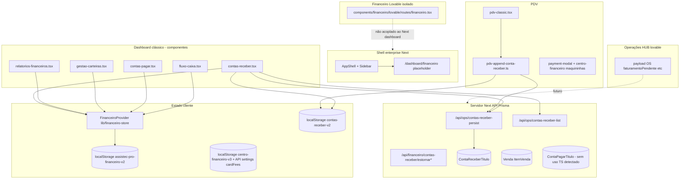

# Relatório master técnico — Domínio financeiro OmniGestão

**Escopo:** análise estática do repositório (sem alterações de código).  
**Objetivo:** base para integração do **Financeiro HUB Lovable** sem surpresas arquiteturais.  
**Data de referência:** inventário do codebase no estado atual do projeto.

---

## 1. Resumo executivo

O OmniGestão concentra lógica e UI financeira em **três camadas sobrepostas**:

1. **Painel “clássico” / Operações de loja** — `FinanceiroProvider` + `localStorage` (carteiras, movimentos, contas a pagar em memória local), componentes em `components/dashboard/financeiro/*`, integração forte com **PDV** e **Contas a Receber** (local + API + Prisma).
2. **Prisma (servidor)** — modelos `ContaReceberTitulo`, `Venda`, `ItemVenda`, `ContaPagarTitulo` (este último **sem uso aparente** no código TS além do schema), com `payload` JsonB para espelhar linhas ricas.
3. **Protótipo isolado Lovable** — `components/financeiro/lovable/` (TanStack Router, UI extensa, **dados majoritariamente mockados** no próprio `financeiro.tsx`), **não montado** nas rotas Next do dashboard enterprise atual.

A entrada **Financeiro** do shell enterprise (`/dashboard/financeiro`) é hoje uma **página placeholder** (“em construção”), enquanto o subsistema financeiro legado referencia rotas tipo `/?page=contas-pagar` (redirects em `app/contas-*.tsx`) que **não batem** com o `app/page.tsx` atual (landing de marketing) — risco de **links mortos** ou fluxo legado não acionado por esses redirects.

**Operações HUB (lovable)** introduziu no **payload JsonB da OS** campos `faturamento*` ao aprovar/recusar orçamento (`lib/os/faturamento.ts`, `components/operacoes/lovable/api/os.ts`), **sem** modelo financeiro Prisma dedicado ainda — ponte natural para o futuro HUB.

---

## 2. Arquitetura atual (visão em camadas)

---

## 3. Rotas e páginas

### 3.1 Next.js `app/` (App Router)

| Rota | Conteúdo observado |
|------|---------------------|
| `/dashboard/financeiro` | Placeholder (“em construção”). |
| `/dashboard/financeiro/contas-a-pagar` | Placeholder. |
| `/dashboard/financeiro/contas-a-receber` | Placeholder. |
| `/fluxo-caixa`, `/contas-pagar`, `/contas-receber`, `/relatorios-financeiros` | `redirect("/?page=...")` — destino é home `/?page=...`, mas `app/page.tsx` é **landing**, não SPA interna (ver **conflito** abaixo). |
| `/dashboard/vendas` | PDV / vendas (cliente). |
| `/vendas-hub/*` | Hub de vendas (rotas separadas). |
| `/dashboard/os` | OS “clássica” (Prisma + aba financeiro no formulário). |
| `/dashboard/operacoes-v2` | Operações HUB Lovable (OS JsonB, faturamento payload). |

### 3.2 Navegação UI

- **`components/painel-inicial/Sidebar.tsx`:** link “Financeiro” → `/dashboard/financeiro` (stub).
- **`components/dashboard/sidebar.tsx` / `mobile-nav.tsx`:** itens com `page: "fluxo-caixa"`, `contas-pagar`, etc. (modelo **SPA por query** — depende de shell que interprete `page`).

### 3.3 Protótipo Lovable (TanStack Router)

- `components/financeiro/lovable/routes/financeiro.tsx` — rota file-based **`/financeiro`** no **mini-app Lovable**, não exposta como rota Next padrão sem wiring adicional.

---

## 4. Componentes financeiros

### 4.1 `components/dashboard/financeiro/` (integrados ao `FinanceiroProvider`)

| Arquivo | Função | Dependência principal |
|---------|--------|------------------------|
| `fluxo-caixa.tsx` | Lançamentos / saldos por carteira | `useFinanceiro()` |
| `contas-pagar.tsx` | CRUD contas a pagar (lista) | `useFinanceiro()` → `contasPagar` |
| `contas-receber.tsx` | Títulos, parcelas, recebimentos, estorno, sync | `localStorage` + APIs ops + opcional `useFinanceiro` para movimentos |
| `gestao-carteiras.tsx` | Carteiras, transferências | `useFinanceiro()` |
| `relatorios-financeiros.tsx` | Agregações gastos/receitas | `useFinanceiro()` |

### 4.2 `components/financeiro/lovable/`

- **`routes/financeiro.tsx`:** monólito (~2k+ linhas) com abas: visão geral, contas a pagar/receber, fluxo, carteiras, relatórios, modais — **estado React local + dados mock** (ex.: array `carteiras` fixo).
- Demais arquivos: **cópia de UI primitives** (`components/ui/*`), `hooks/use-mobile.tsx`, `styles.css` — padrão “bundle Lovable” isolado.

### 4.3 Outros componentes com impacto financeiro

| Área | Arquivo | Nota |
|------|---------|------|
| PDV | `components/dashboard/vendas/pdv-classic.tsx` | À prazo → `appendContaReceberTituloPdvAprazo`. |
| Pagamento | `components/dashboard/vendas/payment-modal.tsx` | Taxas maquininha via `centro-financeiro`. |
| Caixa | `components/dashboard/caixa/caixa-provider.tsx` | Encaminha `useOperationsStore` (ledger diário). |
| OS clássica | `app/dashboard/os/page.tsx` | Aba “Financeiro” no payload `extra.financeiro`. |
| Dashboard 360 | `components/dashboard/relatorios/dashboard-360.tsx` | Usa `useFinanceiro` para lucro/contas. |
| Stats | `components/dashboard/stats-cards.tsx` | Boletos / link `/dashboard/contas-pagar` (rota pode 404). |
| Config | `components/configuracoes-v3/.../FinanceiroSection.tsx` | Centro financeiro v3 + resumo `useFinanceiro`. |
| Config | `components/configuracoes/.../FinanceiroSection.tsx` | Somente visual / toasts. |

---

## 5. Hooks

| Hook | Local | Uso |
|------|-------|-----|
| `useFinanceiro` | `lib/financeiro-store.tsx` | Único “hook financeiro” de produto; carteiras, movimentos, contas pagar. |
| `useCaixa` | `components/dashboard/caixa/caixa-provider.tsx` | Caixa operacional PDV (não contabilidade completa). |
| `useLojaAtiva` | `lib/loja-ativa` | Multiloja; chaves `localStorage` financeiras. |
| `hooks/*` | `hooks/use-mobile`, créditos | **Sem** hooks dedicados “contas a receber” na pasta `hooks/`. |

---

## 6. Libs, serviços e APIs

### 6.1 Núcleo tipos + store local

| Arquivo | Papel |
|---------|--------|
| `lib/financeiro-types.ts` | `Carteira`, `MovimentoFinanceiro`, `TransferenciaCarteira`, `ContaPagarItem`, `CARTEIRAS_INICIAIS`. |
| `lib/financeiro-store.tsx` | Provider; persistência `assistec-pro-financeiro-v2-{lojaId}`; saldo calculado. |
| `lib/centro-financeiro.ts` | Maquininhas, contas bancárias template, taxas; persistência v3 por `storeId`; usado PDV + config. |

### 6.2 Contas a receber

| Arquivo | Papel |
|---------|--------|
| `lib/contas-receber-types.ts` | `ContaReceberRow` + relação opcional com vendas. |
| `lib/contas-receber-storage.ts` | Chaves `localStorage`. |
| `lib/contas-receber-pagamentos.ts` | Linhas de pagamento / estorno. |
| `lib/contas-receber-recibo.ts` | Recibo. |
| `lib/contas-receber-prisma-queries.ts` | Leitura servidor com `include` vendas. |
| `lib/contas-receber-sync-d360.ts` | Integração legado D360 (se usado). |
| `lib/contas-receber-import-constants.ts` | Importação. |
| `lib/pdv-append-conta-receber.ts` | PDV → título à prazo + POST persist. |

### 6.3 APIs relevantes

| Rota | Função |
|------|--------|
| `POST /api/ops/contas-receber-persist` | Upsert `ContaReceberTitulo` por `storeId` + `localKey`. |
| `GET /api/ops/contas-receber-list` | Lista servidor (ops gate). |
| `POST /api/financeiro/contas-receber/estornar` | Estorno título. |
| `POST /api/financeiro/contas-receber/estornar-parcela` | Estorno parcela. |
| `POST /api/ops/sync-legacy-financeiro` | Sync legado. |
| `POST /api/import/validate/financeiro` | Validação import `fluxo_caixa`, `contas_pagar`, `contas_receber`. |

### 6.4 IA / voz

| Arquivo | Papel |
|---------|--------|
| `lib/ai/processar-texto-financeiro.ts` | NLP texto → lançamentos (via API route). |
| `lib/voice-financeiro-nlp.ts` | Parsing voz. |
| `app/api/ai/processar-texto-financeiro/route.ts` | Exposição HTTP. |

### 6.5 Operações / OS (ponte futura)

| Arquivo | Papel |
|---------|--------|
| `lib/os/faturamento.ts` | `isFaturamentoOS`, `buildFaturamentoFromOrcamento`, etc. |
| `components/operacoes/lovable/api/os.ts` | Aprovação/recusa grava `faturamento*` no payload. |
| `components/operacoes/lovable/api/vendas.ts` | `criarVendaDeOS` mock DB em memória (`api/_db`) — **não** Prisma `Venda`. |

### 6.6 Scripts

| Arquivo | Papel |
|---------|--------|
| `scripts/migrate-legacy-financeiro.mjs` | Migra tabelas legadas → `contas_receber_titulos`. |

---

## 7. Prisma (schema) — o que existe vs o que o app usa

| Modelo | Campos relevantes | Uso no código TS |
|--------|-------------------|------------------|
| `ContaReceberTitulo` | `storeId`, `localKey`, `payload` JsonB, escalares | **Sim** — persist/list APIs. |
| `Venda` / `ItemVenda` | `pedidoId`, `payload`, `contaReceberTituloId` | **Sim** em queries de CR; **PDV clássico** pode não criar `Venda` Prisma em todos os fluxos (verificar fluxo completo de finalização). |
| `ContaPagarTitulo` | análogo a receber | **Não** encontrado grep de `contaPagarTitulo` / `contas_pagar_titulos` em TS — **tabela preparada, app não consome**. |

---

## 8. Payloads e interfaces importantes

| Payload / tipo | Onde | Conteúdo |
|----------------|------|-----------|
| `ContaReceberRow` | localStorage + Prisma `payload` | Parcelas, histórico pagamentos, vínculo `vendas[]`. |
| `FinanceiroState` | localStorage via `financeiro-store` | `carteiras`, `movimentos`, `transferencias`, `contasPagar`. |
| `CentroFinanceiroV3` | localStorage + opcional `settings.cardFees` API | Maquininhas, contas, metas. |
| OS `OrdemServico` payload | Operações HUB | `orcamento`, `faturamentoPendente`, `faturamentoStatus`, `faturamentoOrigem`, `faturamentoTotal`, `faturamentoCriadoEm`, `faturamentoReferencia`, `timeline`. |
| OS “clássica” `extra.financeiro` | `app/dashboard/os/page.tsx` | `custoPecas`, `valorMaoObra`, `valorPecas`, `valorTotal`, `formaPagamento`, `valorEntrada`, `dataPrevistaEntrega`. |

---

## 9. Integração com Ordens de Serviço (OS)

| Sistema | Integração financeira | Real / mock |
|---------|------------------------|-------------|
| **OS clássica** (`/dashboard/os`) | Campos `financeiro` no payload Prisma/OS | **Real** no formulário; não visto vínculo automático com `ContaReceberTitulo`. |
| **Operações HUB** (`operacoes-v2`) | Orçamento JsonB; aprovação → `faturamento*`; `faturarOS` → `criarVendaDeOS` | **Faturamento payload real**; **venda pós-faturar** ainda em **mock** (`lovable/api/vendas.ts` + `baixarPeca` simulado). |

**Lacuna:** não há fluxo unificado “OS aprovada → título em `ContaReceberTitulo` Prisma” ainda; apenas preparação no payload.

---

## 10. Integração com estoque

| Fluxo | Comportamento |
|-------|----------------|
| PDV | `operations-store` / catálogo PDV + inventário; movimentação conforme finalização de venda. |
| Operações HUB `faturarOS` | `baixarPeca` na API lovable de estoque (simulada) — **não** é a mesma stack que `InventoryItem` do `operations-store`. |

**Conflito:** duas representações de estoque (Prisma produtos vs seeds/lovable) — risco na integração financeira se totais e SKUs divergirem.

---

## 11. Integração com PDV

| Ponto | Detalhe |
|-------|---------|
| À prazo | `appendContaReceberTituloPdvAprazo` → `localStorage` + `contas-receber-persist`. |
| Formas de pagamento | `payment-modal` + `getMaquininhasParaPdvForStore` (centro financeiro). |
| Caixa | `DailyLedger` em `operations-store` (totais por forma do dia). |
| Navegação | `router.push("/?page=contas-receber")` em PDV — **quebra potencial** se `/?page` não existir na home. |

---

## 12. O que está mockado vs real

### 12.1 Mockado ou protótipo

- **`components/financeiro/lovable/routes/financeiro.tsx`:** dados de demonstração; não usa `FinanceiroProvider` nem Prisma.
- **`/dashboard/financeiro*` (3 páginas):** apenas texto placeholder.
- **`criarVendaDeOS` (lovable):** push em `db.vendas` em memória, não `prisma.venda`.
- **KPIs** `app/dashboard/page.tsx` (Painel Inicial): valores estáticos de exemplo (“R$ 128.490”, etc.).
- **Config financeira** (trecho lovable antigo): “somente visual”.

### 12.2 Real (persistência ou servidor)

- **`FinanceiroProvider` + localStorage:** operacional para quem usa o shell que monta esses componentes.
- **Contas a receber:** local + upsert Prisma + APIs estorno.
- **Centro financeiro (taxas):** local + merge com `/api/stores/{id}/settings` (`cardFees`).
- **Contas a pagar (UI):** dados em **localStorage** via `financeiro-store` — **sem** API Prisma `ContaPagarTitulo` encontrada.
- **Payload OS Operações HUB:** `faturamento*` real no JsonB após aprovação.

---

## 13. Conflitos e riscos técnicos

1. **Duas “fontes da verdade” financeiras:** `localStorage` (carteiras/fluxo/pagar) vs Prisma (receber/vendas) vs mock Lovable vs payload OS.
2. **Rotas placeholder vs legado SPA:** Sidebar enterprise aponta para stub; redirects `/?page=*` podem não ter host SPA na home atual.
3. **Duas OS:** clássica (`dashboard/os`) vs HUB (`operacoes-v2`) com modelos de dados diferentes.
4. **`ContaPagarTitulo` morto:** schema sem consumo — risco de decisões duplicadas quando o HUB criar “pagar” de novo.
5. **`stats-cards` → `/dashboard/contas-pagar`:** pasta não existe em `app/dashboard/` — possível **404**.
6. **Tipos `Carteira` duplicados conceitualmente:** `financeiro-types` vs carteiras mock no Lovable financeiro.
7. **Multiloja:** chaves por `lojaId`/`storeId` — integração deve validar headers (`x-assistec-loja-id`) de ponta a ponta.

---

## 14. Duplicações explícitas

| Item | Ocorrências |
|------|-------------|
| UI financeira completa | `dashboard/financeiro/*` **vs** `financeiro/lovable/routes/financeiro.tsx`. |
| Conceito “carteira” | Store tipado **vs** arrays mock Lovable. |
| Seções Config “Financeiro” | `configuracoes` **vs** `configuracoes-v3` (uma rica, outra placeholder). |
| Navegação financeira | Sidebar enterprise **vs** `dashboard/sidebar` query-page. |

---

## 15. O que reaproveitar (recomendado)

- **`lib/financeiro-types.ts` + `financeiro-store.tsx`** como contrato inicial de **carteiras/movimentos** até migração servidor — ou extrair tipos para pacote compartilhado.
- **`lib/contas-receber-*` + APIs ops** — base sólida para títulos e PDV à prazo.
- **`lib/centro-financeiro.ts`** — taxas e maquininhas já alinhadas ao PDV.
- **`lib/os/faturamento.ts`** — gate para “faturamento pendente” vindo de OS.
- **Componentes `dashboard/financeiro/*`** — comportamento real com usuários legados; migrar gradualmente para layout Lovable **sem** perder persistência.

---

## 16. O que refatorar

- Unificar **navegação** financeira no App Router (uma árvore só sob `/dashboard/financeiro/...`).
- Centralizar **persistência** de contas a pagar (hoje só local) com `ContaPagarTitulo` ou substituir modelo conscientemente.
- Alinhar **faturar OS** (lovable) com **Prisma `Venda` + ContaReceber** quando o produto exigir um único ledger.
- Substituir KPIs mock do painel inicial por agregações reais (ou remover até ter fonte).

---

## 17. O que remover ou aposentar (futuro)

- Placeholders vazios em `app/dashboard/financeiro/*` **após** substituir por HUB ou redirect explícito.
- Duplicata **mock** dentro de `financeiro.tsx` Lovable quando o HUB passar a consumir APIs/store.
- Redirects `app/contas-*.tsx` / `fluxo-caixa` **se** a home não for SPA — corrigir ou apontar para rota Next real.

---

## 18. Módulo compartilhado ideal

Sugestão de pacote interno (nome ilustrativo) `@omni/finance-core`:

- Tipos: título receber/pagar, movimento caixa, carteira, status, origem (`orcamento_os`, `pdv`, `manual`).
- Validadores: `isFaturamentoOS`, normalização de `ContaReceberRow`.
- Adapters: Prisma ↔ DTO ↔ localStorage (estratégia deprecação).
- **Sem** UI — apenas domínio + ports.

---

## 19. Plano de migração (idealizado)

1. **Inventariar usuários ativos** de `FinanceiroProvider` vs apenas Prisma CR.
2. **Congelar** novos mocks no Lovable; tratar `financeiro.tsx` como referência UX apenas.
3. **Definir rota canônica** `/dashboard/financeiro` e subrotas reais (substituir placeholders).
4. **Mapear dados:** tabela de equivalência `localStorage` keys ↔ modelos Prisma.
5. **Migrar contas a pagar** para servidor (usar `ContaPagarTitulo` ou novo modelo) com feature flag.
6. **Unificar vendas:** PDV + OS HUB → mesma criação de `Venda` / título quando aplicável.
7. **Desligar** duplicatas de UI após paridade de features.

---

## 20. Plano de integração do Financeiro HUB Lovable

1. **Montar** o HUB como rota Next (layout existente `AppShell`) — importar rotas ou componentes desmontados do monólito Lovable.
2. **Injetar** `useFinanceiro` / fetch servidor atrás de camada de serviço (não manter estado só no `financeiro.tsx`).
3. **Conectar** aba “receber” às APIs existentes (`contas-receber-list`, persist).
4. **Conectar** “pagar” a futura API ou bridge para `ContaPagarTitulo`.
5. **Dashboards** — ler de agregações servidor ou derivar de Prisma (evitar segundo ledger em memória longo prazo).
6. **OS:** listener de `faturamentoPendente` → criar título ou venda conforme regra de negócio (workflow a definir com produto).

---

## 21. Ordem sugerida de implementação

1. Corrigir **rotas mortas** (sidebar stats, redirects `/?page`).
2. Substituir **placeholders** `app/dashboard/financeiro/*` por shell do HUB ou redirect temporário documentado.
3. Extrair **design system** do Lovable para `components/ui` compartilhado (já existe padrão no projeto) — reduzir duplicação `financeiro/lovable/components/ui`.
4. Camada **API única** para listagem financeira consolidada (mesmo que read-only no início).
5. Integração **OS faturamento** → **ContaReceberTitulo** ou **Venda**.
6. Migração **contas pagar** local → Prisma.
7. Desativação **localStorage** financeiro após migração e backup/export.

---

## 22. Riscos da integração

| Risco | Mitigação |
|-------|----------|
| Perda de dados localStorage | Export/import + migração assistida + feature flag. |
| Divergência multiloja | Testes com `storeId` e headers ops. |
| Regressão PDV | E2E fluxo à vista / à prazo / estorno. |
| Dupla contagem | Regra única de origem (venda vs título vs movimento). |
| Performance JsonB | Índices Prisma + paginação em listas grandes. |

---

## 23. Checklist técnico (pré-integração)

- [ ] Documentar rota canônica financeira e atualizar `Sidebar` enterprise.
- [ ] Auditar todos os links para `/dashboard/contas-pagar`, `/?page=*`, `/fluxo-caixa`.
- [ ] Listar chaves `localStorage` em produção e plano de migração.
- [ ] Confirmar uso real de `ContaPagarTitulo` (zero vs planejado).
- [ ] Mapear criação de `Venda` Prisma no PDV (todos os caminhos de checkout).
- [ ] Definir evento de domínio: “faturamento pendente OS” → ação financeira.
- [ ] Decisão: HUB consome `FinanceiroProvider` temporariamente ou só API?
- [ ] Testes: persist CR, estorno parcela, PDV à prazo, troca de loja.
- [ ] Remover ou isolar mock do Painel Inicial se for confundir stakeholders.

---

## 24. Conclusão

O OmniGestão já possui **pernas reais** em **Contas a Receber** (cliente + servidor) e **PDV** (à prazo + taxas), mas a **visão enterprise** do Financeiro no Next está **atrasada** em relação ao código legado do dashboard. O **Financeiro HUB Lovable** é hoje um **protótipo rico porém desconectado**. A integração bem-sucedida exige **unificação de rotas**, **uma estratégia clara de persistência** (eliminar ou formalizar o `localStorage` como cache) e **ligação explícita** entre o novo **payload de faturamento da OS** e o **ledger financeiro** (Prisma), sem pular a compatibilidade com o PDV atual.

---

*Fim do relatório. Nenhuma alteração de código foi aplicada na geração deste documento.*

