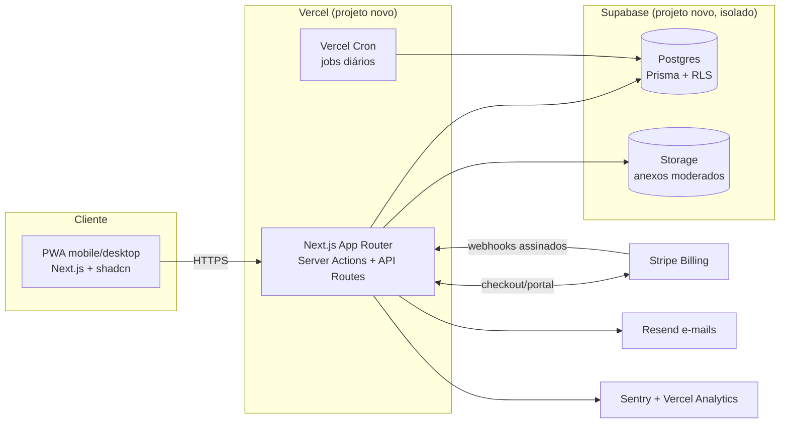

# Arquitetura — SaaS de Consulta de Películas — 001

**GOAL:** `CATALOGO-SAAS-MASTER-PLAN-001`
**Data:** 22 de Julho de 2026
**Status:** PROPOSTA (ADRs formais em [ADR_DECISOES_ARQUITETURA_001.md](ADR_DECISOES_ARQUITETURA_001.md))

---

## 1. Princípios

1. **Projeto separado do OmniGestão Pro** — repositório próprio, banco próprio, deploy
   próprio, sem dependência runtime alguma. Reaproveitamento = cópia versionada de código
   puro + snapshot de dados via ETL ([IMPORTACAO](IMPORTACAO_DADOS_EXISTENTES_001.md)).
2. **Monolito modular** — um app Next.js. Sem microserviços, sem filas, sem Kubernetes.
   O dataset é minúsculo (429 modelos / 1.751 aliases / 1.443 linhas) e o tráfego inicial
   será de dezenas-centenas de assinantes. Complexidade extra é risco, não virtude.
3. **Fail-closed nos dados** — status de evidência nunca é promovido; pares ocultos nunca
   vazam por rota nenhuma; acesso pago só ativa por webhook validado.
4. **Custo fixo mínimo** — alvo < R$ 300/mês de infraestrutura até ~500 assinantes.

---

## 2. Matriz de decisão de stack

Escala: 1 (ruim) – 5 (ótimo). Critérios ponderados pela realidade: 1 dev + IAs, Brasil,
mobile-first, cobrança recorrente.

### 2.1 Framework de aplicação

| Critério | Next.js (App Router) | Remix/RR7 | SvelteKit | Rails/Laravel |
| :--- | :---: | :---: | :---: | :---: |
| Velocidade de implementação (time já domina) | 5 | 3 | 2 | 2 |
| Ecossistema UI (shadcn/Tailwind) | 5 | 4 | 3 | 3 |
| PWA | 4 | 4 | 4 | 3 |
| Deploy serverless barato (Vercel) | 5 | 4 | 4 | 2 |
| Assistência de IA (código previsível) | 5 | 4 | 3 | 4 |
| **Decisão** | **✔ Next.js** | | | |

Justificativa dominante: o time já opera Next.js 16 + React 19 + TS strict em produção
(OmniGestão). Trocar framework agora só adiciona risco.

### 2.2 Banco e plataforma de dados

| Critério | Supabase (Postgres) | Neon (Postgres) | PlanetScale (MySQL) | SQLite/Turso |
| :--- | :---: | :---: | :---: | :---: |
| Custo inicial | 5 (free→US$25) | 5 | 3 | 5 |
| Experiência prévia do time | 5 | 2 | 1 | 1 |
| RLS / segurança em profundidade | 5 | 4 | 2 | 2 |
| Storage p/ anexos (fotos de contribuição) | 5 (embutido) | 2 | 2 | 2 |
| Backup/PITR gerenciado | 4 | 4 | 4 | 3 |
| `pg_trgm` p/ fuzzy search | 5 | 5 | 1 | 2 |
| **Decisão** | **✔ Supabase, projeto NOVO e isolado** | | | |

Regra inegociável: **nunca o projeto Supabase do OmniGestão**. Projeto novo, credenciais
novas, billing separado.

### 2.3 ORM e acesso a dados

Prisma 6 (experiência do time, migrations versionadas). Conexão via pooler (transaction
mode) para serverless; `DIRECT_URL` só para migrations — mesmo padrão já operado.

### 2.4 Autenticação

| Critério | NextAuth v5 (Credentials + e-mail) | Supabase Auth | Clerk |
| :--- | :---: | :---: | :---: |
| Custo | 5 | 5 | 2 (por MAU) |
| Experiência do time | 5 | 3 | 1 |
| Controle do fluxo de dispositivos/sessões | 5 (JWT + tabela própria) | 3 | 3 |
| Magic link | 4 (via provider e-mail) | 5 | 5 |
| Lock-in | 5 (nenhum) | 3 | 1 |
| **Decisão** | **✔ NextAuth v5**: e-mail+senha (bcrypt) no MVP; magic link opcional na Fase 2 via Resend | | |

Sessões JWT + tabela `DeviceSession` própria para o limite de dispositivos (o controle de
dispositivo é regra de negócio central — precisa ser nosso, não do provedor).

### 2.5 Pagamentos

Comparativo completo e ciclo de vida em [PLANOS_ASSINATURAS_PAGAMENTOS_001.md](PLANOS_ASSINATURAS_PAGAMENTOS_001.md).
Resumo: **Stripe no MVP** (cartão recorrente + PIX avulso para períodos pré-pagos), com
abstração fina (`PaymentProvider` interface) para permitir Mercado Pago depois sem
reescrever o domínio. Gate humano sobre taxas vigentes.

### 2.6 Busca

Sem Elasticsearch/Algolia/Meilisearch — overengineering para 429 modelos. Motor próprio em
memória (evolução direta do engine auditado `lib/catalogo-aparelhos/`) + `pg_trgm` como
fallback fuzzy. Detalhe em [BUSCA_E_COMPATIBILIDADE_001.md](BUSCA_E_COMPATIBILIDADE_001.md).

---

## 3. Topologia

Componentes: **um** app Next.js (site público + app autenticado + admin), um Postgres, um
storage, Stripe, Resend, Sentry. Nada mais no MVP.

---

## 4. Definições formais por área

| Área | Decisão | Notas |
| :--- | :--- | :--- |
| **Frontend** | Next.js App Router, React Server Components onde possível, shadcn/ui (tokens semânticos, sem cor hardcoded), Tailwind 4 | Design system próprio ([UX](UX_DESIGN_SYSTEM_LANDING_001.md)) |
| **Backend** | Server Actions p/ mutações do app; Route Handlers p/ busca (GET cacheável), webhooks e admin | Serviços puros em `lib/` (padrão que já funciona no OmniGestão) |
| **Banco** | Postgres (Supabase novo), Prisma 6, migrations versionadas desde o dia 1 (`prisma migrate`, nunca só `db push` em produção) | Multi-tenant por `organizationId` em TODA query |
| **Autenticação** | NextAuth v5, e-mail+senha bcrypt; verificação de e-mail obrigatória; magic link Fase 2 | Roles: `OWNER`, `MEMBER` (org) + `PLATFORM_ADMIN`, `CURATOR` (plataforma) |
| **Pagamentos** | Stripe Billing (subscriptions cartão) + Payment Links/Checkout PIX p/ tri/anual pré-pago | Acesso ativado SOMENTE por webhook validado |
| **Armazenamento** | Supabase Storage, bucket privado, URLs assinadas curtas | Só anexos de contribuição/bancada (Fase 2+) |
| **Logs** | Vercel logs (runtime) + `AuditLog` no banco (negócio) + Sentry (erros) | Retenção `AuditLog`: 24 meses |
| **Monitoramento** | Sentry (erros), Vercel Analytics (web vitals), healthcheck `/api/health` + alerta de cron | Dashboards simples primeiro |
| **Deploy** | Vercel, preview por PR, produção só via merge na main | Env por ambiente; secrets nunca no repo |
| **Backup** | Supabase backups diários + export semanal (pg_dump) p/ storage externo + snapshots de catálogo versionados ([IMPORTACAO §7](IMPORTACAO_DADOS_EXISTENTES_001.md)) | Teste de restore trimestral |
| **Filas** | Nenhuma no MVP. Vercel Cron p/ jobs (digest de solicitações, verificação de assinaturas órfãs, limpeza de sessões) | Reavaliar só se webhooks exigirem retry além do nativo do Stripe |
| **E-mails** | Resend + React Email: verificação, recuperação de senha, recibo, aviso de falha de cobrança, notificação de modelo adicionado | Domínio próprio com SPF/DKIM |
| **PDF** | Geração server-side com `@react-pdf/renderer` (serverless-friendly), watermark obrigatório (org + usuário + data + id do documento) | Sem HTML→headless-Chrome (peso/frio em serverless) |
| **PWA** | `@ducanh2912/next-pwa` (já dominado); cache do shell; dados sempre online | Offline de dados fica FORA (proteção da base) |
| **Cache** | Índice de busca em memória por instância, chaveado por `catalogVersion`; HTTP `private, max-age=60` em consultas autenticadas; sem CDN cache de dados | Invalidação: bump de `catalogVersion` na publicação de catálogo |
| **Busca** | Motor em memória + `pg_trgm` fallback | [BUSCA](BUSCA_E_COMPATIBILIDADE_001.md) |

---

## 5. Reaproveitamento do OmniGestão sem acoplamento perigoso

| Ativo | Como reaproveitar | Proibido |
| :--- | :--- | :--- |
| `lib/catalogo-aparelhos/*.ts` (engine puro, sem deps de banco) | **Copiar** (vendorizar) para o novo repo como ponto de partida do motor; adaptar a fonte de CSV→DB | Importar por path/pacote do repo OmniGestão |
| Seeds CSV auditados (`docs/catalogo/seeds/`) + artefatos da auditoria | Snapshot com hash conferido vira insumo do ETL | Ler em runtime do repo antigo |
| Padrões operacionais (Server Actions, tokens visuais, localKey/idempotência, auditoria via histórico) | Reaplicar como convenção | Compartilhar schema/tabelas |
| Conta Vercel/Supabase | Mesma organização de billing é aceitável | Mesmo projeto/banco/env |

Integração futura OmniGestão↔SaaS (Fase 5) será **por API pública autenticada**, nunca por
banco compartilhado.

---

## 6. Ambientes e configuração

| Ambiente | Banco | Stripe | Observações |
| :--- | :--- | :--- | :--- |
| `dev` local | Supabase projeto dev (ou local) | test mode | seeds de exemplo, nunca dados de assinantes |
| `preview` (PR) | banco dev | test mode | protegido por senha básica |
| `production` | Supabase prod | live mode | webhooks com secret próprio |

Variáveis mínimas: `DATABASE_URL`, `DIRECT_URL`, `AUTH_SECRET`, `NEXTAUTH_URL`,
`STRIPE_SECRET_KEY`, `STRIPE_WEBHOOK_SECRET`, `STRIPE_PRICE_*`, `RESEND_API_KEY`,
`SENTRY_DSN`, `NEXT_PUBLIC_APP_URL`. Sem `NEXT_PUBLIC_` para qualquer segredo (lição já
aprendida no OmniGestão).

---

## 7. Requisitos não funcionais

| Requisito | Alvo MVP |
| :--- | :--- |
| Latência de busca (servidor) | p95 < 300 ms; p50 < 100 ms |
| Disponibilidade | 99,5% (sem SLA contratual no MVP) |
| Escala | 1.000 assinantes sem mudança de arquitetura |
| Segurança | OWASP top-10 coberto; rate limit central; headers de segurança |
| LGPD | Dados pessoais mínimos; consentimento; exclusão de conta funcional |
| Acessibilidade | WCAG AA nos fluxos principais |
| Peso da página de busca | < 200 KB JS inicial |

---

## 8. O que fica explicitamente FORA da arquitetura do MVP

Microserviços; Kafka/filas; Redis (só se rate-limit em memória se provar insuficiente —
então Upstash); Elasticsearch; Kubernetes; GraphQL; app nativo; multi-região;
feature-flag SaaS pago (tabela `FeatureFlag` própria basta).
