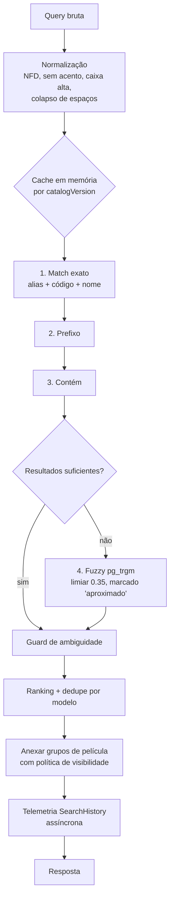

# Motor de Busca e Taxonomia de Evidência — 001

**GOAL:** `CATALOGO-SAAS-MASTER-PLAN-001`
**Data:** 22 de Julho de 2026
**Status:** PROPOSTA TÉCNICA
**Base:** engine puro já auditado (`lib/catalogo-aparelhos/catalogo-aparelhos.ts` +
`peliculas.ts`), a ser vendorizado no novo repo e adaptado de CSV→DB.

---

## 1. Entradas aceitas

| Tipo de entrada | Exemplo | Resolução |
| :--- | :--- | :--- |
| Nome oficial | "Galaxy A05" | alias `canonical`/nome canônico |
| Nome abreviado | "A05", "13 pro" | alias `short` (ambíguo → trava de marca) |
| Marca + modelo | "samsung a05" | tokenização marca+resto |
| Código técnico | "SM-A055M", "XT2427" | ManufacturerCode (match exato, ranking máximo) |
| Código regional | "RMX3999" | ManufacturerCode `regional` |
| Erro comum | "ifone 11", "moto g 84" | alias `common_typo` + fuzzy pg_trgm |
| Nome de marketplace | "Moto G84 5G 256GB Grafite" | alias `marketplace_name` + tokenização |
| Alias genérico | "note 12" | aliases com desambiguação |

## 2. Pipeline da consulta

Detalhes por etapa:

1. **Normalização** — regra idêntica ao engine atual (`normalizeDeviceQuery`): NFD +
   remoção de diacríticos U+0300–U+036F, uppercase, colapso de espaços, preservando
   espaços internos. Códigos técnicos normalizam também removendo hífens (`SMA055M`).
2. **Índice em memória** — construído 1x por instância a partir do banco, chaveado por
   `CatalogVersion.version` (invalidação por bump). Estruturas: `Map<slug, model>`,
   `Map<normalizedAlias, entries[]>`, mapa de marcas por alias (detecção de colisão),
   índice de grupos por modelo (mesma forma do `PeliculaIndex` atual). Dataset cabe em
   < 5 MB de RAM.
3. **Cascata exato → prefixo → contém** — preservada do engine atual (`MATCH_RANK`),
   com dedupe por modelo mantendo o melhor matchType.
4. **Fuzzy controlada** — só quando a cascata retorna < 3 resultados; `pg_trgm`
   `similarity ≥ 0.35` sobre `normalizedAlias`/`canonicalName`; resultados marcados
   `matchType: "fuzzy"` e exibidos como "você quis dizer…" — nunca misturados como se
   fossem match direto. Proteção: fuzzy jamais dispara para queries ≤ 3 caracteres.
5. **Guard de ambiguidade** — regras herdadas e mantidas:
   - alias com `isAmbiguous`/`requiresBrandContext` → resposta pede marca
     (chips de marca clicáveis) quando o match é exato sobre o termo ambíguo;
   - termo presente em > 1 marca (21 strings conhecidas, ex. "8", "12", "c55") →
     `requiresBrandContext` forçado;
   - `?brand=` filtra e desambigua (comportamento atual preservado).
6. **Anexo de compatibilidades** — para cada modelo do resultado, grupos e pares via
   política de visibilidade (§5.3), com agregação SEM promoção (pior status, menor
   confiança, OR de teste seco — regra do `peliculas.ts` atual).

## 3. Ranking

Ordem de precedência (empates resolvidos pelo critério seguinte):

1. Match de código técnico exato (ManufacturerCode).
2. `MATCH_RANK`: exact < prefix < contains < fuzzy.
3. Marca coincidente com `brandFilter`/contexto da sessão.
4. Confiança do modelo (`alta < media < baixa` — rank atual).
5. Popularidade de consulta (contador agregado de SearchHistory, janela 90 dias) —
   NOVO vs engine atual; desempata "iPhone 11" acima de "iPhone 11 Pro Max" quando a
   query é "iphone 11".
6. Ordem alfabética pt-BR (estabilidade).

## 4. Distinções obrigatórias

- **4G/5G:** `connectivity` é campo de 1ª classe; a UI SEMPRE sufixa ("Moto G53 5G");
  query contendo "5g"/"4g" filtra `connectivity`; resultado com variantes irmãs mostra
  aviso "Existe também em 4G — confira o aparelho".
- **Pro/Plus/Max/Ultra/Lite:** `variantTier` de 1ª classe; variantes irmãs aparecem como
  linhas separadas agrupadas visualmente pela família; nunca colapsadas.
- **Comportamento sem resultado:** mensagem honesta + CTA "Solicitar este modelo"
  (pré-preenchido com a query) + registro `hadZeroResults=true` (alimenta fila de gaps).
- **Sugestões:** com < 3 caracteres, sugerir marcas e modelos populares; com zero
  resultado, sugerir fuzzy "você quis dizer".

## 5. Taxonomia de evidência e confiança

### 5.1 Status — tabela normativa

| Status | Significado | Quem atribui | Evidência mínima | Visível? | Aviso ao usuário | Pode comprar? | Precisa bancada? | Revisão/expiração |
| :--- | :--- | :--- | :--- | :--- | :--- | :--- | :--- | :--- |
| `confirmado_bancada` | Testado fisicamente em bancada com protocolo | Sistema, via BenchTest aprovado (aprovador ≠ testador) | 1 BenchTest `approved` | Sim (selo máximo) | "Confirmado em bancada" | Sim | — | Revalidar se molde do fornecedor mudar |
| `confirmado_fornecedor` | Fornecedor confirma formalmente o molde | Curador, com EvidenceSource `supplier` | 1 evidência `supplier_confirmation` ativa | Sim | "Confirmado por fornecedor" | Sim | Não | Revisão anual da fonte |
| `multiplas_fontes_publicas` | ≥ 2 fontes públicas independentes concordam | Curador | 2 evidências `public_listing` de fontes distintas | Sim | "Múltiplas fontes; recomendamos conferir na primeira aplicação" | Sim | Recomendada | Reavaliar a cada 6 meses |
| `fornecedor_publico_unico` | 1 lista pública de fornecedor, sem confirmação direta | Curador | 1 evidência `public_listing` (fonte supplier) | Beta | "Recomendamos testar antes da aplicação" | Sim, com aviso | Sim (para promover) | Buscar 2ª fonte |
| `marketplace_publico_unico` | 1 anúncio de marketplace apenas | Curador | 1 evidência `public_listing` (marketplace) | Beta | "Informação de anúncio; teste antes da aplicação" | Com aviso forte | Sim | Fonte fraca — prioridade de checagem |
| `provavel_mercado` | Prática consolidada de mercado, sem fonte formal | Curador | 1 evidência `market_practice` | Beta | "Compatibilidade provável — faça conferência seca antes" | Com aviso | Sim (para promover) | Reavaliar em curadoria |
| `precisa_testar` | Derivado de aproximação (tamanho de tela etc.) | Sistema (import) ou curador | — | **Não** (oculto) | — | Não | Sim (único caminho de saída) | Fila de bancada |
| `conflitante` | Evidências ativas se contradizem | Sistema (detecção) ou curador | 2 evidências em conflito | **Não** | — | Não | Sim | Bloqueado até resolução com motivo |
| `nao_recomendado` | Testado/apurado: NÃO serve | Curador ou BenchTest `no_fit` | evidência negativa | Sim, como negativo | "Não recomendado — encaixe incorreto verificado" | Não | — | Permanente até nova evidência |
| `sem_evidencia` | Cadastrado sem nenhuma evidência ativa (ex. todas retratadas) | Sistema | — | **Não** | — | Não | Sim | Fila de curadoria |
| `desativado` | Removido logicamente (erro de cadastro, modelo deprecado) | Curador com motivo | — | **Não** | — | Não | — | Restaurável com trilha |

Regras transversais:
- **Nunca promover automaticamente.** Import nunca eleva status; contribuição aprovada
  vira evidência, e o status derivado sobe apenas se a política (§5.2) permitir; override
  manual de curador só REBAIXA (fail-closed).
- **Estado inicial do seed:** `confirmado_fornecedor` (563 linhas), `provavel_mercado`,
  `precisa_testar` — mapeados 1:1 do import. `confirmado_bancada` nasce com **0** registros
  e é impossível de atribuir sem BenchTest aprovado.
- **Pares herdam o PIOR status** dos dois lados (regra do engine atual, mantida como lei).

### 5.2 Derivação do status (ordem de avaliação)

1. Existe override de curador para baixo? → usa o override.
2. Evidências ativas em conflito? → `conflitante`.
3. BenchTest aprovado `fit`? → `confirmado_bancada`.
4. Evidência `supplier_confirmation` ativa? → `confirmado_fornecedor`.
5. ≥ 2 `public_listing` de fontes distintas? → `multiplas_fontes_publicas`.
6. 1 `public_listing` de supplier / de marketplace? → `fornecedor_publico_unico` /
   `marketplace_publico_unico`.
7. `market_practice`? → `provavel_mercado`.
8. Marcado no import como aproximação? → `precisa_testar`.
9. Nenhuma evidência ativa? → `sem_evidencia`.

### 5.3 Política de visibilidade (o que o assinante vê)

| `derivedStatus` | `visibility` | MVP |
| :--- | :--- | :--- |
| `confirmado_bancada`, `confirmado_fornecedor`, `multiplas_fontes_publicas` | `public` | 136 pares + 417 próprias |
| `fornecedor_publico_unico`, `marketplace_publico_unico`, `provavel_mercado` | `beta` (aviso obrigatório) | 34 pares |
| `nao_recomendado` | `public` como NEGATIVO explícito | — |
| demais | `hidden` | 765 pares NUNCA expostos |

### 5.4 Textos ao usuário final (sem jargão)

- `confirmado_bancada` → **"Confirmado em bancada"** (selo verde, ícone de bancada)
- `confirmado_fornecedor` → **"Confirmado por fornecedor"** (selo verde)
- `multiplas_fontes_publicas` → **"Confirmado por múltiplas fontes"** (selo verde-claro)
- beta (§5.3) → **"Recomendamos testar antes da aplicação"** (selo âmbar)
- `conflitante`/em curadoria → **"Informação em revisão"** (nunca exibido como resultado;
  aparece apenas se um item público for rebaixado enquanto está em favoritos do usuário)
- `nao_recomendado` → **"Não recomendado"** (selo vermelho, com motivo curto)

Avisos fixos de domínio (mantidos do contrato atual da API):
1. "Compatibilidade de película não garante compatibilidade de capinha."
2. "Confirme fisicamente antes de vender quando o selo pedir teste."

## 6. Requisitos não funcionais da busca

| Requisito | Alvo | Mecanismo |
| :--- | :--- | :--- |
| Latência servidor | p50 < 100 ms, p95 < 300 ms | índice em memória; fuzzy só em fallback |
| Percepção mobile | resposta < 1 s em 4G | debounce 250 ms, resposta enxuta paginada (≤ 10 itens, contrato atual `MAX_LIMIT`) |
| Cache | por instância + `private, max-age=60` | chave = catalogVersion + query normalizada |
| Telemetria | 100% das buscas em SearchHistory (gravação assíncrona, nunca bloqueia resposta) | latência, resultCount, zeroResults, seleção |
| Abuso | rate limit por conta/dispositivo/IP ([SEGURANCA §4](SEGURANCA_PROTECAO_BASE_001.md)) | 60/min por dispositivo; janelas diárias por plano |

## 7. Testes necessários

1. **Golden set** — suíte com ~200 queries reais (extraídas dos aliases + erros comuns)
   com resultado esperado; roda em CI; qualquer regressão bloqueia merge.
2. **Propriedades da agregação** — nunca promover status; par sempre herda o pior lado
  (portar os testes existentes `peliculas.test.ts` / `catalogo-aparelhos.test.ts`).
3. **Ambiguidade** — as 21 strings colidentes exigem marca; 328 aliases ambíguos nunca
  resolvem sem contexto.
4. **Vazamento** — teste automatizado que varre TODAS as rotas públicas provando que
   nenhum dos 765 pares `hidden` aparece (fixture com a matriz de pares como oráculo).
5. **Paridade de import** — pós-ETL, derivação de pares do banco == 935 pares da matriz
   auditada ([IMPORTACAO §5](IMPORTACAO_DADOS_EXISTENTES_001.md)).
6. **Performance** — benchmark das 100 queries mais comuns abaixo do alvo p95.
