# Importação dos Dados Existentes (ETL) — 001

**GOAL:** `CATALOGO-SAAS-MASTER-PLAN-001`
**Data:** 22 de Julho de 2026
**Status:** PROPOSTA TÉCNICA — o importador é um GOAL da Fase 1
([BACKLOG G-04/G-05](BACKLOG_GOALS_INICIAIS_001.md)); nada aqui autoriza execução agora.

---

## 1. Objetivo e princípios

Levar os dados auditados (CSVs de `docs/audits/catalogo-saas-base-readiness-001/` +
seeds revisados) para o banco NOVO do SaaS, com garantia de que **o que entra no banco é
exatamente o que a auditoria reconciliou** — nem um par a mais, nem um status promovido.

1. **Snapshot, não sincronização.** O novo repo recebe uma cópia versionada dos CSVs
   (`data/seed-snapshot/`); o SaaS nunca lê o repositório do OmniGestão em runtime
   ([ARQUITETURA §5](ARQUITETURA_CATALOGO_SAAS_001.md)).
2. **Integridade por hash.** Cada arquivo é conferido por SHA-256 contra o
   `MANIFESTO_EVIDENCIAS_001.md` da auditoria antes de qualquer parse. Hash divergente =
   aborta tudo.
3. **IDs estáveis.** Slugs existentes são preservados (`apple_iphone_11`,
   `pelicula_g003`) — URLs, favoritos e histórico nunca quebram por reimportação.
4. **Nunca promover.** O importador jamais eleva status de evidência; `confirmado_bancada`
   é impossível de criar por import (nasce 0 — [BUSCA §5.1](BUSCA_E_COMPATIBILIDADE_001.md)).
5. **Pares são derivados.** Nenhuma tabela armazena os 935 pares como verdade primária —
   eles emergem da associação modelo↔grupo ([MODELO_DADOS — FilmCompatibility](MODELO_DADOS_CONCEITUAL_001.md)).
   A matriz de pares da auditoria é usada só como **oráculo de validação**.
6. **Capinhas: zero.** Nenhuma linha de capinha entra em tabela nenhuma (0 relações
   físicas na base — [MASTER_PLAN §4](CATALOGO_SAAS_MASTER_PLAN_001.md)).

## 2. Insumos e integridade

| Arquivo (snapshot no novo repo) | Conteúdo | Volume |
| :--- | :--- | ---: |
| `MODELOS_CANONICOS_INVENTARIO_001.csv` | Modelos canônicos | 429 |
| `ALIASES_INVENTARIO_001.csv` | Aliases + códigos técnicos | 1.751 |
| `COMPATIBILIDADES_PELICULAS_INVENTARIO_001.csv` | Linhas técnicas de película | 1.443 |
| `MATRIZ_PARES_COMPATIBILIDADE_001.csv` | Oráculo de pares (não importado) | 935 |
| `PELICULAS_MVP_PUBLICAVEL_001.csv` | Oráculo de visibilidade MVP | 136 + 34 |
| `MATRIZ_RECONCILIACAO_METRICAS_001.csv` | Contagens canônicas | — |
| `MATRIZ_COBERTURA_MARCAS_001.csv` | Cobertura por marca | 10 marcas |
| `FILA_REVISAO_001.csv` | Itens de curadoria | 527 |
| `GAPS_MODELOS_MERCADO_001.csv` | Gaps 2024–2026 | 10 |
| `INVENTARIO_FONTES_001.csv` | Fontes de evidência | — |
| `COMPATIBILIDADES_CAPINHAS_INVENTARIO_001.csv` | **Prova do zero** (não importado) | 0 |
| Manifesto SHA-256 | Espelho do `MANIFESTO_EVIDENCIAS_001.md` | — |

O manifesto (arquivos + hashes + contagens esperadas) é commitado junto do snapshot e
gravado em `CatalogVersion.sourceManifest` na publicação.

## 3. Pipeline

```mermaid
flowchart LR
  A[Snapshot CSVs<br/>+ manifesto] --> B[1. Verificação<br/>SHA-256]
  B --> C[2. Staging<br/>tabelas *_staging]
  C --> D[3. Transformação<br/>normalização + mapeamento]
  D --> E[4. Validação<br/>invariantes + contagens]
  E --> F[5. Dry-run<br/>relatório de diferenças]
  F -->|aprovação explícita| G[6. Publicação atômica<br/>CatalogVersion novo]
  G --> H[7. Verificação pós-publicação<br/>paridade com oráculos]
  H -->|divergência| I[Rollback automático]
```

Cada etapa produz relatório legível; falha em qualquer etapa aborta sem tocar dados
publicados. O fluxo no admin segue [PAINEL_ADMIN §2](PAINEL_ADMIN_MODERACAO_001.md)
(upload → staging → preview com diff → dry-run → publicar → rollback de 1 clique).

## 4. Transformações e mapeamento

Destinos conforme [MODELO_DADOS — Mapeamento seed → entidades](MODELO_DADOS_CONCEITUAL_001.md):

| Origem | Destino | Regras principais |
| :--- | :--- | :--- |
| Modelos (429) | `CanonicalDeviceModel` | slug preservado; `connectivity`/`variantTier` extraídos como campos de 1ª classe |
| Aliases (1.751) | `DeviceAlias` + `ManufacturerCode` | códigos técnicos (SM-*, XT*, RMX*) viram `ManufacturerCode`; alias curto/numérico nasce `isAmbiguous + requiresBrandContext`; as 21 strings colidentes conferidas nominalmente |
| Linhas `grupo_pelicula` (1.026) | `FilmCompatibility kind=group_membership` | grupo referenciado por slug; **hard gate: grupo com > 25 membros aborta** (lição do pseudo-grupo) |
| Linhas `mesmo_modelo` (417) | `FilmCompatibility kind=self` | **NUNCA viram grupo** — a correção P0 vira invariante de código |
| Status por linha (1.443) | `CompatibilityEvidence` | ver tabela abaixo |
| Fontes | `EvidenceSource` | dedupe por (`name`,`sourceType`) |
| Fila de revisão (527) | itens de curadoria (ator = sistema) | nascem `pending` na fila do admin ([PAINEL_ADMIN §5](PAINEL_ADMIN_MODERACAO_001.md)) |
| Gaps de mercado (10) | `ModelRequest in_research` | ator = sistema |
| Grupos (116) | `FilmGroup` | slug preservado; `memberCount` recalculado, nunca lido do CSV |

Mapeamento status do seed → evidência (derivação depois recalcula o status —
[BUSCA §5.2](BUSCA_E_COMPATIBILIDADE_001.md)):

| Status no seed | Evidência criada | Força |
| :--- | :--- | :--- |
| `confirmado_fornecedor` (563 linhas) | `supplier_confirmation` (fonte do seed) | strong |
| `provavel_mercado` | `market_practice` | medium |
| `precisa_testar` | **nenhuma evidência** — flag de aproximação no import | — |

Invariante de honestidade: após derivação, nenhum registro pode ter status MAIS ALTO que
o do seed auditado. Status mais baixo é aceitável (fail-closed); mais alto é bug e aborta.

## 5. Validação e paridade (gate do dry-run)

O dry-run só é aprovável se TODAS as contagens baterem com os oráculos:

| Verificação | Esperado |
| :--- | ---: |
| `CanonicalDeviceModel` | 429 |
| `DeviceAlias` + `ManufacturerCode` (total) | 1.751 |
| `FilmGroup` ativos | 116 |
| `FilmCompatibility kind=group_membership` | 1.026 |
| `FilmCompatibility kind=self` | 417 |
| Modelos com cobertura (self ou grupo) | 419 |
| Modelos isolados (sem par cruzado) | 172 |
| **Pares derivados únicos (não direcionais)** | **935** |
| — mesma marca / multimarcas | 407 / 528 |
| Resultados direcionais | 1.870 |
| Visibilidade `public` (pares) | 136 |
| Visibilidade `beta` (pares) | 34 |
| Visibilidade `hidden` (pares) | 765 |
| Evidências criadas | 1.443 |
| `BenchTest` | **0** |
| Qualquer dado de capinha em qualquer tabela | **0** |
| Grupos com > 25 membros | 0 |

Além das contagens: comparação **par a par** da derivação contra
`MATRIZ_PARES_COMPATIBILIDADE_001.csv` e da visibilidade contra
`PELICULAS_MVP_PUBLICAVEL_001.csv` (não basta o total bater — o conjunto tem que ser
idêntico). Qualquer divergência = relatório + abort; nada é publicado parcialmente.

Este é o teste de paridade referenciado em [BUSCA §7.5](BUSCA_E_COMPATIBILIDADE_001.md);
ele permanece na CI como teste de regressão permanente do importador.

## 6. Publicação atômica e rollback

- Publicar = transação que grava o novo `CatalogVersion` (`staged` → `published`),
  aponta a versão corrente da plataforma para ele e registra `stats` (as contagens do §5)
  e `sourceManifest` (hashes).
- O motor de busca invalida o índice em memória por bump de `catalogVersion`
  ([BUSCA §2](BUSCA_E_COMPATIBILIDADE_001.md)); instâncias reconstroem lazy (< 5 MB).
- **Rollback = repontar** a versão corrente para a anterior — operação de 1 clique no
  admin, alvo < 1 min, sem restaurar backup ([MODELO_DADOS — CatalogVersion](MODELO_DADOS_CONCEITUAL_001.md)).
- Publicação exibe simulação de impacto antes de confirmar
  ([PAINEL_ADMIN §3](PAINEL_ADMIN_MODERACAO_001.md)).

## 7. Snapshots e backup

Referenciado por [ARQUITETURA §4 — Backup](ARQUITETURA_CATALOGO_SAAS_001.md):

- **Snapshot lógico por publicação:** export dos dados de catálogo da versão (JSON/CSV +
  manifesto de hashes) para storage — restauração independente de backup físico.
- **Backups gerenciados** Supabase diários + export semanal `pg_dump` para storage externo.
- **Teste de restore trimestral** documentado (backup não testado não é backup).
- Retenção de snapshots de catálogo: todas as versões (são pequenos e são a história da base).

## 8. Idempotência e reimportação

- Reexecutar o importador com os mesmos hashes = no-op declarado (nenhuma nova versão).
- Atualizações futuras da base (curadoria, novos modelos) entram como **novos snapshots
  versionados** passando pelo MESMO pipeline (staging → validação → dry-run → publicação) —
  não existe caminho lateral de escrita em massa no catálogo.
- O importador roda com credencial própria, limitada ao banco novo. **Proibido:** qualquer
  conexão com o banco do OmniGestão; qualquer criação de par; qualquer promoção de status;
  qualquer escrita fora das tabelas de catálogo/curadoria.

## 9. Critérios de aceite (para os GOALs do importador)

1. Hash divergente em qualquer CSV → aborta antes do staging, com mensagem clara.
2. Dry-run reproduz 100% da tabela do §5 e o diff par a par vazio contra os oráculos.
3. Publicação e rollback são atômicos e auditados (`AuditLog` + `CatalogVersion`).
4. Reexecução idempotente comprovada em teste.
5. Suíte de paridade integrada à CI (falha bloqueia merge).
6. Nenhuma menção/rota/tabela de capinha recebe dado algum (teste automatizado).
