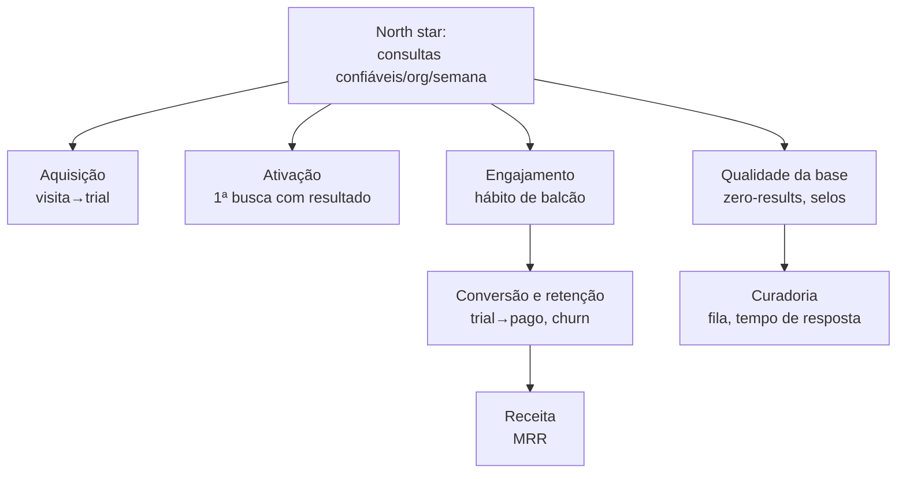

# Métricas e Analytics — 001

**GOAL:** `CATALOGO-SAAS-MASTER-PLAN-001`
**Data:** 22 de Julho de 2026
**Status:** PROPOSTA — todas as metas são **HIPÓTESES** a calibrar no beta fechado.
Nenhum número daqui é claim público; claims públicos são SÓ os do
[PRD §7](PRD_CATALOGO_SAAS_MVP_001.md).

---

## 1. Princípios

1. **Metas são hipóteses declaradas** — servem para disparar investigação, não para
   teatro de dashboard. Após 4 semanas de beta, cada meta é recalibrada com dado real.
2. **Sem vanity metrics** — pageviews e downloads não pagam curadoria; as métricas
   centrais medem valor entregue no balcão e saúde da base.
3. **Telemetria própria primeiro** — `SearchHistory` + banco + Stripe respondem 90% das
   perguntas; ferramenta externa paga só quando uma pergunta concreta exigir.
4. **Métrica ruim é sintoma, não vergonha** — zero-results alto = fila de curadoria, não
   número a esconder.

## 2. North star e árvore de métricas

**North star: consultas com resposta confiável por organização ativa por semana**
(consulta que retornou ao menos um resultado com selo `public`/`beta`).

É a métrica que une os três lados: base boa (curadoria) × produto rápido (busca) ×
cliente engajado (hábito de balcão). Ela alimenta retenção → receita.

## 3. Métricas por grupo (com metas-hipótese)

### Aquisição (landing → conta)

| Métrica | Definição | Meta-hipótese |
| :--- | :--- | :--- |
| Uso da demo | % de visitantes que fazem ≥ 1 consulta na demo | ≥ 25% |
| Demo → cadastro | % que criam conta após usar a demo | ≥ 10% |
| Visita → trial ativo | conta criada + e-mail verificado + 1ª busca | ≥ 4% das visitas |

### Ativação (o "aha" do balcão)

| Métrica | Definição | Meta-hipótese |
| :--- | :--- | :--- |
| Tempo até 1ª busca com resultado | do cadastro à 1ª resposta com selo | ≤ 5 min p/ ≥ 70% |
| Ativação D1 | % de trials com ≥ 3 buscas no 1º dia | ≥ 50% |
| Instalação PWA | % de contas com PWA instalado em 7 dias | ≥ 30% |

### Engajamento (hábito)

| Métrica | Definição | Meta-hipótese |
| :--- | :--- | :--- |
| Buscas/org/dia útil | mediana entre orgs ativas | ≥ 5 |
| Retenção D7 / D30 | % de orgs com uso na semana/mês seguinte | ≥ 50% / ≥ 35% |
| Uso do funil de compra | % de orgs ativas que geram lista ou PDF no mês | ≥ 40% |

### Qualidade da base (a métrica que manda na curadoria)

| Métrica | Definição | Meta-hipótese |
| :--- | :--- | :--- |
| **Taxa de zero-results** | % de buscas com `hadZeroResults` | ≤ 15% no beta; ≤ 10% no lançamento |
| Cobertura confiável da resposta | % de respostas com ≥ 1 item selo verde (`public`) | ≥ 60% |
| Reports de incompatibilidade | por 1.000 respostas exibidas | ≤ 2 |
| Solicitações resolvidas | mediana solicitação → `added`/resposta | ≤ 14 dias |

A taxa de zero-results do beta é o dado que decide o lançamento aberto
([MASTER_PLAN §6.2](CATALOGO_SAAS_MASTER_PLAN_001.md), [ROADMAP §3](ROADMAP_IMPLEMENTACAO_001.md)).

### Conversão e receita

| Métrica | Definição | Meta-hipótese |
| :--- | :--- | :--- |
| Trial → pago | % de trials que assinam em até 14 dias do fim | 20–30% |
| Churn mensal | cancelamentos / base ativa | ≤ 6% |
| Mix anual/trimestral | % da base em períodos pré-pagos | ≥ 30% |
| Recuperação de inadimplência | % de `past_due` que voltam a `active` | ≥ 60% |
| MRR — marcos | break-even de infra (~15 Essencial) → 100 fundadores → 300 orgs | marcos, não prazos |

### Curadoria e operação

| Métrica | Definição | Meta-hipótese |
| :--- | :--- | :--- |
| Itens de curadoria processados | por semana ([PAINEL_ADMIN §5](PAINEL_ADMIN_MODERACAO_001.md)) | 30/semana |
| Fila de revisão | tendência do backlog (nasce com 527) | decrescente após o beta |
| Pares publicáveis | evolução de 136 (pares `public`) | crescente; sem meta de prazo |

### Confiabilidade e segurança

| Métrica | Definição | Meta |
| :--- | :--- | :--- |
| Latência de busca | p50 / p95 no servidor | < 100 ms / < 300 ms ([BUSCA §6](BUSCA_E_COMPATIBILIDADE_001.md)) |
| Disponibilidade | uptime mensal | ≥ 99,5% ([ARQUITETURA §7](ARQUITETURA_CATALOGO_SAAS_001.md)) |
| Sinais de abuso | contas na escada de resposta ([SEGURANCA §5](SEGURANCA_PROTECAO_BASE_001.md)) | 100% revisados em ≤ 48h |
| Webhooks com erro | eventos `error` no `PaymentEvent` | 0 sem tratamento em 24h |

## 4. Instrumentação (MVP — sem ferramenta paga)

| Fonte | O que responde |
| :--- | :--- |
| `SearchHistory` | tudo de busca: volume, zero-results, latência, seleção, por org/dispositivo |
| Banco (entidades de uso) | favoritos, listas, PDFs, solicitações, dispositivos |
| Stripe | MRR, churn, conversão, inadimplência (verdade financeira) |
| Vercel Analytics | web vitals e funil da landing (sem cookie invasivo) |
| Sentry | erros e regressões |
| Painel admin (tela 3.18 — [UX](UX_DESIGN_SYSTEM_LANDING_001.md)) | KPIs diários agregados: buscas, zero-results, assinaturas, filas |

Eventos mínimos de produto (além da busca, que já é 100% registrada): cadastro,
verificação, 1ª busca, instalação PWA, criação de lista, geração de PDF, solicitação de
modelo, checkout iniciado, assinatura ativada, cancelamento (com a pergunta única de
saída — [PLANOS §3.4](PLANOS_ASSINATURAS_PAGAMENTOS_001.md)).

Privacidade: telemetria por organização/dispositivo com IP em hash
([SEGURANCA §7](SEGURANCA_PROTECAO_BASE_001.md)); nenhum dado de uso é exposto entre
organizações; nada de session replay no MVP.

## 5. Ritual de leitura e decisões guiadas por métrica

- **Semanal (30 min):** north star, zero-results (com top-20 queries sem resposta →
  alimenta a fila de curadoria), funil trial, churn do mês corrente, filas de
  curadoria/solicitação, sinais de abuso.
- **Gates que dependem de métrica:**
  - lançamento aberto ← zero-results e conversão do beta ([ROADMAP §3](ROADMAP_IMPLEMENTACAO_001.md));
  - Mercado Pago/PIX mensal ← perda de conversão atribuível a pagamento
    ([PLANOS §5](PLANOS_ASSINATURAS_PAGAMENTOS_001.md));
  - SEO programático ← custo de aquisição vs risco de exposição
    ([SEGURANCA §6](SEGURANCA_PROTECAO_BASE_001.md));
  - trial com/sem cartão ← conversão real vs abuso ([PLANOS §6](PLANOS_ASSINATURAS_PAGAMENTOS_001.md)).

## 6. Anti-padrões (proibidos)

- Publicar métrica interna como claim de marketing sem passar pelo
  [PRD §7](PRD_CATALOGO_SAAS_MVP_001.md).
- Meta virar cota (ex.: aprovar curadoria às pressas para "bater 30/semana" — a meta cai,
  a qualidade não).
- Comparar semanas sem sazonalidade de varejo (segunda ≠ sábado).
- Instrumentar antes de precisar (cada evento novo tem que responder uma pergunta real).
- Dashboard sem dono: toda métrica do §3 tem uma ação associada — se nenhuma decisão
  depende dela, ela sai do painel.
