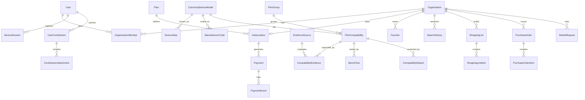

# Modelo de Dados Conceitual — SaaS Catálogo de Películas — 001

**GOAL:** `CATALOGO-SAAS-MASTER-PLAN-001`
**Data:** 22 de Julho de 2026
**Status:** CONCEITUAL — sem migrations, sem SQL. Nomes em inglês (convenção Prisma futura).

Convenções gerais (valem para todas as entidades, não repetidas em cada bloco):
- PK `id` (cuid); `createdAt`/`updatedAt` automáticos.
- Multi-tenant: toda entidade de assinante carrega `organizationId` indexado; toda query
  de aplicação filtra por ele.
- Soft-state: entidades de negócio têm `status` + histórico; **nada de dados de catálogo é
  deletado fisicamente** — desativação com trilha (padrão herdado do OmniGestão).
- `AuditLog` registra mutações administrativas e eventos sensíveis.
- Dados sensíveis: apenas o mínimo (nome, e-mail, senha bcrypt). Sem CPF/CNPJ no MVP
  (nota fiscal de serviço é decisão pós-MVP — gate humano).

---

## Domínio 1 — Identidade e acesso

### User
- **Finalidade:** pessoa que loga (balconista, dono, admin da plataforma).
- **Campos:** `email` (único, citext), `passwordHash` (bcrypt), `name`, `emailVerifiedAt`,
  `platformRole` (`NONE | CURATOR | PLATFORM_ADMIN`), `status` (`active | suspended | deleted`),
  `lastLoginAt`.
- **Relacionamentos:** N:N com Organization via OrganizationMember; 1:N DeviceSession,
  UserContribution.
- **Índices/unicidade:** unique(`email`).
- **Sensível:** e-mail, nome, hash. **Retenção:** exclusão de conta → anonimização
  (e-mail → hash irreversível) mantendo trilhas financeiras por 5 anos (obrigação fiscal).
- **Auditoria:** login, troca de senha, mudança de role → AuditLog.

### Organization
- **Finalidade:** a loja/empresa assinante — unidade de cobrança e isolamento (tenant).
- **Campos:** `name`, `slug` (único), `whatsapp`, `city`/`uf` (opcionais), `status`
  (`trial | active | past_due | suspended | canceled`), `trialEndsAt`, `settings` (JSONB:
  preferências de exibição, fornecedor padrão do PDF).
- **Relacionamentos:** 1:N OrganizationMember, Favorite, SearchHistory, ShoppingList,
  PurchaseOrder, ModelRequest; 1:1 Subscription ativa.
- **Índices:** unique(`slug`); index(`status`).
- **Retenção:** cancelada → dados de uso mantidos 12 meses para reativação, depois purge.
- **Auditoria:** mudanças de status e de plano.

### OrganizationMember
- **Finalidade:** vínculo usuário↔organização com papel.
- **Campos:** `userId`, `organizationId`, `role` (`OWNER | MEMBER`), `status`
  (`active | invited | removed`), `invitedByUserId`, `invitedAt`/`joinedAt`.
- **Índices:** unique(`userId`,`organizationId`); index(`organizationId`,`status`).
- **Regras:** exatamente 1 OWNER ativo no MVP; limite de membros ativos = limite do plano
  (validado no servidor). Fase 3 adiciona papéis finos.
- **Auditoria:** convites, remoções.

### DeviceSession
- **Finalidade:** dispositivo ativo da assinatura — mecanismo do limite por plano.
- **Campos:** `userId`, `organizationId`, `deviceLabel` ("Moto G do balcão"),
  `deviceFingerprint` (hash de UA + hints, não identificador invasivo), `sessionTokenHash`,
  `lastSeenAt`, `ipLastHash`, `status` (`active | revoked | expired`), `revokedByUserId`.
- **Índices:** index(`organizationId`,`status`); unique(`sessionTokenHash`).
- **Regras:** contagem de `active` ≤ limite do plano; ativação de novo dispositivo além do
  limite exige revogar um existente (self-service, sem punição); rotação anômala (> N
  trocas/dia) sinaliza abuso ([SEGURANCA §5](SEGURANCA_PROTECAO_BASE_001.md)).
- **Sensível:** IP em hash. **Retenção:** revogadas purgadas em 90 dias.

---

## Domínio 2 — Planos e cobrança

### Plan
- **Finalidade:** definição comercial versionada (Essencial, Pro; mensal/tri/anual).
- **Campos:** `code` (único, ex. `essencial-mensal-v1`), `name`, `tier`
  (`ESSENCIAL | PRO`), `interval` (`monthly | quarterly | yearly`), `priceCents` (Int —
  dinheiro sempre em centavos), `currency` (`BRL`), `limits` (JSONB: `maxDevices`,
  `maxMembers`, `maxDailySearches`, `pdfWatermark`), `stripePriceId`, `isFounder` (bool),
  `active`.
- **Índices:** unique(`code`); unique(`stripePriceId`).
- **Regras:** preço nunca é editado — novo plano versionado; assinaturas antigas mantêm o
  plano contratado (preço fundador congelado = plano `isFounder` que nunca é desativado
  para quem já está nele).
- **Auditoria:** criação/desativação.

### Subscription
- **Finalidade:** estado-verdade do acesso pago de uma Organization.
- **Campos:** `organizationId`, `planId`, `provider` (`stripe | manual`),
  `providerSubscriptionId` (nullable p/ pré-pago PIX), `status`
  (`trialing | active | past_due | grace | suspended | canceled | expired`),
  `currentPeriodStart/End`, `cancelAtPeriodEnd`, `graceUntil`, `canceledAt`, `history`
  (JSONB append-only de transições).
- **Índices:** unique(`organizationId`) p/ ativa; unique(`providerSubscriptionId`);
  index(`status`,`currentPeriodEnd`).
- **Regras:** transições SÓ por webhook validado ou ação administrativa auditada; cron
  diário expira `grace` vencida; pré-pago PIX = período fechado com `provider='manual'` +
  Payment aprovado.
- **Auditoria:** toda transição de status com causa (evento) no `history`.

### Payment
- **Finalidade:** cobrança individual (fatura/charge) e conciliação.
- **Campos:** `subscriptionId`, `organizationId`, `provider`, `providerPaymentId`,
  `method` (`card | pix | boleto`), `amountCents`, `currency`, `status`
  (`pending | paid | failed | refunded | charged_back`), `paidAt`, `failureReason`,
  `localKey` (única — idempotência, padrão OmniGestão: `pay:{provider}:{providerPaymentId}`).
- **Índices:** unique(`localKey`); index(`organizationId`,`status`); unique(`providerPaymentId`).
- **Retenção:** 5 anos (fiscal). **Auditoria:** via PaymentEvent.

### PaymentEvent
- **Finalidade:** trilha bruta e idempotência de webhooks.
- **Campos:** `provider`, `providerEventId` (único), `type`, `payload` (JSONB bruto),
  `processedAt`, `processingResult` (`applied | ignored | error`), `paymentId?`,
  `subscriptionId?`, `signatureValid` (bool).
- **Índices:** unique(`provider`,`providerEventId`) — garante processamento único.
- **Regras:** todo webhook é gravado ANTES de processar; reprocessamento é idempotente.
- **Retenção:** 24 meses.

---

## Domínio 3 — Catálogo canônico

### CanonicalDeviceModel
- **Finalidade:** o aparelho canônico — âncora de tudo (429 no seed inicial).
- **Campos:** `slug` (único, estável, ex. `apple_iphone_11` — preservado do seed),
  `brand`, `manufacturer`, `family` ("iPhone", "Galaxy A"), `canonicalName`, `shortName`,
  `variant` ("11 Pro"), `connectivity` (`4G | 5G | NA`) — **campo de 1ª classe, nunca parte
  do nome**, `variantTier` (`base | pro | plus | max | ultra | lite | NA`), `yearHint`,
  `regionHint`, `status` (`active | legacy | draft | review | deprecated`),
  `confidence` (`alta | media | baixa`), `notes`, `catalogVersionId` (versão em que entrou).
- **Relacionamentos:** 1:N DeviceAlias, ManufacturerCode, FilmCompatibility.
- **Índices:** unique(`slug`); index(`brand`,`status`); index trigram em `canonicalName`.
- **Regras 4G/5G e Pro/Max:** dois aparelhos que diferem em `connectivity` ou
  `variantTier` são SEMPRE modelos distintos; a UI sempre exibe o sufixo; a busca nunca
  colapsa variantes ([BUSCA §4](BUSCA_E_COMPATIBILIDADE_001.md)).
- **Desativação:** `deprecated` com `supersededByModelId` (nunca delete).
- **Auditoria:** toda mutação → AuditLog com diff.

### DeviceAlias
- **Finalidade:** nomes alternativos de busca (1.751 no seed).
- **Campos:** `modelId`, `alias`, `normalizedAlias` (derivado, sem acento/caixa),
  `aliasType` (`canonical | brand_short | commercial_variant | marketplace_name | short |
  common_typo`), `isAmbiguous`, `requiresBrandContext`, `confidence`, `status`
  (`active | disabled | review`), `source` (de onde veio o alias).
- **Índices:** unique(`modelId`,`normalizedAlias`); index(`normalizedAlias`) — colisões
  entre marcas são DETECTADAS por query, não proibidas (as 21 strings colidentes são
  legítimas, ex. "12").
- **Regras:** alias curto/numérico nasce `isAmbiguous=true` + `requiresBrandContext=true`
  por default; promoção a não-ambíguo só por curador com justificativa.
- **Auditoria:** criação/edição/desativação.

### ManufacturerCode
- **Finalidade:** códigos técnicos e regionais (SM-A055M, XT2427, RMX3999) — hoje embutidos
  como aliases; entidade própria permite busca exata e exibição estruturada.
- **Campos:** `modelId`, `codeType` (`technical | regional | anatel | sku_manufacturer`),
  `code`, `normalizedCode`, `region` ("BR", "Global"), `source`, `status`.
- **Índices:** unique(`codeType`,`normalizedCode`,`modelId`); index(`normalizedCode`).
- **Regras:** match exato de código tem ranking máximo na busca.

### AccessoryType
- **Finalidade:** tipo de acessório do catálogo — prepara capinhas sem migração futura.
- **Campos:** `code` (`pelicula_tela` no MVP; `capinha` reservado, INATIVO), `name`,
  `active`, `launchStage` (`mvp | future`).
- **Regras:** MVP tem exatamente 1 registro ativo. Nenhuma UI expõe `capinha`.

### FilmGroup
- **Finalidade:** grupo físico de molde de película (116 no seed).
- **Campos:** `slug` (estável, ex. `pelicula_g003`), `name` ("XR / iPhone 11"),
  `accessoryTypeId`, `description`, `status` (`active | disabled | review`),
  `memberCount` (derivado/cacheado), `isCrossBrand` (derivado), `catalogVersionId`.
- **Índices:** unique(`slug`).
- **Regras:** o pseudo-grupo "Mesmo modelo" NÃO existe aqui — cobertura própria é
  `FilmCompatibility` do tipo `self` (lição da correção P0: pseudo-grupos causaram a
  explosão de 86.736 pares falsos).
- **Auditoria:** merge/split de grupos com trilha.

### FilmCompatibility
- **Finalidade:** associação modelo↔grupo (1.026 no seed) OU cobertura própria (417).
  **Pares cruzados são DERIVADOS, nunca armazenados como verdade primária.**
- **Campos:** `modelId`, `filmGroupId` (null p/ `self`), `kind` (`group_membership | self`),
  `derivedStatus` (`confirmado_fornecedor | provavel_mercado | precisa_testar |
  nao_recomendado | conflitante | sem_evidencia | desativado` — DERIVADO da pior evidência
  ativa, materializado p/ performance), `confidence` (derivada), `requiresDryTest`,
  `visibility` (`public | beta | hidden`) — derivada de política
  ([BUSCA §5.3](BUSCA_E_COMPATIBILIDADE_001.md)), `statusLockedByCuratorId?` (override
  manual sempre para BAIXO, nunca para cima), `notes`.
- **Relacionamentos:** N:1 modelo e grupo; 1:N CompatibilityEvidence, BenchTest,
  CompatibilityReport.
- **Índices:** unique(`modelId`,`filmGroupId`,`kind`); index(`filmGroupId`);
  index(`visibility`).
- **Derivação de pares:** par exibível A↔B existe quando A e B pertencem ao mesmo
  FilmGroup ativo; o status do par = pior(`derivedStatus` de A, `derivedStatus` de B) —
  exatamente a regra já validada no engine (`peliculas.ts`, agregação sem promoção).
- **Desativação:** `visibility=hidden` + `derivedStatus=desativado` + motivo; histórico preservado.
- **Auditoria:** toda mudança de status/visibility com ator e motivo.

### CompatibilityEvidence
- **Finalidade:** evidência atômica que sustenta uma FilmCompatibility.
- **Campos:** `compatibilityId`, `evidenceSourceId`, `evidenceType`
  (`supplier_confirmation | public_listing | market_practice | bench_test | user_report`),
  `strength` (`strong | medium | weak`), `observedAt`, `recordedByUserId`, `excerpt`
  (texto curto legível — regra anti-mojibake do engine atual mantida), `status`
  (`active | retracted | superseded`), `retractionReason?`.
- **Índices:** index(`compatibilityId`,`status`); index(`evidenceSourceId`).
- **Regras:** evidência nunca é editada — retratada e substituída (append-only);
  `bench_test` só nasce de BenchTest aprovado.
- **Auditoria:** criação/retratação.

### EvidenceSource
- **Finalidade:** catálogo de fontes (fornecedores, listas públicas, seed original).
- **Campos:** `name`, `sourceType` (`supplier | public_table | marketplace | internal_seed |
  bench | user`), `reliability` (`alta | media | baixa`), `url?`, `contactRef?`, `notes`,
  `active`.
- **Índices:** unique(`name`,`sourceType`).
- **Sensível:** contato de fornecedor é dado comercial — visível só a admin.

### BenchTest
- **Finalidade:** teste físico de bancada (hoje 0 registros — a entidade nasce vazia e
  honesta; é o único caminho para `confirmado_bancada`).
- **Campos:** `compatibilityId`, `testedByUserId`, `organizationId?` (loja parceira),
  `testedAt`, `protocolVersion`, `result` (`fit | fit_with_caveat | no_fit`),
  `caveats` (borda/câmera/sensor), `photos` (refs a Storage), `reviewedByUserId?`,
  `reviewStatus` (`pending | approved | rejected`), `rejectionReason?`.
- **Índices:** index(`compatibilityId`,`reviewStatus`).
- **Regras:** só BenchTest `approved` gera CompatibilityEvidence `bench_test`; aprovador
  ≠ testador (dupla verificação).
- **Auditoria:** aprovação/rejeição.

### CompatibilityReport
- **Finalidade:** contestação de assinante ("não serviu").
- **Campos:** `compatibilityId`, `organizationId`, `userId`, `reportType`
  (`no_fit | partial_fit | wrong_model | other`), `description`, `photos?`, `status`
  (`open | investigating | resolved_confirmed | resolved_rejected`), `resolutionNotes`,
  `resolvedByUserId?`.
- **Índices:** index(`compatibilityId`,`status`); index(`organizationId`).
- **Regras:** 2º report `no_fit` distinto sobre a mesma compatibilidade → rebaixa
  automaticamente `visibility` para `beta` (com aviso) e abre item de curadoria; 3º →
  `hidden` até resolução. Fail-closed.
- **Auditoria:** resolução com motivo.

---

## Domínio 4 — Contribuição e curadoria (Fase 2, modelado desde já)

### UserContribution
- **Finalidade:** sugestão de assinante (novo alias, nova compatibilidade, correção).
- **Campos:** `userId`, `organizationId`, `contributionType`
  (`new_alias | new_compatibility | correction | new_model_info`), `targetModelId?`,
  `targetCompatibilityId?`, `payload` (JSONB estruturado da sugestão), `status`
  (`pending | approved | rejected | needs_info`), `moderatedByUserId?`, `moderationNotes`,
  `rewardGranted?` (Fase 2+: reconhecimento).
- **Índices:** index(`status`,`createdAt`); index(`userId`).
- **Regras:** aprovação NUNCA aplica direto — gera rascunho de mutação de catálogo que o
  curador confirma ([PAINEL_ADMIN §4](PAINEL_ADMIN_MODERACAO_001.md)); quem aprovou fica
  registrado na entidade e no AuditLog.
- **Retenção:** rejeitadas mantidas 12 meses (aprender padrões de má qualidade).

### ContributionAttachment
- **Finalidade:** fotos/arquivos da contribuição.
- **Campos:** `contributionId`, `storagePath` (bucket privado), `mimeType`, `sizeBytes`,
  `sha256`, `scanStatus` (`pending | clean | blocked`).
- **Índices:** index(`contributionId`); unique(`sha256`,`contributionId`).
- **Sensível:** fotos podem conter dados pessoais — bucket privado, URL assinada curta.
- **Retenção:** segue a contribuição.

---

## Domínio 5 — Uso do assinante

### Favorite
- **Finalidade:** modelos/grupos marcados pela organização.
- **Campos:** `organizationId`, `userId`, `targetType` (`model | film_group`),
  `targetId`, `label?`.
- **Índices:** unique(`organizationId`,`targetType`,`targetId`); index(`organizationId`).

### SearchHistory
- **Finalidade:** histórico de consultas (UX + telemetria + detecção de abuso).
- **Campos:** `organizationId`, `userId`, `deviceSessionId`, `rawQuery`,
  `normalizedQuery`, `brandFilter?`, `resultCount`, `selectedModelId?`, `hadZeroResults`,
  `latencyMs`, `searchedAt`.
- **Índices:** index(`organizationId`,`searchedAt`); index(`hadZeroResults`,`searchedAt`)
  (fila de gaps); index(`deviceSessionId`,`searchedAt`) (rate/abuso).
- **Sensível:** comportamento de uso — nunca exposto entre organizações.
- **Retenção:** detalhe 6 meses; agregados (contagens) indefinido.

### ShoppingList
- **Finalidade:** lista de compras de películas da organização.
- **Campos:** `organizationId`, `createdByUserId`, `name`, `status`
  (`open | ordered | archived`), `notes`.
- **Índices:** index(`organizationId`,`status`).

### ShoppingListItem
- **Finalidade:** item da lista — referencia grupo físico (a unidade de compra real) ou
  modelo.
- **Campos:** `shoppingListId`, `filmGroupId?`, `modelId?`, `quantity` (Int), `notes`,
  `addedByUserId`.
- **Índices:** unique(`shoppingListId`,`filmGroupId`,`modelId`); index(`shoppingListId`).
- **Regras:** consolidação por grupo físico é o valor central ("1 molde atende N modelos").

### PurchaseOrder
- **Finalidade:** pedido gerado a partir de uma lista (documento enviado ao fornecedor).
- **Campos:** `organizationId`, `shoppingListId`, `createdByUserId`, `supplierName?`,
  `pdfStoragePath`, `watermarkFingerprint` (id embutido no PDF — antifraude/rastreio de
  vazamento), `sentVia?` (`whatsapp | email | download`), `status` (`draft | generated | sent`).
- **Índices:** index(`organizationId`,`createdAt`); unique(`watermarkFingerprint`).
- **Retenção:** 24 meses.

### ModelRequest
- **Finalidade:** solicitação de modelo/cobertura ausente (motor de crescimento da base).
- **Campos:** `organizationId`, `userId`, `rawQueryOrigin?` (busca que falhou),
  `brandGuess`, `modelGuess`, `notes`, `status`
  (`open | in_research | added | rejected_duplicate | rejected_invalid`),
  `resolvedModelId?`, `resolvedByUserId?`, `requestersCount` (dedupe: pedidos iguais
  incrementam em vez de duplicar).
- **Índices:** index(`status`,`requestersCount` desc) — priorização por demanda;
  index(`organizationId`).
- **Regras:** ao virar `added`, notifica todas as organizações solicitantes (Notification).

---

## Domínio 6 — Plataforma

### AuditLog
- **Finalidade:** trilha imutável de ações administrativas e eventos sensíveis.
- **Campos:** `actorUserId?` (null p/ sistema), `actorRole`, `action` (verbo canônico,
  ex. `catalog.compatibility.status_changed`), `targetType`, `targetId`,
  `organizationId?`, `before`/`after` (JSONB diff), `reason?`, `ip?` (hash), `at`.
- **Índices:** index(`targetType`,`targetId`); index(`actorUserId`,`at`); index(`action`,`at`).
- **Regras:** append-only; sem UPDATE/DELETE pela aplicação.
- **Retenção:** 24 meses (negócio) / 5 anos (financeiro).

### Notification
- **Finalidade:** notificações in-app (+ e-mail espelhado quando crítico).
- **Campos:** `organizationId`, `userId?` (null = todos da org), `kind`
  (`model_added | payment_failed | subscription_expiring | contribution_moderated |
  report_resolved | announcement`), `title`, `body`, `linkPath?`, `readAt?`, `emailedAt?`.
- **Índices:** index(`organizationId`,`userId`,`readAt`).
- **Retenção:** 6 meses após leitura.

### FeatureFlag
- **Finalidade:** liberação gradual (ex. `beta_pairs_visible`, `contributions_enabled`,
  `capinhas_module` — este último nasce `false` e só muda com gate humano da Fase 4).
- **Campos:** `key` (único), `enabled`, `rolloutRule?` (JSONB: por plano, por org
  allowlist), `description`, `updatedByUserId`.
- **Índices:** unique(`key`).
- **Auditoria:** toda mudança → AuditLog.

### CatalogVersion *(entidade de suporte — exigida pela importação)*
- **Finalidade:** versão publicada do catálogo; chave de cache do motor de busca e âncora
  de rollback.
- **Campos:** `version` (Int sequencial), `sourceManifest` (JSONB: arquivos + SHA-256,
  espelhando `MANIFESTO_EVIDENCIAS_001.md`), `publishedByUserId`, `publishedAt`, `stats`
  (JSONB: contagens por status — conferidas contra a auditoria), `status`
  (`staged | published | rolled_back`).
- **Regras:** publicar = transação que aponta a versão corrente; rollback = repontar para
  a anterior ([IMPORTACAO §6](IMPORTACAO_DADOS_EXISTENTES_001.md)).

---

## Mapeamento seed auditado → entidades

| Fonte auditada | Entidade destino | Volume inicial |
| :--- | :--- | ---: |
| `MODELOS_CANONICOS_INVENTARIO_001.csv` | CanonicalDeviceModel | 429 |
| `ALIASES_INVENTARIO_001.csv` | DeviceAlias (+ ManufacturerCode p/ `technical_code`) | 1.751 |
| Grupos do seed de compatibilidades | FilmGroup | 116 |
| Linhas `grupo_pelicula` | FilmCompatibility `kind=group_membership` | 1.026 |
| Linhas `mesmo_modelo` | FilmCompatibility `kind=self` | 417 |
| Status por linha | CompatibilityEvidence (1 por linha, source = `internal_seed`/fornecedor) | 1.443 |
| `FILA_REVISAO_001.csv` | itens de curadoria (UserContribution `type=correction`, ator = sistema) | 527 |
| `GAPS_MODELOS_MERCADO_001.csv` | ModelRequest (ator = sistema, `in_research`) | 10 |
| `MATRIZ_PARES_COMPATIBILIDADE_001.csv` | **NÃO importada como tabela** — usada só como oráculo de validação do dry-run (935 pares derivados devem bater) | — |
| Capinhas | **nada** (0 registros — nenhuma tabela recebe dados de capinha) | 0 |
