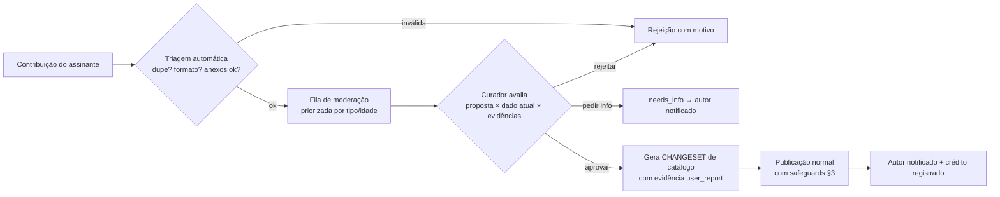

# Painel Administrativo e Moderação — 001

**GOAL:** `CATALOGO-SAAS-MASTER-PLAN-001`
**Data:** 22 de Julho de 2026
**Status:** PROPOSTA FUNCIONAL (admin mínimo na Fase 1; moderação completa na Fase 2)

---

## 1. Papéis internos

| Papel | Pode | Não pode |
| :--- | :--- | :--- |
| `CURATOR` | CRUD de catálogo em rascunho, anexar evidências, moderar contribuições/solicitações, rebaixar status | Publicar catálogo, tocar assinaturas/pagamentos, mudar flags |
| `PLATFORM_ADMIN` | Tudo do curator + publicar catálogo, importar CSV, rollback, gerir assinaturas (cortesia/suspensão), flags, usuários | Editar AuditLog; promover status sem evidência (bloqueado por política, não por confiança no humano) |

Toda ação administrativa: registrada em `AuditLog` (ator, antes/depois, motivo).

## 2. Capacidades (mapa completo)

### Catálogo
- **Modelos:** criar/editar (rascunho→publicar), deprecar com sucessor, nunca deletar.
- **Aliases:** criar/editar/desativar; **detector de colisões** roda a cada mutação:
  alias novo que colide com outra marca já nasce `isAmbiguous + requiresBrandContext`
  (as 21 strings colidentes conhecidas são o caso de teste).
- **Códigos técnicos:** CRUD de `ManufacturerCode` com validação de formato por tipo.
- **Grupos:** criar/renomear/mesclar/dividir com simulação de impacto (quantos pares
  exibíveis mudam) antes de confirmar.
- **Relações (FilmCompatibility):** adicionar/remover membro de grupo; anexar
  fontes/fotos (evidências); mudar nível de evidência (sempre via evidência, nunca edição
  direta do status — exceto rebaixamento manual com motivo); desativar/restaurar com
  motivo; **comparar versões** (diff por CatalogVersion).
- **Conflitos:** fila dedicada de `conflitante` + relatório de contradições detectadas.

### Operação
- **Contribuições:** aprovar/rejeitar/pedir info (fluxo §4).
- **Solicitações de modelo:** fila priorizada por `requestersCount`; resolver vinculando
  o modelo criado → notifica solicitantes.
- **Reports de incompatibilidade:** investigar, resolver com desfecho e motivo; rebaixa
  automática já aplicada pelo sistema ([MODELO_DADOS — CompatibilityReport](MODELO_DADOS_CONCEITUAL_001.md)).
- **Importar CSV:** upload → staging → validação → **preview com diff** → dry-run →
  publicar (gera CatalogVersion) → **rollback de 1 clique** para versão anterior
  ([IMPORTACAO](IMPORTACAO_DADOS_EXISTENTES_001.md)).
- **Assinaturas:** visão somente-leitura do estado (verdade = provedor + webhooks);
  ações permitidas: estender cortesia (auditada), suspender por abuso (auditada),
  reenviar convite de portal. Nunca editar valores/pagamentos à mão.
- **Dispositivos:** ver sessões de uma organização, revogar em caso de abuso confirmado.
- **Abuso:** dashboard de sinais ([SEGURANCA §5](SEGURANCA_PROTECAO_BASE_001.md)) com
  ações graduais (aviso → limite → suspensão).
- **Logs:** viewer do AuditLog com filtros por ator/ação/alvo/período.

## 3. Safeguards contra contaminação da base (o requisito central)

O risco nº 1 do admin é uma edição errada envenenar resultados para todos os assinantes.
Defesas em camadas:

1. **Rascunho → Revisão → Publicação.** Mutações de catálogo nunca vão direto ao ar:
   entram num changeset pendente; publicar é ação explícita separada que gera
   `CatalogVersion` novo. Fase 1 (equipe de 1): auto-revisão com tela de confirmação
   mostrando o diff de impacto; Fase 2+: quatro olhos (autor ≠ publicador).
2. **Simulação de impacto obrigatória.** Antes de publicar, o sistema mostra: N modelos
   afetados, N pares que entram/saem da visibilidade pública, N favoritos de assinantes
   atingidos. Publicação exibe esses números na confirmação.
3. **Invariantes de política verificadas na publicação (hard gates):**
   - nenhum par com lado `precisa_testar` pode ficar `public`/`beta`;
   - `confirmado_bancada` exige BenchTest aprovado vinculado;
   - grupo com > 25 membros exige confirmação extra (suspeita de pseudo-grupo — a lição
     do bug "Mesmo modelo"/86.736 pares);
   - contagens pós-publicação são reconciliadas com as esperadas (paridade com matriz).
4. **Versionamento com rollback.** Toda publicação é um snapshot; rollback repontamento
   atômico para a versão anterior (< 1 min), com o motor de busca invalidando cache por
   `catalogVersion`.
5. **Status derivado, não editado.** A UI de admin muda EVIDÊNCIAS; o status é
   recalculado pela política ([BUSCA §5.2](BUSCA_E_COMPATIBILIDADE_001.md)). Único
   atalho manual: rebaixar (fail-closed), com motivo obrigatório.
6. **AuditLog append-only** de tudo, com diff.

## 4. Fluxo de moderação de contribuições (Fase 2)

Regras: aprovação NUNCA aplica direto (vira changeset); aprovador fica registrado
(`moderatedByUserId` + AuditLog); contribuição só vira evidência `user_report`
(força fraca — não promove status sozinha, salvo política de múltiplas confirmações
independentes ≥ 3 organizações distintas, e mesmo então no máximo até
`multiplas_fontes_publicas`).

## 5. Fila de curadoria inicial (herdada da auditoria)

Ao importar, o admin nasce com trabalho real e priorizado:
- 527 itens da `FILA_REVISAO_001.csv` (aliases numéricos/curtos, faltantes, conflitos);
- 10 gaps de mercado 2024–2026 (`GAPS_MODELOS_MERCADO_001.csv`) como ModelRequests
  `in_research`;
- 34 pares beta a caminho de confirmação; 765 pares ocultos aguardando fornecedor/bancada.

Meta operacional sugerida (hipótese): processar 30 itens/semana de curadoria no beta.

## 6. Bancada física (protocolo — habilita capinhas no futuro e melhora películas já)

- **Protocolo versionado** (`protocolVersion`): teste seco com película/capinha real —
  checagem de borda, recorte de câmera, sensor de proximidade, molde; fotos obrigatórias
  (frente/detalhe); resultado `fit | fit_with_caveat | no_fit`.
- **Formulário de bancada no admin** (mobile-friendly — a bancada é na loja): seleciona
  relação → executa protocolo → anexa fotos → envia para revisão.
- **Dupla verificação:** aprovador ≠ testador; só aprovação gera evidência
  `bench_test` e habilita `confirmado_bancada`.
- **Rede de lojas parceiras:** começa na operação própria (Rafacell); expansão com
  parceiros selecionados (gate humano) com contas Pro de cortesia auditadas.
- **Capinhas:** o MESMO protocolo com campos extras (botões, portas, aberturas);
  nenhum dado de capinha entra por outra via; aprovação automática por dimensões é
  **proibida por política** (tolerâncias de pesquisa são heurísticas não validadas).

## 7. Admin mínimo do MVP (corte da Fase 1)

Inclui: CRUD modelos/aliases/grupos/relações com rascunho→publicar + detector de colisão
+ evidências + fila de solicitações + import/rollback + AuditLog viewer + visão de
assinaturas somente-leitura.
Fica para Fase 2: moderação de contribuições, dashboard de abuso avançado, bancada
digital, comparador de versões rico (na Fase 1: diff simples por publicação).
