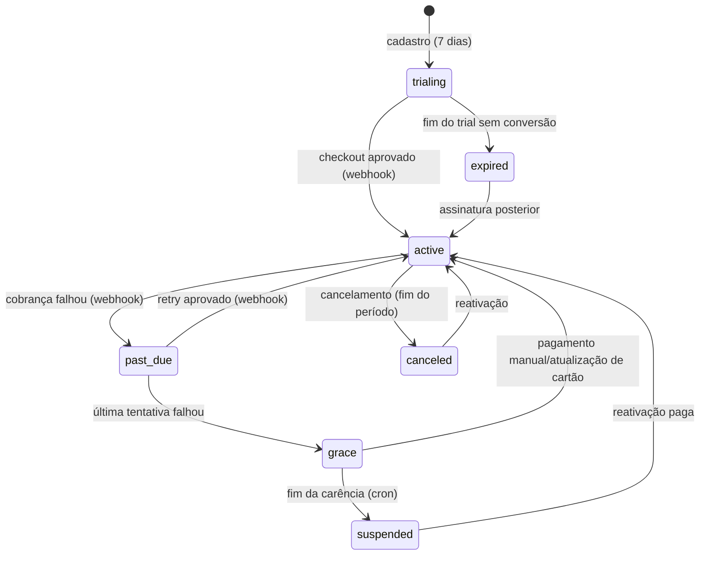

# Planos, Assinaturas e Pagamentos — 001

**GOAL:** `CATALOGO-SAAS-MASTER-PLAN-001`
**Data:** 22 de Julho de 2026
**Status:** PROPOSTA — preços finais e gateway são **GATE HUMANO** (taxas citadas são
ordens de grandeza públicas conhecidas e DEVEM ser verificadas nas tabelas vigentes antes
da decisão).

---

## 1. Referência competitiva

Concorrente líder analisado (Películas Compatíveis UTI — pesquisa pública exploratória):
1 mês R$ 22 (2 disp.) · 3 meses R$ 42 (3 disp.) · 6 meses R$ 78 (4 disp.) ·
1 ano R$ 144 (5 disp.). Recursos: busca, login, controle de dispositivos, lista/pedido,
PDF, solicitação de modelos, relato de incompatibilidade. Fraquezas: UX datada, sem níveis
de confiança, sem percepção premium.

Posicionamento: **paridade de preço de entrada (levemente abaixo) + superioridade de
produto (confiança explícita, UX, pedido/PDF integrado)** — nunca guerra de preço.

## 2. Estrutura de planos

| Recurso | **Essencial** | **Loja Pro** |
| :--- | :--- | :--- |
| Usuários | 1 | 3 |
| Dispositivos ativos | 2 | 5 |
| Lojas (organizações filhas) | 1 | até 3 (Fase 3; no MVP: 1 org com mais usuários/disp.) |
| Busca + resultados com confiança | ✔ | ✔ |
| Consultas/dia (limite anti-abuso, invisível no uso normal) | 300 | 1.000 |
| Favoritos / Histórico | ✔ / 30 dias | ✔ / 12 meses |
| Lista de compras | 1 ativa | ilimitadas |
| Pedido em PDF (com watermark) | 10/mês | ilimitado* (soft-cap 100/mês) |
| Compartilhar WhatsApp | ✔ | ✔ |
| Solicitação de modelos | ✔ | ✔ prioridade na fila |
| Exportação CSV da própria lista | — | ✔ (só listas próprias, nunca a base) |
| Relatórios de uso da equipe | — | Fase 3 |
| Acesso futuro ao módulo de capinhas | — | prioridade de beta (sem promessa de data) |
| Suporte | e-mail | e-mail prioritário + WhatsApp |

Racional Essencial×Pro: Essencial atende o lojista solo (dor nº 1); Pro vende **equipe +
volume + operação de compra** — diferenças reais de custo de serviço, não recursos
artificialmente bloqueados.

### Administrador da plataforma (interno, não vendido)
Gestão completa de catálogo (modelos, aliases, grupos, evidências, conflitos),
moderação, assinaturas/pagamentos (somente leitura no Stripe + ações de cortesia),
usuários, dispositivos, logs e auditoria — detalhado em
[PAINEL_ADMIN_MODERACAO_001.md](PAINEL_ADMIN_MODERACAO_001.md). RBAC em
[SEGURANCA §3](SEGURANCA_PROTECAO_BASE_001.md).

## 3. Preços — avaliação da proposta preliminar e recomendação

### 3.1 Custos que o preço precisa cobrir (estimativas a validar)

| Item | Estimativa mensal |
| :--- | ---: |
| Vercel Pro | ~US$ 20 (~R$ 110) |
| Supabase Pro | ~US$ 25 (~R$ 140) |
| Resend / Sentry (tiers iniciais) | ~R$ 0–60 |
| **Infra fixa total** | **~R$ 250–310** |
| Taxa de pagamento (cartão, ordem de grandeza ~4–5% + fixo) | ~R$ 1,00–1,50 por cobrança de R$ 19,90 |
| Curadoria da base (tempo do proprietário/equipe) | principal custo real — horas/semana |
| Aquisição | orgânico (grupos, Instagram, indicação) no início; CAC-caixa ≈ 0, CAC-tempo alto |

Break-even de infra: **~15 assinantes Essencial mensais**. O negócio é viável em escala
pequena — o custo dominante é curadoria, não servidores.

### 3.2 Avaliação dos preços preliminares propostos

| Proposta preliminar | Avaliação |
| :--- | :--- |
| Essencial mensal R$ 19,90 | **OK.** 10% abaixo do líder (R$ 22) com produto superior. Margem sobre taxa+infra confortável. |
| Essencial tri R$ 39,90 | **Rejeitar.** = 33% de desconto; treina o cliente a nunca pagar mensal e canibaliza receita cedo demais. |
| Essencial tri R$ 44,90 | **OK (recomendado).** ~25% de desconto (R$ 14,97/mês efetivo); ainda abaixo do líder (R$ 42/3m = R$ 14/mês) em valor percebido. |
| Essencial anual R$ 119,90 | **OK como preço FUNDADOR** (R$ 9,99/mês efetivo, 50% off): gera caixa e base de avaliações no lançamento. Preço de LISTA recomendado: R$ 149,90 (37% off). Fundador limitado (primeiras 100 contas ou 90 dias). |
| Pro mensal R$ 29,90 | **OK.** +50% sobre Essencial por 3 usuários/5 dispositivos — barato pelo valor, caro o bastante para segmentar. |
| Pro tri R$ 59,90 | **Rejeitar.** = R$ 19,96/mês — Pro trimestral custaria o mesmo que Essencial mensal, destruindo a escada de valor. Recomendado: **R$ 79,90** (~11% off). |
| Pro anual R$ 159,90 | **Rejeitar.** = R$ 13,32/mês, abaixo do Essencial mensal; e a apenas R$ 40/ano do Essencial anual — upsell vira ruído. Recomendado: **R$ 249,90 lista / R$ 199,90 fundador**. |

### 3.3 Tabela recomendada (GATE HUMANO para aprovação final)

| Plano | Mensal | Trimestral | Anual (lista) | Anual (fundador*) |
| :--- | ---: | ---: | ---: | ---: |
| Essencial | R$ 19,90 | R$ 44,90 | R$ 149,90 | **R$ 119,90** |
| Loja Pro | R$ 29,90 | R$ 79,90 | R$ 249,90 | **R$ 199,90** |

\* Fundador: primeiras 100 organizações OU 90 dias de lançamento (o que vier primeiro);
preço **congelado enquanto a assinatura permanecer ativa** (não "vitalício"
incondicional — vitalício irrevogável é passivo perpétuo e é **desaconselhado**; se o
proprietário quiser algo mais forte, limitar a coorte a 20–30 contas).

### 3.4 Políticas comerciais

| Política | Definição recomendada |
| :--- | :--- |
| Teste gratuito | 7 dias, sem cartão (§6) |
| Desconto de lançamento | é o próprio preço fundador — sem cupom adicional (dois descontos empilhados destroem ancoragem) |
| Upgrade | imediato, pró-rata pelo provedor; limites novos valem na hora |
| Downgrade | agendado para o fim do período corrente; se dispositivos/usuários excederem o novo limite, o OWNER escolhe quais revogar (nunca escolha automática) |
| Renovação | automática (cartão); pré-pago PIX recebe avisos D-7/D-3/D-0 com link de novo pagamento |
| Inadimplência | §7.2 (retries + carência de 7 dias em modo leitura limitada) |
| Cancelamento | self-service em 2 cliques, mantém acesso até o fim do período pago; pesquisa de saída de 1 pergunta |
| Recuperação | e-mail D+3 e D+15 com oferta de retorno (sem desconto agressivo automático); dados mantidos 12 meses |
| Reembolso | 7 dias da primeira cobrança (CDC — arrependimento), integral; renovações: pró-rata apenas por falha grave do serviço (gate humano p/ texto jurídico) |
| Carência (grace) | 7 dias após falha final de cobrança, com acesso em modo leitura (busca limitada a favoritos) |

## 4. Fluxo de vida da assinatura

Passo a passo do caminho feliz: escolher plano → `POST /checkout` cria sessão no provedor
(metadata: `organizationId`, `planCode`) → usuário paga → provedor emite webhook →
**backend valida assinatura do webhook, registra `PaymentEvent` (idempotente por
`providerEventId`), cria `Payment`, ativa `Subscription`** → UI reflete estado lido do
banco. **O retorno visual do checkout NUNCA concede acesso** — a página de sucesso apenas
faz polling do estado real da assinatura.

Eventos mínimos tratados: `checkout.session.completed`, `invoice.paid`,
`invoice.payment_failed`, `customer.subscription.updated`, `customer.subscription.deleted`,
`charge.refunded`, `charge.dispute.created` (chargeback → suspensão imediata + auditoria).

Conciliação: job diário cruza assinaturas ativas locais × estado no provedor; divergência
gera alerta e NUNCA auto-corrige silenciosamente.

## 5. Comparativo de provedores (Brasil)

Escala 1–5. Taxas são ordem de grandeza pública — **verificar tabelas vigentes (gate)**.

| Critério | Stripe | Mercado Pago | Pagar.me | Asaas (alternativa) |
| :--- | :---: | :---: | :---: | :---: |
| Assinatura recorrente cartão | 5 (Billing completo: retry, dunning, portal) | 4 | 4 | 4 |
| PIX | 3 (avulso; recorrência via fatura) | 5 (nativo, cultura de uso) | 4 | 5 |
| Boleto | 3 | 4 | 5 | 5 |
| Webhooks/DX/documentação | 5 | 3 | 3 | 3 |
| Experiência PRÉVIA do time (produção OmniGestão) | **5** | 1 | 1 | 1 |
| Portal do assinante pronto (self-service) | 5 | 2 | 2 | 3 |
| Recuperação de pagamento (smart retries) | 5 | 3 | 3 | 3 |
| Custo percebido (ordem de grandeza) | ~4% + fixo cartão | ~4–5% | ~4% | ~3–5% |
| Confiança do lojista BR na marca | 3 | **5** | 3 | 3 |
| Lock-in (migração de assinaturas) | médio (cartões tokenizados migráveis com processo) | médio | médio | médio |

**Recomendação MVP: Stripe.** Motivos decisivos: (1) o time já opera Stripe Billing em
produção — menor risco de erro em código de dinheiro; (2) dunning/portal prontos reduzem
semanas de trabalho; (3) webhooks maduros. Mitigação da fraqueza PIX: planos trimestral e
anual vendidos também como **pagamento PIX avulso** (Checkout/Payment Link) que concede
período fechado com renovação por novo PIX (aviso D-7/D-3/D-0).

**Evolução (Fase 3+):** se métricas mostrarem perda relevante de conversão por ausência de
PIX no mensal, adicionar Mercado Pago como segundo provedor atrás da interface
`PaymentProvider` (o domínio `Subscription/Payment/PaymentEvent` já é agnóstico).
**Contingência:** a mesma abstração é o plano de saída em caso de bloqueio/instabilidade
do provedor primário.

## 6. Teste grátis — decisão

**Recomendado: 7 dias sem cartão** + demo pública na landing (5 consultas de modelos
populares, sem login, servida de allowlist estática — não expõe a base).

- A favor: público desconfiado de cadastrar cartão; fricção mínima maximiza a métrica
  crítica (primeira busca com resultado); o líder não oferece trial — diferencial.
- Riscos e mitigações: scraping em contas trial → limites duros (30 consultas/dia,
  1 dispositivo, PDF com watermark "AVALIAÇÃO", sem export); contas descartáveis →
  verificação de e-mail obrigatória + 1 trial por e-mail/dispositivo (fingerprint).
- Alternativa se conversão vier baixa: trial com cartão (7→14 dias) — decidir com dados.

## 7. Regras operacionais

### 7.1 Dispositivos
Limite por plano aplicado no servidor via `DeviceSession` ativa. Troca self-service:
ativar novo além do limite exige revogar um antigo na hora (1 clique, sem contato com
suporte). Antiabuso: > 4 revogações/ativações em 24h → aviso; reincidência → revisão
manual. **Nunca** bloquear silenciosamente o usuário legítimo.

### 7.2 Inadimplência (cartão)
Retries do provedor (D+1, D+3, D+5) → `past_due` (banner no app, e-mail) → falha final →
`grace` 7 dias (leitura limitada) → `suspended` (bloqueio de consulta, dados preservados).
Reativação instantânea ao pagar.

### 7.3 Segurança de webhook (inegociável)
Verificação de assinatura (`STRIPE_WEBHOOK_SECRET`) + rejeição por timestamp antigo +
idempotência por `providerEventId` (unique) + gravação do evento bruto antes de processar
+ resposta 2xx só após persistência. Endpoint sem autenticação de sessão, mas com rate
limit e allowlist de tipos de evento. Testes de contrato com payloads reais do CLI.

## 8. Perguntas em aberto (consolidadas em [OPEN_QUESTIONS](OPEN_QUESTIONS_GATES_HUMANOS_001.md))
Preço final e coorte fundador; taxas vigentes dos provedores; emissão de NFS-e (município,
regime tributário, ferramenta); texto jurídico de reembolso; CNPJ/entidade que fatura.
